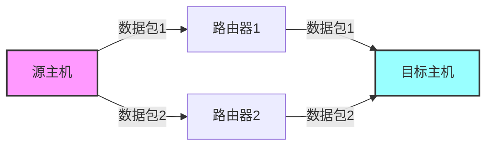
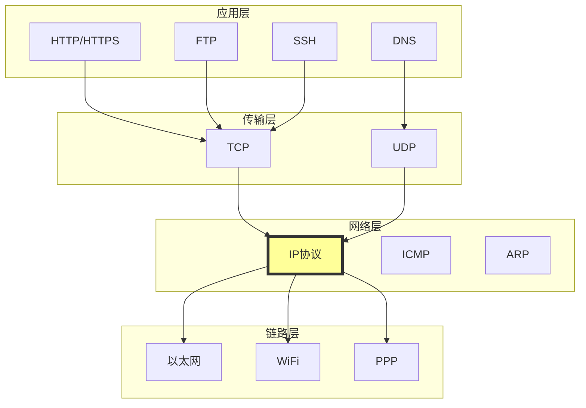
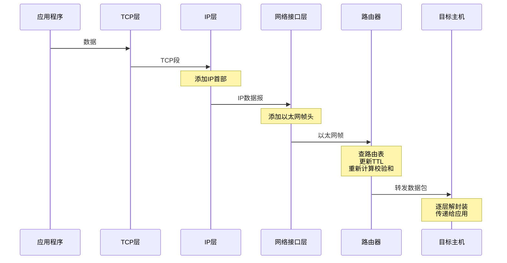

# IP协议详解 - 第一章：简介与概述

## 1.1 什么是IP协议？

IP（Internet Protocol，互联网协议）是TCP/IP协议族的核心协议之一，工作在OSI模型的网络层（第3层）。它负责在互联网中传输数据包（称为数据报datagram），确保数据从源主机送达目标主机。

### 核心功能
- **寻址（Addressing）**：通过IP地址标识网络中的每个设备
- **路由（Routing）**：确定数据包从源到目的地的最佳路径
- **分片与重组（Fragmentation & Reassembly）**：处理不同网络的MTU差异
- **无连接传输**：每个数据包独立传输，不建立连接

## 1.2 IP协议的设计理念

### 1.2.1 尽力而为服务（Best Effort Service）

IP协议提供的是"尽力而为"的服务，这意味着：
- **不保证可靠性**：数据包可能丢失、重复或乱序
- **不保证延迟**：没有时延保证
- **不保证带宽**：没有最小带宽保证

这种设计让IP协议保持简单，将复杂的功能留给上层协议（如TCP）实现。

### 1.2.2 无连接特性



每个IP数据包都是独立的实体：
- 不需要事先建立连接
- 每个数据包可能走不同的路径
- 数据包可能不按顺序到达

## 1.3 IP协议在网络协议栈中的位置



## 1.4 Linux内核中的IP协议实现

在Linux内核中，IP协议的实现主要位于以下文件：

### 核心文件结构
```bash
linux/net/ipv4/
├── ip_input.c      # IP数据包接收处理
├── ip_output.c     # IP数据包发送处理
├── ip_forward.c    # IP数据包转发
├── ip_fragment.c   # IP分片处理
├── route.c         # 路由表管理
└── arp.c          # ARP协议实现
```

### 关键数据结构

```c
// include/linux/ip.h
struct iphdr {
#if defined(__LITTLE_ENDIAN_BITFIELD)
    __u8    ihl:4,      // 首部长度
            version:4;   // 版本号（IPv4为4）
#elif defined (__BIG_ENDIAN_BITFIELD)
    __u8    version:4,
            ihl:4;
#endif
    __u8    tos;        // 服务类型
    __be16  tot_len;    // 总长度
    __be16  id;         // 标识符
    __be16  frag_off;   // 分片偏移
    __u8    ttl;        // 生存时间
    __u8    protocol;   // 协议类型
    __sum16 check;      // 首部校验和
    __be32  saddr;      // 源IP地址
    __be32  daddr;      // 目标IP地址
    /* 选项字段（如果有）*/
};
```

## 1.5 IP协议的版本

目前主要有两个版本的IP协议在使用：

### IPv4（RFC 791）
- **地址长度**：32位（4字节）
- **地址空间**：约42.9亿个地址
- **表示格式**：点分十进制（如192.168.1.1）
- **当前状态**：仍然是互联网主流

### IPv6（RFC 8200）
- **地址长度**：128位（16字节）
- **地址空间**：3.4×10³⁸个地址
- **表示格式**：冒号分隔的十六进制（如2001:db8::1）
- **当前状态**：逐步普及中

本教程主要讲解IPv4协议（基于RFC 791）。

## 1.6 数据传输示例

让我们通过一个简单的例子了解IP数据包如何在网络中传输：



## 1.7 Linux命令行工具

在学习IP协议时，以下Linux命令行工具非常有用：

### 查看IP配置
```bash
# 查看网络接口配置
ip addr show
# 或使用传统命令
ifconfig

# 查看路由表
ip route show
# 或
route -n
```

### 分析IP数据包
```bash
# 使用tcpdump抓包
sudo tcpdump -i eth0 -n -vv

# 使用Wireshark（图形界面）
wireshark

# 查看网络统计信息
netstat -s | grep -i ip
```

### 测试连通性
```bash
# ping测试（使用ICMP）
ping 8.8.8.8

# 路径追踪
traceroute google.com
# 或
mtr google.com
```

## 1.8 本章小结

IP协议是互联网的基础，它提供了：
1. **全球唯一的地址体系**：通过IP地址识别每个设备
2. **数据包路由机制**：确保数据能够到达目的地
3. **适应性强的设计**：能够在各种底层网络上运行
4. **简单高效的实现**：将复杂功能留给其他层处理

在接下来的章节中，我们将深入探讨：
- IP数据报的详细格式
- IP地址和子网划分
- 路由原理
- 分片与重组机制
- Linux内核实现细节

## 思考题

1. 为什么IP协议设计成"无连接"和"尽力而为"的服务模式？
2. IP协议与TCP协议的职责如何划分？
3. 在你的Linux系统上，使用`ip addr`命令查看网络接口，理解输出的每一部分含义。
4. 使用`tcpdump`捕获一个HTTP请求，观察IP首部的各个字段。

---

下一章：[IP数据报格式详解](./02-datagram-format.md)