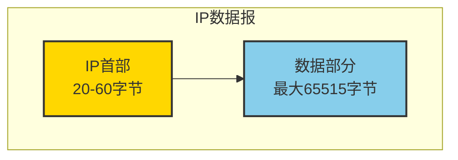
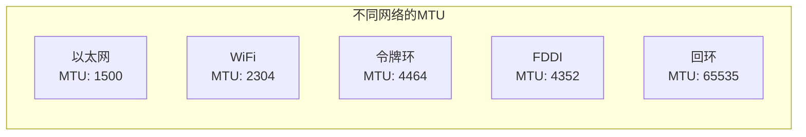

# IP协议详解 - 第二章：IP数据报格式

## 2.1 IP数据报结构概览

IP数据报由首部（Header）和数据（Data）两部分组成：



## 2.2 IP首部格式详解

### 2.2.1 标准IP首部结构（20字节）

```
 0                   1                   2                   3
 0 1 2 3 4 5 6 7 8 9 0 1 2 3 4 5 6 7 8 9 0 1 2 3 4 5 6 7 8 9 0 1
+-+-+-+-+-+-+-+-+-+-+-+-+-+-+-+-+-+-+-+-+-+-+-+-+-+-+-+-+-+-+-+-+
|Version|  IHL  |Type of Service|          Total Length         |
+-+-+-+-+-+-+-+-+-+-+-+-+-+-+-+-+-+-+-+-+-+-+-+-+-+-+-+-+-+-+-+-+
|         Identification        |Flags|      Fragment Offset    |
+-+-+-+-+-+-+-+-+-+-+-+-+-+-+-+-+-+-+-+-+-+-+-+-+-+-+-+-+-+-+-+-+
|  Time to Live |    Protocol   |         Header Checksum       |
+-+-+-+-+-+-+-+-+-+-+-+-+-+-+-+-+-+-+-+-+-+-+-+-+-+-+-+-+-+-+-+-+
|                       Source Address                          |
+-+-+-+-+-+-+-+-+-+-+-+-+-+-+-+-+-+-+-+-+-+-+-+-+-+-+-+-+-+-+-+-+
|                    Destination Address                        |
+-+-+-+-+-+-+-+-+-+-+-+-+-+-+-+-+-+-+-+-+-+-+-+-+-+-+-+-+-+-+-+-+
|                    Options                    |    Padding    |
+-+-+-+-+-+-+-+-+-+-+-+-+-+-+-+-+-+-+-+-+-+-+-+-+-+-+-+-+-+-+-+-+
```

### 2.2.2 各字段详细说明

#### 版本（Version）- 4位
- **含义**：IP协议版本号
- **IPv4值**：4（二进制：0100）
- **IPv6值**：6（二进制：0110）

```c
// Linux内核中的版本检查
static inline bool ip_version_check(struct iphdr *iph) {
    return iph->version == 4;
}
```

#### 首部长度（IHL：Internet Header Length）- 4位
- **含义**：IP首部长度，以32位字（4字节）为单位
- **最小值**：5（20字节）
- **最大值**：15（60字节）
- **计算公式**：首部字节数 = IHL × 4

```c
// 计算IP首部实际长度
static inline unsigned int ip_hdrlen(const struct sk_buff *skb) {
    return ip_hdr(skb)->ihl * 4;
}
```

#### 服务类型（Type of Service）- 8位

```
 0   1   2   3   4   5   6   7
+---+---+---+---+---+---+---+---+
|  PRECEDENCE   | D | T | R | 0 | 0 |
+---+---+---+---+---+---+---+---+

PRECEDENCE（优先级）：
  111 - 网络控制
  110 - 网际控制
  101 - 关键
  100 - 闪电
  011 - 闪速
  010 - 立即
  001 - 优先
  000 - 常规

D (Delay) - 延迟：0=普通，1=低延迟
T (Throughput) - 吞吐量：0=普通，1=高吞吐量
R (Reliability) - 可靠性：0=普通，1=高可靠性
```

现代网络中，这个字段被重新定义为DSCP（Differentiated Services Code Point）和ECN（Explicit Congestion Notification）。

#### 总长度（Total Length）- 16位
- **含义**：整个IP数据报的长度（首部+数据），以字节为单位
- **最大值**：65535字节
- **最小值**：20字节（只有首部）
- **实际限制**：通常受MTU限制（以太网MTU=1500）

```c
// Linux内核中的长度验证
static int ip_rcv_finish(struct net *net, struct sock *sk,
                         struct sk_buff *skb) {
    const struct iphdr *iph = ip_hdr(skb);

    if (skb->len < ntohs(iph->tot_len))
        goto drop;  // 实际接收长度小于声明长度，丢弃
    else if (skb->len > ntohs(iph->tot_len))
        pskb_trim_rcsum(skb, ntohs(iph->tot_len));  // 截断多余数据

    // ...
}
```

#### 标识（Identification）- 16位
- **作用**：唯一标识一个IP数据报，用于分片重组
- **生成方式**：通常递增或随机生成
- **重要性**：同一数据报的所有分片具有相同的标识

#### 标志（Flags）- 3位

```
 0   1   2
+---+---+---+
| 0 | DF| MF|
+---+---+---+

位0：保留，必须为0
位1（DF）：Don't Fragment，禁止分片
  0 = 可以分片
  1 = 不能分片
位2（MF）：More Fragments，更多分片
  0 = 最后一个分片或未分片
  1 = 后面还有分片
```

#### 分片偏移（Fragment Offset）- 13位
- **含义**：分片在原始数据报中的位置
- **单位**：8字节块（64位）
- **计算**：实际偏移 = Fragment Offset × 8
- **最大偏移**：8191 × 8 = 65528字节

#### 生存时间（TTL：Time To Live）- 8位
- **含义**：数据报可经过的最大路由器数
- **初始值**：通常为64、128或255
- **递减规则**：每经过一个路由器减1
- **到期处理**：TTL=0时丢弃数据报，发送ICMP超时消息

```bash
# Linux系统中查看和设置默认TTL
cat /proc/sys/net/ipv4/ip_default_ttl
echo 64 > /proc/sys/net/ipv4/ip_default_ttl
```

#### 协议（Protocol）- 8位
常见协议号：
- 1：ICMP（Internet Control Message Protocol）
- 6：TCP（Transmission Control Protocol）
- 17：UDP（User Datagram Protocol）
- 41：IPv6封装
- 89：OSPF（Open Shortest Path First）

```c
// Linux内核中的协议处理
static int ip_local_deliver_finish(struct net *net, struct sock *sk,
                                   struct sk_buff *skb) {
    // ...
    int protocol = ip_hdr(skb)->protocol;
    const struct net_protocol *ipprot;

    ipprot = rcu_dereference(inet_protos[protocol]);
    if (ipprot) {
        ret = ipprot->handler(skb);  // 调用对应协议处理函数
    }
    // ...
}
```

#### 首部校验和（Header Checksum）- 16位
- **覆盖范围**：仅IP首部，不包括数据部分
- **算法**：16位二进制反码求和的反码
- **重新计算**：每个路由器都要重新计算（因为TTL变化）

```c
// 计算IP校验和
static inline __sum16 ip_compute_csum(const void *buff, int len) {
    unsigned int sum = 0;
    const __u16 *ptr = buff;

    while (len > 1) {
        sum += *ptr++;
        len -= 2;
    }

    if (len > 0)
        sum += *(__u8*)ptr;

    while (sum >> 16)
        sum = (sum & 0xffff) + (sum >> 16);

    return (__sum16)(~sum);
}
```

#### 源IP地址（Source Address）- 32位
发送方的IP地址。

#### 目标IP地址（Destination Address）- 32位
接收方的IP地址。

## 2.3 IP选项字段

IP选项提供了额外的控制功能，但在现代网络中很少使用。

### 选项格式

```
选项类型（1字节）
+---+---+---+---+---+---+---+---+
| C |  Class   |    Number      |
+---+---+---+---+---+---+---+---+

C (Copied)：分片时是否复制
  0 = 不复制到分片
  1 = 复制到所有分片

Class：选项类别
  00 = 控制
  01 = 保留
  10 = 调试和测量
  11 = 保留
```

### 常见选项类型

| 类型 | 长度 | 名称 | 描述 |
|------|------|------|------|
| 0 | 1 | 选项结束 | 标记选项列表结束 |
| 1 | 1 | 无操作 | 用于对齐 |
| 7 | 可变 | 记录路由 | 记录经过的路由器 |
| 131 | 可变 | 松散源路由 | 指定必须经过的路由器 |
| 137 | 可变 | 严格源路由 | 指定完整路径 |
| 68 | 可变 | 时间戳 | 记录时间戳 |

## 2.4 实践：使用tcpdump分析IP数据报

### 捕获IP数据包
```bash
# 捕获所有IP数据包
sudo tcpdump -i any -n -vv -X -c 5

# 只捕获特定主机的IP数据包
sudo tcpdump -i eth0 host 192.168.1.100

# 捕获并保存为文件
sudo tcpdump -i eth0 -w capture.pcap
```

### 解析示例输出
```
15:30:45.123456 IP (tos 0x0, ttl 64, id 12345, offset 0, flags [DF],
proto TCP (6), length 52)
192.168.1.100.54321 > 93.184.216.34.80: Flags [S], seq 1234567890

解析：
- tos 0x0：服务类型为0（普通服务）
- ttl 64：TTL值为64
- id 12345：标识字段
- flags [DF]：设置了Don't Fragment标志
- proto TCP (6)：协议号6（TCP）
- length 52：总长度52字节
```

## 2.5 Linux内核中的IP首部处理

### 发送路径
```c
// net/ipv4/ip_output.c
int ip_build_and_send_pkt(struct sk_buff *skb, const struct sock *sk,
                          __be32 saddr, __be32 daddr,
                          struct ip_options_rcu *opt) {
    struct iphdr *iph;

    // 构建IP首部
    iph = ip_hdr(skb);
    iph->version = 4;
    iph->ihl = 5;  // 无选项时为5
    iph->tos = inet->tos;
    iph->ttl = ip_select_ttl(inet, &rt->dst);
    iph->protocol = sk->sk_protocol;
    iph->saddr = saddr;
    iph->daddr = daddr;
    iph->tot_len = htons(skb->len);
    ip_select_ident(net, skb, sk);  // 设置标识字段

    // 计算校验和
    iph->check = 0;
    iph->check = ip_fast_csum((unsigned char *)iph, iph->ihl);

    return ip_local_out(net, sk, skb);
}
```

### 接收路径
```c
// net/ipv4/ip_input.c
int ip_rcv(struct sk_buff *skb, struct net_device *dev,
           struct packet_type *pt, struct net_device *orig_dev) {
    struct iphdr *iph;
    u32 len;

    // 基本长度检查
    if (skb->len < sizeof(struct iphdr))
        goto drop;

    iph = ip_hdr(skb);

    // 版本检查
    if (iph->version != 4)
        goto drop;

    // 首部长度检查
    if (iph->ihl < 5 || iph->ihl > 15)
        goto drop;

    // 校验和验证
    if (ip_fast_csum((u8 *)iph, iph->ihl))
        goto drop;

    // 长度验证
    len = ntohs(iph->tot_len);
    if (skb->len < len || len < (iph->ihl * 4))
        goto drop;

    // 继续处理...
    return NF_HOOK(NFPROTO_IPV4, NF_INET_PRE_ROUTING,
                   net, NULL, skb, dev, NULL,
                   ip_rcv_finish);
drop:
    kfree_skb(skb);
    return NET_RX_DROP;
}
```

## 2.6 数据报大小与MTU

### MTU（Maximum Transmission Unit）概念



### 路径MTU发现
```bash
# 查看接口MTU
ip link show dev eth0

# 设置MTU
sudo ip link set dev eth0 mtu 1400

# 使用ping测试路径MTU
ping -M do -s 1472 google.com
# -M do：设置DF标志
# -s 1472：数据大小（加上28字节IP+ICMP首部=1500）
```

## 2.7 实验：构造自定义IP数据包

使用Python的Scapy库构造和发送自定义IP数据包：

```python
#!/usr/bin/env python3
from scapy.all import *

# 构造IP数据包
ip_packet = IP(
    version=4,
    ihl=5,
    tos=0x10,  # 低延迟
    id=12345,
    flags="DF",  # 不分片
    ttl=64,
    proto=1,  # ICMP
    src="192.168.1.100",
    dst="8.8.8.8"
)

# 添加ICMP载荷
icmp_packet = ICMP(type=8, code=0)  # Echo Request

# 组合并发送
packet = ip_packet/icmp_packet
send(packet)

# 查看数据包详情
packet.show()

# 查看原始字节
hexdump(packet)
```

## 2.8 性能优化考虑

### 首部压缩
在某些场景下（如VPN、低带宽链路），可以使用首部压缩技术：
- **Van Jacobson压缩**：用于TCP/IP
- **ROHC（Robust Header Compression）**：用于无线网络

### 硬件加速
现代网卡支持的IP相关硬件加速：
```bash
# 查看网卡offload功能
ethtool -k eth0 | grep -E "rx-checksum|tx-checksum|tso|gso"

# 启用/禁用校验和卸载
sudo ethtool -K eth0 rx-checksum on
sudo ethtool -K eth0 tx-checksum on
```

## 2.9 常见问题诊断

### 校验和错误
```bash
# 查看IP统计信息
netstat -s | grep -i "bad header checksums"

# 使用Wireshark过滤校验和错误
ip.checksum_bad == true
```

### TTL相关问题
```bash
# 追踪路由跳数
traceroute -I google.com

# 查看TTL超时统计
netstat -s | grep -i "timeout"
```

## 2.10 本章小结

IP首部是IP协议的核心，理解每个字段的含义对于：
1. **网络故障排查**：分析数据包问题
2. **性能优化**：合理设置参数
3. **安全分析**：识别异常流量
4. **协议开发**：实现网络应用

关键要点：
- IP首部最小20字节，最大60字节
- 每个字段都有明确的作用和处理规则
- Linux内核对IP首部有完善的验证机制
- 理解IP首部有助于理解整个TCP/IP协议栈

## 思考与练习

1. 使用tcpdump捕获一个HTTP请求，分析其IP首部的所有字段值。
2. 编写程序计算IP首部校验和，并验证捕获数据包的校验和。
3. 研究为什么IP首部长度用4字节为单位，而分片偏移用8字节为单位？
4. 使用iptables修改数据包的TTL值，观察效果。

---

下一章：[IP地址与子网划分](./03-addressing.md)