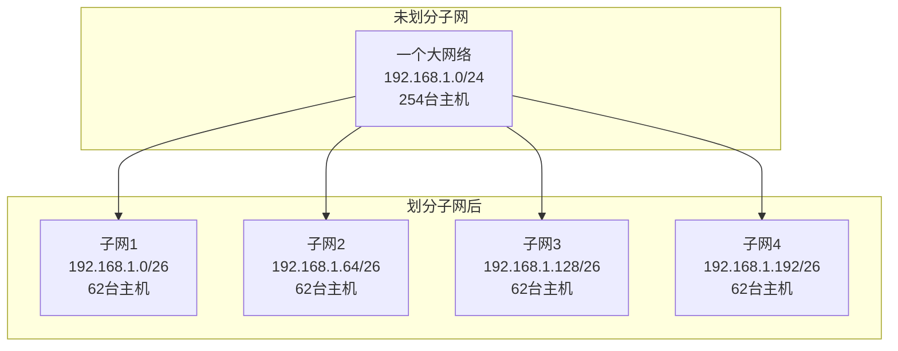
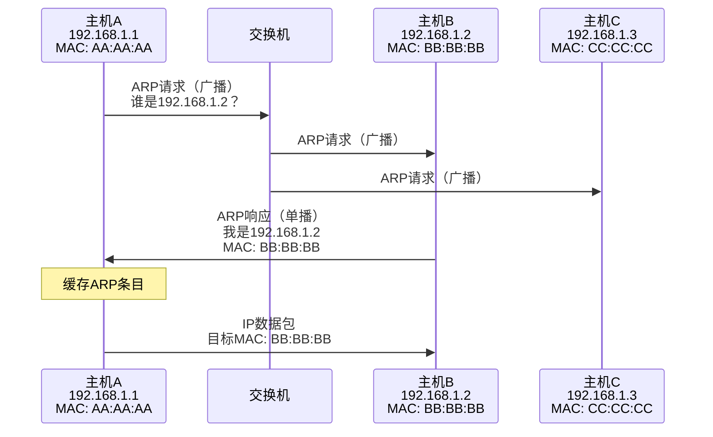
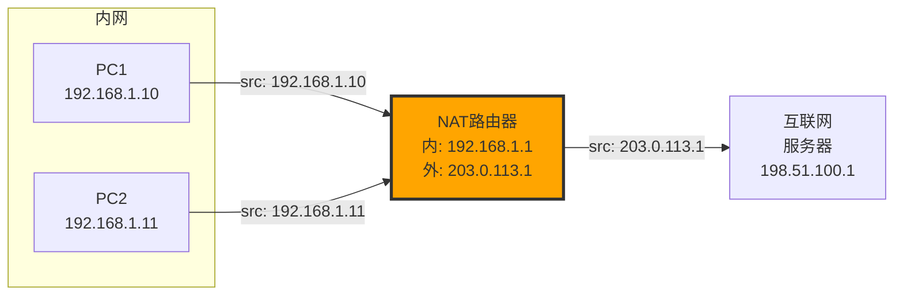

# IP协议详解 - 第三章：IP地址与子网划分

## 3.1 IP地址基础

### 3.1.1 IP地址的本质

IP地址是网络层的逻辑地址，用于在互联网中唯一标识一台主机或路由器的接口。


### 3.1.2 IPv4地址结构

IPv4地址是32位二进制数，通常用点分十进制表示：

```
二进制：11000000.10101000.00000001.00000001
十进制：192.168.1.1

每个八位组（octet）范围：0-255
```

## 3.2 IP地址分类

### 3.2.1 传统分类方法（Classful Addressing）

```
类别 A:
 0                   1                   2                   3
 0 1 2 3 4 5 6 7 8 9 0 1 2 3 4 5 6 7 8 9 0 1 2 3 4 5 6 7 8 9 0 1
+-+-+-+-+-+-+-+-+-+-+-+-+-+-+-+-+-+-+-+-+-+-+-+-+-+-+-+-+-+-+-+-+
|0|  网络号(7位) |              主机号(24位)                    |
+-+-+-+-+-+-+-+-+-+-+-+-+-+-+-+-+-+-+-+-+-+-+-+-+-+-+-+-+-+-+-+-+
范围: 1.0.0.0 - 126.255.255.255
网络数: 126个
每网络主机数: 16,777,214个

类别 B:
+-+-+-+-+-+-+-+-+-+-+-+-+-+-+-+-+-+-+-+-+-+-+-+-+-+-+-+-+-+-+-+-+
|1|0|      网络号(14位)       |         主机号(16位)            |
+-+-+-+-+-+-+-+-+-+-+-+-+-+-+-+-+-+-+-+-+-+-+-+-+-+-+-+-+-+-+-+-+
范围: 128.0.0.0 - 191.255.255.255
网络数: 16,384个
每网络主机数: 65,534个

类别 C:
+-+-+-+-+-+-+-+-+-+-+-+-+-+-+-+-+-+-+-+-+-+-+-+-+-+-+-+-+-+-+-+-+
|1|1|0|         网络号(21位)          |    主机号(8位)         |
+-+-+-+-+-+-+-+-+-+-+-+-+-+-+-+-+-+-+-+-+-+-+-+-+-+-+-+-+-+-+-+-+
范围: 192.0.0.0 - 223.255.255.255
网络数: 2,097,152个
每网络主机数: 254个

类别 D (组播):
+-+-+-+-+-+-+-+-+-+-+-+-+-+-+-+-+-+-+-+-+-+-+-+-+-+-+-+-+-+-+-+-+
|1|1|1|0|              组播地址(28位)                           |
+-+-+-+-+-+-+-+-+-+-+-+-+-+-+-+-+-+-+-+-+-+-+-+-+-+-+-+-+-+-+-+-+
范围: 224.0.0.0 - 239.255.255.255

类别 E (保留):
+-+-+-+-+-+-+-+-+-+-+-+-+-+-+-+-+-+-+-+-+-+-+-+-+-+-+-+-+-+-+-+-+
|1|1|1|1|0|                保留(27位)                           |
+-+-+-+-+-+-+-+-+-+-+-+-+-+-+-+-+-+-+-+-+-+-+-+-+-+-+-+-+-+-+-+-+
范围: 240.0.0.0 - 255.255.255.255
```

### 3.2.2 Linux中查看地址类别

```c
// 判断IP地址类别的宏定义
#define IN_CLASSA(a)      ((((long int) (a)) & 0x80000000) == 0)
#define IN_CLASSA_NET     0xff000000
#define IN_CLASSA_HOST    0x00ffffff
#define IN_CLASSA_MAX     128

#define IN_CLASSB(a)      ((((long int) (a)) & 0xc0000000) == 0x80000000)
#define IN_CLASSB_NET     0xffff0000
#define IN_CLASSB_HOST    0x0000ffff
#define IN_CLASSB_MAX     65536

#define IN_CLASSC(a)      ((((long int) (a)) & 0xe0000000) == 0xc0000000)
#define IN_CLASSC_NET     0xffffff00
#define IN_CLASSC_HOST    0x000000ff

#define IN_CLASSD(a)      ((((long int) (a)) & 0xf0000000) == 0xe0000000)
#define IN_MULTICAST(a)   IN_CLASSD(a)
```

## 3.3 特殊IP地址

### 3.3.1 特殊地址列表

| 地址            | 用途     | 说明               |
| --------------- | -------- | ------------------ |
| 0.0.0.0/8       | 本网络   | 表示"这个网络"     |
| 127.0.0.0/8     | 回环地址 | 本地回环测试       |
| 169.254.0.0/16  | 链路本地 | DHCP失败时自动配置 |
| 10.0.0.0/8      | 私有地址 | A类私有地址        |
| 172.16.0.0/12   | 私有地址 | B类私有地址        |
| 192.168.0.0/16  | 私有地址 | C类私有地址        |
| 224.0.0.0/4     | 组播地址 | D类地址            |
| 255.255.255.255 | 受限广播 | 本地网络广播       |

### 3.3.2 Linux中的特殊地址处理

```bash
# 查看回环接口
ip addr show lo

# 配置回环地址（通常自动配置）
sudo ip addr add 127.0.0.1/8 dev lo

# 查看路由表中的特殊路由
ip route show table local
```

## 3.4 子网划分（Subnetting）

### 3.4.1 为什么需要子网划分？



优势：

1. **减少广播域大小**
2. **提高网络安全性**
3. **简化网络管理**
4. **提高IP地址利用率**

### 3.4.2 子网掩码（Subnet Mask）

子网掩码用于区分IP地址中的网络部分和主机部分：

```
IP地址:     192.168.1.100    = 11000000.10101000.00000001.01100100
子网掩码:   255.255.255.0    = 11111111.11111111.11111111.00000000
                                ↑______网络部分______↑ ↑_主机部分_↑

网络地址:   192.168.1.0      (IP地址 AND 子网掩码)
广播地址:   192.168.1.255    (网络地址 OR 反向掩码)
```

### 3.4.3 CIDR表示法

CIDR（Classless Inter-Domain Routing）无类域间路由：

```
192.168.1.0/24  表示前24位是网络位
等价于子网掩码: 255.255.255.0

常用CIDR与子网掩码对照:
/8  = 255.0.0.0       = 16,777,214 个主机
/16 = 255.255.0.0     = 65,534 个主机
/24 = 255.255.255.0   = 254 个主机
/25 = 255.255.255.128 = 126 个主机
/26 = 255.255.255.192 = 62 个主机
/27 = 255.255.255.224 = 30 个主机
/28 = 255.255.255.240 = 14 个主机
/29 = 255.255.255.248 = 6 个主机
/30 = 255.255.255.252 = 2 个主机（点对点链路）
/31 = 255.255.255.254 = 0 个主机（特殊用途）
/32 = 255.255.255.255 = 主机路由
```

### 3.4.4 子网划分实例

将192.168.1.0/24划分为4个子网：

```python
#!/usr/bin/env python3
import ipaddress

# 原始网络
network = ipaddress.IPv4Network('192.168.1.0/24')
print(f"原始网络: {network}")
print(f"可用主机数: {network.num_addresses - 2}")

# 划分为4个子网（需要2位额外的网络位）
subnets = list(network.subnets(new_prefix=26))  # /24 -> /26

for i, subnet in enumerate(subnets, 1):
    print(f"\n子网{i}: {subnet}")
    print(f"  网络地址: {subnet.network_address}")
    print(f"  广播地址: {subnet.broadcast_address}")
    print(f"  第一个主机: {subnet.network_address + 1}")
    print(f"  最后一个主机: {subnet.broadcast_address - 1}")
    print(f"  可用主机数: {subnet.num_addresses - 2}")
```

## 3.5 Linux内核中的地址管理

### 3.5.1 地址数据结构

```c
// include/linux/inetdevice.h
struct in_ifaddr {
    struct hlist_node    hash;
    struct in_ifaddr    *ifa_next;
    struct in_device    *ifa_dev;
    struct rcu_head     rcu_head;
    __be32              ifa_local;    // 本地IP地址
    __be32              ifa_address;  // 对端地址（点对点）
    __be32              ifa_mask;     // 子网掩码
    __be32              ifa_broadcast;// 广播地址
    unsigned char       ifa_scope;    // 地址作用域
    unsigned char       ifa_prefixlen;// CIDR前缀长度
    __u32               ifa_flags;    // 地址标志
    char                ifa_label[IFNAMSIZ]; // 地址标签
};
```

### 3.5.2 添加和删除地址

```bash
# 添加IP地址
sudo ip addr add 192.168.1.100/24 dev eth0

# 添加多个IP（IP别名）
sudo ip addr add 192.168.1.101/24 dev eth0 label eth0:1

# 删除IP地址
sudo ip addr del 192.168.1.100/24 dev eth0

# 查看所有地址
ip addr show
```

内核实现：

```c
// net/ipv4/devinet.c
static int inet_rtm_newaddr(struct sk_buff *skb, struct nlmsghdr *nlh,
                           struct netlink_ext_ack *extack) {
    struct in_ifaddr *ifa;
    struct in_device *in_dev;
    struct net_device *dev;
    // ...

    ifa = inet_alloc_ifa();
    if (!ifa)
        return -ENOBUFS;

    // 设置地址参数
    ifa->ifa_local = nla_get_in_addr(tb[IFA_LOCAL]);
    ifa->ifa_address = nla_get_in_addr(tb[IFA_ADDRESS]);
    ifa->ifa_prefixlen = ifm->ifa_prefixlen;
    ifa->ifa_mask = inet_make_mask(ifm->ifa_prefixlen);

    // 添加到设备
    return __inet_insert_ifa(ifa, nlh, NETLINK_CB(skb).portid,
                            extack);
}
```

## 3.6 地址解析与ARP

### 3.6.1 ARP协议原理



### 3.6.2 Linux中的ARP操作

```bash
# 查看ARP缓存
arp -n
# 或
ip neigh show

# 添加静态ARP条目
sudo arp -s 192.168.1.100 00:11:22:33:44:55

# 删除ARP条目
sudo arp -d 192.168.1.100

# 清空ARP缓存
sudo ip neigh flush all

# 查看ARP统计
cat /proc/net/arp
```

### 3.6.3 内核ARP实现

```c
// net/ipv4/arp.c
static int arp_process(struct net *net, struct sock *sk,
                       struct sk_buff *skb) {
    struct arphdr *arp;
    unsigned char *arp_ptr;
    __be32 sip, tip;

    arp = arp_hdr(skb);

    // 解析ARP包
    arp_ptr = (unsigned char *)(arp + 1);
    sha = arp_ptr;  // 源MAC地址
    arp_ptr += dev->addr_len;
    memcpy(&sip, arp_ptr, 4);  // 源IP地址
    arp_ptr += 4;
    tha = arp_ptr;  // 目标MAC地址
    arp_ptr += dev->addr_len;
    memcpy(&tip, arp_ptr, 4);  // 目标IP地址

    if (arp->ar_op == htons(ARPOP_REQUEST)) {
        // 处理ARP请求
        if (tip == inet_addr_type(net, tip) == RTN_LOCAL) {
            // 这是询问我们的地址
            arp_send_dst(ARPOP_REPLY, ETH_P_ARP, sip,
                        dev, tip, sha, dev->dev_addr, sha, NULL);
        }
    } else if (arp->ar_op == htons(ARPOP_REPLY)) {
        // 处理ARP响应，更新邻居表
        neigh_update(n, sha, NUD_REACHABLE, NEIGH_UPDATE_F_OVERRIDE);
    }
    // ...
}
```

## 3.7 VLSM和路由汇总

### 3.7.1 可变长子网掩码（VLSM）

VLSM允许在同一个网络中使用不同长度的子网掩码：

```
企业网络规划示例:
总部:     192.168.0.0/25  (126主机) - 100个用户
分公司A:  192.168.0.128/26 (62主机)  - 50个用户
分公司B:  192.168.0.192/27 (30主机)  - 20个用户
点对点1:  192.168.0.224/30 (2主机)   - 路由器连接
点对点2:  192.168.0.228/30 (2主机)   - 路由器连接
预留:     192.168.0.232/29 (6主机)   - 未来扩展
```

### 3.7.2 路由汇总（Route Aggregation）

将多个网络汇总为一个超网：

```python
#!/usr/bin/env python3
import ipaddress

# 需要汇总的网络
networks = [
    ipaddress.IPv4Network('192.168.0.0/24'),
    ipaddress.IPv4Network('192.168.1.0/24'),
    ipaddress.IPv4Network('192.168.2.0/24'),
    ipaddress.IPv4Network('192.168.3.0/24'),
]

# 计算汇总网络
summary = ipaddress.collapse_addresses(networks)
for net in summary:
    print(f"汇总网络: {net}")  # 192.168.0.0/22

# 验证
for original in networks:
    for summary_net in summary:
        if original.subnet_of(summary_net):
            print(f"{original} 包含在 {summary_net} 中")
```

## 3.8 NAT（网络地址转换）

### 3.8.1 NAT工作原理



### 3.8.2 Linux中配置NAT

```bash
# 启用IP转发
echo 1 > /proc/sys/net/ipv4/ip_forward

# 配置SNAT（源NAT）
iptables -t nat -A POSTROUTING -s 192.168.1.0/24 -o eth0 -j MASQUERADE

# 配置DNAT（目标NAT）- 端口转发
iptables -t nat -A PREROUTING -p tcp --dport 80 -j DNAT --to 192.168.1.10:8080

# 查看NAT规则
iptables -t nat -L -v -n

# 查看连接跟踪表
conntrack -L
```

## 3.9 实践：网络规划案例

### 3.9.1 需求分析

某公司需要规划网络，要求：

- 总部：200台设备
- 3个分支：每个50台设备
- 服务器区：20台服务器
- DMZ区：10台设备
- 管理网络：5台设备

### 3.9.2 地址规划方案

```python
#!/usr/bin/env python3
import ipaddress

def plan_network(base_network, requirements):
    """
    根据需求规划子网
    """
    network = ipaddress.IPv4Network(base_network)
    print(f"基础网络: {network}\n")

    # 按需求大小排序（从大到小）
    sorted_reqs = sorted(requirements.items(),
                        key=lambda x: x[1],
                        reverse=True)

    current = network
    allocated = []

    for name, hosts_needed in sorted_reqs:
        # 计算需要的位数
        # 需要考虑网络地址和广播地址
        total_needed = hosts_needed + 2

        # 找到合适的前缀长度
        for prefix_len in range(32, 0, -1):
            test_net = ipaddress.IPv4Network(
                f"{current.network_address}/{prefix_len}"
            )
            if test_net.num_addresses >= total_needed:
                subnet = test_net
                break

        allocated.append((name, subnet))

        # 计算下一个可用网络
        next_addr = subnet.broadcast_address + 1
        if next_addr < network.broadcast_address:
            current = ipaddress.IPv4Network(
                f"{next_addr}/{network.prefixlen}"
            )

    # 输出规划结果
    for name, subnet in allocated:
        print(f"{name}:")
        print(f"  网络: {subnet}")
        print(f"  网关: {subnet.network_address + 1}")
        print(f"  可用主机: {subnet.network_address + 2} - "
              f"{subnet.broadcast_address - 1}")
        print(f"  主机数: {subnet.num_addresses - 2}\n")

# 执行规划
requirements = {
    "总部": 200,
    "分支1": 50,
    "分支2": 50,
    "分支3": 50,
    "服务器区": 20,
    "DMZ": 10,
    "管理网": 5
}

plan_network("10.0.0.0/16", requirements)
```

## 3.10 IPv6地址简介

虽然本教程主要讲解IPv4，但了解IPv6也很重要：

### 3.10.1 IPv6地址格式

```
完整格式: 2001:0db8:0000:0000:0008:0800:200c:417a
压缩格式: 2001:db8::8:800:200c:417a

特殊地址:
::1             - 回环地址（相当于127.0.0.1）
::              - 未指定地址（相当于0.0.0.0）
fe80::/10       - 链路本地地址
fc00::/7        - 唯一本地地址（私有地址）
ff00::/8        - 组播地址
```

### 3.10.2 Linux中的IPv6操作

```bash
# 查看IPv6地址
ip -6 addr show

# 添加IPv6地址
sudo ip -6 addr add 2001:db8::1/64 dev eth0

# 查看IPv6路由
ip -6 route show

# 禁用IPv6（如果需要）
sudo sysctl -w net.ipv6.conf.all.disable_ipv6=1
```

## 3.11 故障排查技巧

### 3.11.1 地址冲突检测

```bash
# 使用arping检测地址冲突
arping -D -I eth0 192.168.1.100

# 使用脚本扫描网段
#!/bin/bash
for ip in 192.168.1.{1..254}; do
    arping -c 1 -D -I eth0 $ip &> /dev/null
    if [ $? -eq 1 ]; then
        echo "$ip 存在冲突"
    fi
done
```

### 3.11.2 网络连通性测试

```bash
# 基本ping测试
ping -c 4 192.168.1.1

# 指定包大小测试MTU
ping -M do -s 1472 192.168.1.1

# 连续ping并统计
ping -f -c 1000 192.168.1.1

# 多路径测试
mtr 8.8.8.8
```

## 3.12 本章小结

IP地址是网络通信的基础，本章我们学习了：

1. **地址分类**：A、B、C、D、E类地址的特点和用途
2. **特殊地址**：私有地址、回环地址、广播地址等
3. **子网划分**：通过子网掩码灵活划分网络
4. **CIDR**：无类域间路由的表示和计算
5. **VLSM**：可变长子网掩码的应用
6. **NAT**：地址转换的原理和配置
7. **Linux实现**：内核如何管理IP地址

关键要点：

- 理解网络位和主机位的概念
- 掌握子网划分的计算方法
- 熟悉Linux中的地址管理命令
- 了解地址规划的最佳实践

## 思考与练习

1. 将172.16.0.0/16网络划分为能容纳500、200、100、50台主机的子网。
2. 编写程序验证一个IP地址是否属于指定的网络。
3. 使用iptables配置一个完整的NAT网关。
4. 分析你所在网络的地址规划，提出优化建议。
5. 研究Linux内核中IP地址的哈希表管理机制。

---

下一章：[IP路由原理](./04-routing.md)
