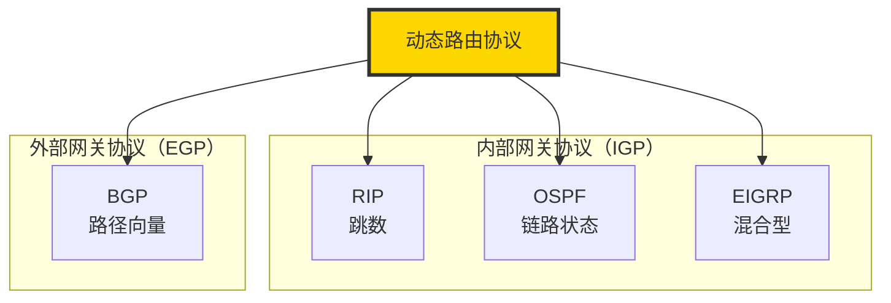

# IP协议详解 - 第四章：IP路由原理

## 4.1 路由基础概念

### 4.1.1 什么是路由？

路由是确定数据包从源到目的地路径的过程。每个路由器维护一个路由表，根据目标IP地址决定下一跳。


### 4.1.2 路由表结构

```bash
# 查看Linux路由表
ip route show

# 典型输出：
default via 192.168.1.1 dev eth0 proto dhcp metric 100
192.168.1.0/24 dev eth0 proto kernel scope link src 192.168.1.100
```

路由表条目包含：
- **目的网络**：要到达的网络
- **下一跳**：下一个路由器地址
- **出接口**：发送数据的网络接口
- **度量值**：路由优先级
- **协议**：路由来源

## 4.2 Linux路由表详解

### 4.2.1 多路由表系统

Linux支持多个路由表，用于策略路由：

```bash
# 查看所有路由表
cat /etc/iproute2/rt_tables
# 255    local       # 本地路由表
# 254    main        # 主路由表
# 253    default     # 默认路由表
# 0      unspec      # 未指定

# 查看特定路由表
ip route show table main
ip route show table local
```

### 4.2.2 路由表内核实现

```c
// include/net/ip_fib.h
struct fib_table {
    struct hlist_node   tb_hlist;
    u32                 tb_id;        // 路由表ID
    int                 tb_num_default;
    struct rcu_head     rcu;
    unsigned long       *tb_data;
    unsigned long       __data[];
};

// 路由表项
struct fib_info {
    struct hlist_node   fib_hash;
    struct hlist_node   fib_lhash;
    struct net          *fib_net;
    int                 fib_treeref;
    refcount_t          fib_clntref;
    unsigned int        fib_flags;
    unsigned char       fib_dead;
    unsigned char       fib_protocol;  // 路由协议
    unsigned char       fib_scope;     // 路由范围
    unsigned char       fib_type;      // 路由类型
    __be32              fib_prefsrc;   // 首选源地址
    u32                 fib_priority;  // 优先级
    struct dst_metrics  *fib_metrics;  // 度量值
    int                 fib_nhs;       // 下一跳数量
    struct fib_nh       fib_nh[];      // 下一跳数组
};
```

## 4.3 路由查找算法

### 4.3.1 最长前缀匹配（LPM）

路由查找使用最长前缀匹配算法：

```python
#!/usr/bin/env python3

class RouteTable:
    def __init__(self):
        self.routes = []

    def add_route(self, network, gateway, interface):
        """添加路由条目"""
        import ipaddress
        net = ipaddress.IPv4Network(network)
        self.routes.append({
            'network': net,
            'gateway': gateway,
            'interface': interface,
            'prefix_len': net.prefixlen
        })
        # 按前缀长度降序排序（最长前缀优先）
        self.routes.sort(key=lambda x: x['prefix_len'], reverse=True)

    def lookup(self, destination):
        """查找路由"""
        import ipaddress
        dst_addr = ipaddress.IPv4Address(destination)

        for route in self.routes:
            if dst_addr in route['network']:
                return route

        return None  # 无匹配路由

# 使用示例
rt = RouteTable()
rt.add_route('0.0.0.0/0', '192.168.1.1', 'eth0')      # 默认路由
rt.add_route('192.168.1.0/24', '0.0.0.0', 'eth0')     # 直连网络
rt.add_route('10.0.0.0/8', '192.168.1.254', 'eth0')   # 特定网络

# 查找路由
dst = '10.1.1.1'
route = rt.lookup(dst)
if route:
    print(f"目标 {dst}:")
    print(f"  匹配网络: {route['network']}")
    print(f"  网关: {route['gateway']}")
    print(f"  接口: {route['interface']}")
```

### 4.3.2 Linux内核路由查找

```c
// net/ipv4/route.c
struct rtable *ip_route_output_key_hash(struct net *net,
                                        struct flowi4 *fl4,
                                        const struct sk_buff *skb) {
    struct fib_result res = {
        .type = RTN_UNSPEC,
        .fi = NULL,
        .table = NULL,
        .tclassid = 0,
    };
    struct rtable *rth;

    // 查找路由缓存
    rth = ip_route_output_key_hash_rcu(net, fl4, &res, skb);

    // 如果缓存未命中，执行慢速路径
    if (!rth) {
        // FIB查找
        err = fib_lookup(net, fl4, &res, 0);
        if (err != 0) {
            // 无路由
            rth = ERR_PTR(err);
            goto out;
        }

        // 创建路由缓存项
        rth = __mkroute_output(&res, fl4, orig_oif, dev_out, flags);
    }

out:
    return rth;
}
```

## 4.4 静态路由配置

### 4.4.1 添加静态路由

```bash
# 添加到特定网络的路由
sudo ip route add 10.0.0.0/8 via 192.168.1.254 dev eth0

# 添加默认路由
sudo ip route add default via 192.168.1.1 dev eth0

# 添加主机路由（/32）
sudo ip route add 10.1.1.1/32 via 192.168.1.254 dev eth0

# 添加等价多路径路由（ECMP）
sudo ip route add 10.0.0.0/8 \
    nexthop via 192.168.1.1 weight 1 \
    nexthop via 192.168.1.2 weight 1

# 添加黑洞路由（丢弃流量）
sudo ip route add blackhole 10.0.0.0/8

# 添加禁止路由（返回ICMP禁止）
sudo ip route add prohibit 10.0.0.0/8
```

### 4.4.2 删除和修改路由

```bash
# 删除路由
sudo ip route del 10.0.0.0/8

# 修改路由（replace = del + add）
sudo ip route replace 10.0.0.0/8 via 192.168.1.100 dev eth0

# 修改默认路由
sudo ip route replace default via 192.168.1.1

# 刷新路由缓存
sudo ip route flush cache
```

### 4.4.3 持久化路由配置

```bash
# Debian/Ubuntu: /etc/network/interfaces
auto eth0
iface eth0 inet static
    address 192.168.1.100
    netmask 255.255.255.0
    gateway 192.168.1.1
    up ip route add 10.0.0.0/8 via 192.168.1.254
    down ip route del 10.0.0.0/8

# RHEL/CentOS: /etc/sysconfig/network-scripts/route-eth0
10.0.0.0/8 via 192.168.1.254
172.16.0.0/16 via 192.168.1.253

# 使用NetworkManager
nmcli connection modify eth0 +ipv4.routes "10.0.0.0/8 192.168.1.254"
```

## 4.5 动态路由协议

### 4.5.1 常见动态路由协议



### 4.5.2 OSPF配置示例（使用Quagga/FRR）

```bash
# 安装FRRouting
sudo apt-get install frr

# 启用OSPF
sudo sed -i 's/ospfd=no/ospfd=yes/' /etc/frr/daemons
sudo systemctl restart frr

# 配置OSPF（/etc/frr/ospfd.conf）
router ospf
 ospf router-id 1.1.1.1
 network 192.168.1.0/24 area 0.0.0.0
 network 10.0.0.0/8 area 0.0.0.1
!
interface eth0
 ip ospf hello-interval 10
 ip ospf dead-interval 40
!

# 查看OSPF邻居
vtysh -c "show ip ospf neighbor"

# 查看OSPF路由
vtysh -c "show ip ospf route"
```

## 4.6 策略路由

### 4.6.1 基于源地址的路由

```bash
# 创建自定义路由表
echo "100 custom" >> /etc/iproute2/rt_tables

# 在自定义表中添加路由
sudo ip route add default via 192.168.2.1 table custom

# 添加规则：从特定源地址使用自定义表
sudo ip rule add from 192.168.1.100 table custom

# 查看路由规则
ip rule show

# 测试路由路径
ip route get 8.8.8.8 from 192.168.1.100
```

### 4.6.2 基于标记的路由

```bash
# 使用iptables标记数据包
sudo iptables -t mangle -A PREROUTING -p tcp --dport 80 -j MARK --set-mark 1

# 基于标记选择路由表
sudo ip rule add fwmark 1 table custom

# 配置连接标记（保持连接使用相同路径）
sudo iptables -t mangle -A PREROUTING -j CONNMARK --restore-mark
sudo iptables -t mangle -A POSTROUTING -j CONNMARK --save-mark
```

## 4.7 路由度量与优先级

### 4.7.1 管理距离（Administrative Distance）

不同路由来源的默认优先级：

| 路由来源 | 管理距离 | Linux metric |
|---------|---------|-------------|
| 直连网络 | 0 | 0 |
| 静态路由 | 1 | 1 |
| OSPF | 110 | 20 |
| RIP | 120 | 100 |
| DHCP | - | 100 |

### 4.7.2 设置路由度量值

```bash
# 添加路由时指定度量值
sudo ip route add 10.0.0.0/8 via 192.168.1.1 metric 50

# 多个路由到同一目标，度量值决定优先级
sudo ip route add 10.0.0.0/8 via 192.168.1.1 metric 10  # 优先
sudo ip route add 10.0.0.0/8 via 192.168.1.2 metric 20  # 备份

# 查看路由度量值
ip route show
```

## 4.8 IP转发与网关功能

### 4.8.1 启用IP转发

```bash
# 临时启用
sudo sysctl -w net.ipv4.ip_forward=1

# 永久启用（编辑/etc/sysctl.conf）
net.ipv4.ip_forward = 1

# 应用配置
sudo sysctl -p

# 查看当前状态
cat /proc/sys/net/ipv4/ip_forward
```

### 4.8.2 Linux内核转发路径

```c
// net/ipv4/ip_forward.c
int ip_forward(struct sk_buff *skb) {
    struct iphdr *iph;
    struct rtable *rt;
    struct ip_options *opt = &(IPCB(skb)->opt);

    // 不转发本地生成的包
    if (skb->pkt_type != PACKET_HOST)
        goto drop;

    // 获取路由信息
    rt = skb_rtable(skb);
    if (rt->rt_type == RTN_LOCAL) {
        // 目标是本机，不应该转发
        goto drop;
    }

    // TTL检查和递减
    if (ip_hdr(skb)->ttl <= 1) {
        icmp_send(skb, ICMP_TIME_EXCEEDED,
                 ICMP_EXC_TTL, 0);
        goto drop;
    }

    // 更新TTL
    ip_decrease_ttl(ip_hdr(skb));

    // 执行netfilter FORWARD链
    return NF_HOOK(NFPROTO_IPV4, NF_INET_FORWARD,
                   net, NULL, skb, skb->dev,
                   rt->dst.dev, ip_forward_finish);
drop:
    kfree_skb(skb);
    return NET_RX_DROP;
}
```

## 4.9 路由环路检测与预防

### 4.9.1 TTL机制

```python
#!/usr/bin/env python3
from scapy.all import *

def trace_route(destination, max_hops=30):
    """实现简单的traceroute"""
    for ttl in range(1, max_hops + 1):
        # 构造ICMP包，设置TTL
        packet = IP(dst=destination, ttl=ttl) / ICMP()

        # 发送并接收响应
        reply = sr1(packet, timeout=1, verbose=0)

        if reply is None:
            print(f"{ttl}: * * *")
        elif reply.type == 11:  # TTL超时
            print(f"{ttl}: {reply.src}")
        elif reply.type == 0:   # 到达目标
            print(f"{ttl}: {reply.src} [目标到达]")
            break

# 使用示例
trace_route("8.8.8.8")
```

### 4.9.2 路由环路检测工具

```bash
# 使用mtr进行持续路由监控
mtr -r -c 100 google.com

# 使用traceroute检测路由环路
traceroute -m 30 8.8.8.8

# 监控路由表变化
ip monitor route
```

## 4.10 高级路由功能

### 4.10.1 等价多路径（ECMP）

```bash
# 配置ECMP负载均衡
sudo ip route add 10.0.0.0/8 \
    nexthop via 192.168.1.1 dev eth0 weight 1 \
    nexthop via 192.168.1.2 dev eth0 weight 1

# 验证ECMP
ip route show 10.0.0.0/8

# 查看负载均衡效果
for i in {1..10}; do
    ip route get 10.0.0.$i | grep via
done
```

### 4.10.2 路由聚合与汇总

```python
#!/usr/bin/env python3
import ipaddress

def summarize_routes(routes):
    """路由聚合示例"""
    networks = []
    for route in routes:
        networks.append(ipaddress.IPv4Network(route))

    # 执行聚合
    summarized = ipaddress.collapse_addresses(networks)

    print("原始路由：")
    for route in routes:
        print(f"  {route}")

    print("\n聚合后：")
    for summary in summarized:
        print(f"  {summary}")

    # 计算节省的路由条目
    saved = len(routes) - len(list(summarized))
    print(f"\n节省了 {saved} 条路由条目")

# 示例
routes = [
    "192.168.0.0/24",
    "192.168.1.0/24",
    "192.168.2.0/24",
    "192.168.3.0/24"
]

summarize_routes(routes)
```

## 4.11 路由故障排查

### 4.11.1 常见问题诊断

```bash
# 1. 检查路由表
ip route show
ip route get 目标IP

# 2. 检查ARP表
ip neigh show

# 3. 使用tcpdump跟踪数据包
sudo tcpdump -i any -n host 目标IP

# 4. 检查防火墙规则
sudo iptables -L -v -n

# 5. 检查反向路径过滤（RPF）
cat /proc/sys/net/ipv4/conf/all/rp_filter

# 6. 路由缓存统计
cat /proc/net/stat/rt_cache
```

### 4.11.2 诊断脚本

```bash
#!/bin/bash
# route_diag.sh - 路由诊断脚本

TARGET=$1

if [ -z "$TARGET" ]; then
    echo "用法: $0 <目标IP或域名>"
    exit 1
fi

echo "=== 路由诊断: $TARGET ==="

# DNS解析
echo -e "\n1. DNS解析:"
host $TARGET

# 路由查找
echo -e "\n2. 路由查找:"
ip route get $TARGET

# Ping测试
echo -e "\n3. 连通性测试:"
ping -c 4 $TARGET

# 路径追踪
echo -e "\n4. 路径追踪:"
traceroute -n $TARGET

# ARP检查（如果是本地网络）
echo -e "\n5. ARP表:"
ip neigh show | grep $TARGET

# 路由表
echo -e "\n6. 路由表摘要:"
ip route show | head -10

echo -e "\n=== 诊断完成 ==="
```

## 4.12 路由性能优化

### 4.12.1 内核参数调优

```bash
# 路由缓存大小
sudo sysctl -w net.ipv4.route.max_size=8388608

# 垃圾回收阈值
sudo sysctl -w net.ipv4.route.gc_thresh=65536

# 路由缓存刷新频率
sudo sysctl -w net.ipv4.route.gc_interval=60

# ARP缓存优化
sudo sysctl -w net.ipv4.neigh.default.gc_thresh1=1024
sudo sysctl -w net.ipv4.neigh.default.gc_thresh2=2048
sudo sysctl -w net.ipv4.neigh.default.gc_thresh3=4096

# 查看路由缓存统计
cat /proc/net/stat/rt_cache
```

### 4.12.2 硬件加速

```bash
# 查看网卡offload功能
ethtool -k eth0 | grep -E "gro|gso|tso"

# 启用通用接收卸载（GRO）
sudo ethtool -K eth0 gro on

# 启用通用分段卸载（GSO）
sudo ethtool -K eth0 gso on
```

## 4.13 容器与虚拟化环境的路由

### 4.13.1 Docker网络路由

```bash
# 查看Docker网络
docker network ls

# 检查Docker bridge路由
ip route show | grep docker0

# 查看iptables NAT规则
sudo iptables -t nat -L DOCKER -v -n

# 创建自定义网络
docker network create --subnet=172.20.0.0/16 mynet

# 容器间路由测试
docker run --rm --network mynet alpine ping 172.20.0.2
```

### 4.13.2 网络命名空间路由

```bash
# 创建网络命名空间
sudo ip netns add ns1
sudo ip netns add ns2

# 创建veth对
sudo ip link add veth0 type veth peer name veth1

# 将接口移入命名空间
sudo ip link set veth0 netns ns1
sudo ip link set veth1 netns ns2

# 配置地址和路由
sudo ip netns exec ns1 ip addr add 10.0.0.1/24 dev veth0
sudo ip netns exec ns2 ip addr add 10.0.0.2/24 dev veth1

# 启用接口
sudo ip netns exec ns1 ip link set veth0 up
sudo ip netns exec ns2 ip link set veth1 up

# 测试连通性
sudo ip netns exec ns1 ping 10.0.0.2
```

## 4.14 本章小结

IP路由是网络通信的核心机制，本章我们学习了：

1. **路由基础**：路由表结构、查找算法
2. **静态路由**：配置、管理和持久化
3. **动态路由**：OSPF、BGP等协议基础
4. **策略路由**：基于源地址、标记的高级路由
5. **Linux实现**：内核路由查找和转发机制
6. **故障排查**：诊断工具和方法
7. **性能优化**：内核参数和硬件加速

关键要点：
- 最长前缀匹配是路由查找的核心算法
- Linux支持灵活的多路由表策略路由
- TTL机制防止路由环路
- 合理的路由规划能提高网络性能

## 思考与练习

1. 实现一个简单的路由表查找程序，支持最长前缀匹配。
2. 配置一个Linux系统作为路由器，连接两个不同的网络。
3. 使用策略路由实现基于应用的流量分流。
4. 分析traceroute的实现原理，编写简化版本。
5. 研究Linux内核的FIB (Forwarding Information Base) trie结构。

---

下一章：[IP分片与重组](./05-fragmentation.md)