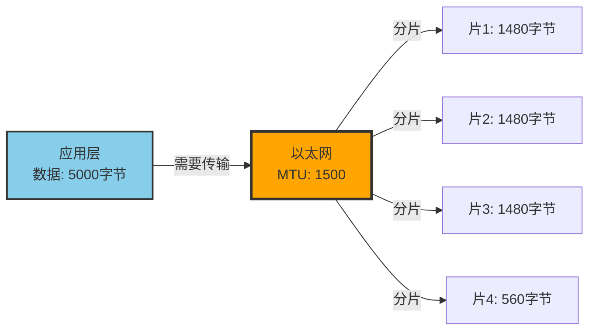
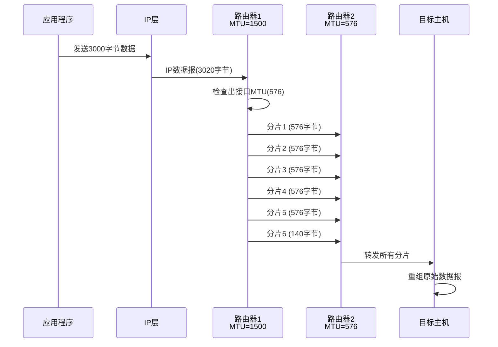
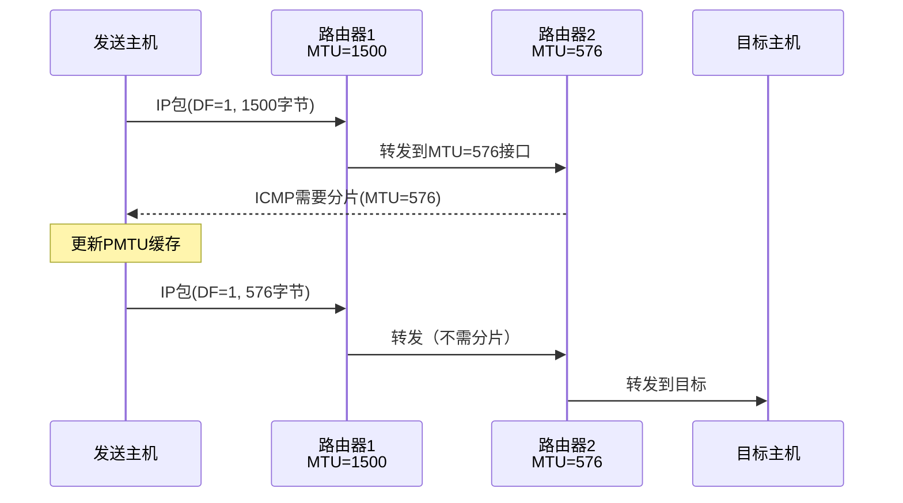

# IP协议详解 - 第五章：IP分片与重组

## 5.1 为什么需要分片？

### 5.1.1 MTU不匹配问题

不同网络技术有不同的最大传输单元（MTU）限制：



常见网络的MTU值：

| 网络类型 | MTU（字节） | 说明 |
|---------|------------|------|
| 以太网 | 1500 | 最常见的局域网 |
| WiFi 802.11 | 2304 | 无线局域网 |
| PPPoE | 1492 | DSL宽带常用 |
| 令牌环 | 4464 | IBM Token Ring |
| FDDI | 4352 | 光纤分布式数据接口 |
| 回环接口 | 65535 | 本地回环 |
| IPv6隧道 | 1280 | IPv6最小MTU |

### 5.1.2 分片的必要性

```python
#!/usr/bin/env python3

def calculate_fragmentation(data_size, mtu, ip_header_size=20):
    """计算IP分片"""
    # 每个分片的最大数据载荷
    max_payload = mtu - ip_header_size

    # 分片偏移必须是8字节的倍数
    fragment_size = (max_payload // 8) * 8

    # 计算需要的分片数
    fragments = []
    offset = 0
    remaining = data_size

    while remaining > 0:
        if remaining > fragment_size:
            # 不是最后一个分片
            frag_data = fragment_size
            more_fragments = True
        else:
            # 最后一个分片
            frag_data = remaining
            more_fragments = False

        fragments.append({
            'offset': offset // 8,  # 以8字节为单位
            'size': frag_data,
            'more_fragments': more_fragments
        })

        offset += frag_data
        remaining -= frag_data

    return fragments

# 示例：5000字节数据通过MTU=1500的网络
fragments = calculate_fragmentation(5000, 1500)
for i, frag in enumerate(fragments, 1):
    print(f"分片{i}: 偏移={frag['offset']*8}, "
          f"大小={frag['size']}, MF={frag['more_fragments']}")
```

## 5.2 IP分片机制

### 5.2.1 分片相关字段

IP首部中与分片相关的字段：

```text
标识（Identification）- 16位
  同一数据报的所有分片具有相同标识

标志（Flags）- 3位
  Bit 0: 保留，必须为0
  Bit 1 (DF): Don't Fragment - 不分片标志
  Bit 2 (MF): More Fragments - 更多分片标志

分片偏移（Fragment Offset）- 13位
  指示分片在原始数据报中的位置（以8字节为单位）
```

### 5.2.2 分片过程



### 5.2.3 Linux内核分片实现

```c
// net/ipv4/ip_output.c
static int ip_fragment(struct net *net, struct sock *sk,
                      struct sk_buff *skb,
                      unsigned int mtu,
                      int (*output)(struct net *, struct sock *,
                                   struct sk_buff *)) {
    struct iphdr *iph = ip_hdr(skb);
    unsigned int hlen = iph->ihl * 4;
    unsigned int len = ntohs(iph->tot_len);
    unsigned int left = len - hlen;  // 剩余数据长度
    unsigned int offset = 0;
    int nfrags = 0;

    // 检查DF标志
    if ((iph->frag_off & htons(IP_DF)) && !skb->ignore_df) {
        // 设置了DF标志，发送ICMP需要分片消息
        icmp_send(skb, ICMP_DEST_UNREACH, ICMP_FRAG_NEEDED,
                 htonl(mtu));
        kfree_skb(skb);
        return -EMSGSIZE;
    }

    // 计算分片大小（必须是8的倍数）
    unsigned int mtu_data = mtu - hlen;
    unsigned int fragsz = (mtu_data & ~7);

    // 创建分片
    while (left > 0) {
        struct sk_buff *skb2;
        unsigned int fraglen;

        if (left > mtu_data) {
            fraglen = fragsz;
            skb2 = alloc_skb(mtu, GFP_ATOMIC);
        } else {
            fraglen = left;
            skb2 = alloc_skb(hlen + fraglen, GFP_ATOMIC);
        }

        // 复制IP首部
        struct iphdr *iph2 = ip_hdr(skb2);
        *iph2 = *iph;

        // 设置分片字段
        iph2->frag_off = htons(offset >> 3);
        if (left > mtu_data)
            iph2->frag_off |= htons(IP_MF);  // 设置MF标志
        iph2->tot_len = htons(hlen + fraglen);

        // 复制数据
        skb_copy_bits(skb, hlen + offset, skb2->data + hlen, fraglen);

        // 重新计算校验和
        ip_send_check(iph2);

        // 发送分片
        output(net, sk, skb2);

        offset += fraglen;
        left -= fraglen;
        nfrags++;
    }

    kfree_skb(skb);
    return 0;
}
```

## 5.3 IP重组机制

### 5.3.1 重组过程

目标主机负责将分片重组为原始数据报：

```python
#!/usr/bin/env python3

class IPReassembler:
    def __init__(self):
        self.fragments = {}  # {(src, dst, id, proto): [fragments]}
        self.timers = {}     # 重组定时器

    def add_fragment(self, src, dst, id, proto, offset, data, more_fragments):
        """添加一个分片"""
        key = (src, dst, id, proto)

        if key not in self.fragments:
            self.fragments[key] = []
            # 启动30秒定时器
            self.timers[key] = time.time() + 30

        # 添加分片
        self.fragments[key].append({
            'offset': offset,
            'data': data,
            'more_fragments': more_fragments
        })

        # 尝试重组
        return self.try_reassemble(key)

    def try_reassemble(self, key):
        """尝试重组数据报"""
        fragments = self.fragments[key]

        # 按偏移排序
        fragments.sort(key=lambda x: x['offset'])

        # 检查是否有第一个分片（offset=0）
        if fragments[0]['offset'] != 0:
            return None

        # 检查是否收到最后一个分片
        has_last = any(not f['more_fragments'] for f in fragments)
        if not has_last:
            return None

        # 检查分片是否连续
        reassembled = bytearray()
        expected_offset = 0

        for frag in fragments:
            if frag['offset'] != expected_offset:
                return None  # 有缺失的分片

            reassembled.extend(frag['data'])
            expected_offset = frag['offset'] + len(frag['data'])

            if not frag['more_fragments']:
                # 这是最后一个分片，重组完成
                del self.fragments[key]
                del self.timers[key]
                return bytes(reassembled)

        return None  # 还需要更多分片

    def cleanup_expired(self):
        """清理超时的重组缓冲区"""
        current_time = time.time()
        expired_keys = [k for k, t in self.timers.items()
                       if t < current_time]

        for key in expired_keys:
            print(f"重组超时: {key}")
            # 可以发送ICMP时间超时消息
            del self.fragments[key]
            del self.timers[key]
```

### 5.3.2 Linux内核重组实现

```c
// net/ipv4/ip_fragment.c
int ip_defrag(struct net *net, struct sk_buff *skb, u32 user) {
    struct net_device *dev = skb->dev;
    struct ipq *qp;
    int ret;

    // 查找或创建重组队列
    qp = ip_find(net, ip_hdr(skb), user, vif);
    if (qp) {
        spin_lock(&qp->lock);
        ret = ip_frag_queue(qp, skb);
        spin_unlock(&qp->lock);

        if (ret == -EINPROGRESS)
            return ret;  // 还需要更多分片

        // 重组完成
        ret = ip_frag_reasm(qp, skb, dev);
        ipq_put(qp);
        return ret;
    }

    return -ENOMEM;
}

// 将分片加入队列
static int ip_frag_queue(struct ipq *qp, struct sk_buff *skb) {
    struct iphdr *iph = ip_hdr(skb);
    int offset = ntohs(iph->frag_off) & IP_OFFSET;
    int end = offset + skb->len - iph->ihl * 4;
    int flags = ntohs(iph->frag_off) & ~IP_OFFSET;

    // 检查重复分片
    if (ip_frag_too_far(qp) || ip_frag_reinit(qp))
        goto drop;

    // 按偏移插入分片
    prev = qp->fragments_tail;
    if (!prev || prev->offset < offset) {
        // 添加到末尾
        qp->fragments_tail = skb;
    } else {
        // 找到正确位置插入
        // ...
    }

    // 检查是否可以重组
    if (qp->flags == (INET_FRAG_FIRST_IN | INET_FRAG_LAST_IN) &&
        qp->meat == qp->len) {
        // 所有分片都已到达
        return ip_frag_reasm(qp, skb, dev);
    }

    return -EINPROGRESS;  // 继续等待更多分片
}
```

## 5.4 路径MTU发现

### 5.4.1 PMTU原理

路径MTU发现（Path MTU Discovery）避免了分片：



### 5.4.2 Linux中的PMTU

```bash
# 查看PMTU缓存
ip route show cache

# 清除PMTU缓存
sudo ip route flush cache

# 启用/禁用PMTU发现
sudo sysctl -w net.ipv4.ip_no_pmtu_disc=0  # 0=启用，1=禁用

# 设置MTU老化时间
sudo sysctl -w net.ipv4.route.mtu_expires=600  # 秒

# 手动探测PMTU
ping -M do -s 1472 目标IP  # -M do设置DF标志
```

### 5.4.3 PMTU黑洞问题

有时ICMP被过滤，导致PMTU发现失败：

```bash
# 启用PMTU黑洞检测
sudo sysctl -w net.ipv4.tcp_mtu_probing=1

# 设置MSS钳制（解决PMTU黑洞）
sudo iptables -t mangle -A FORWARD -p tcp --tcp-flags SYN,RST SYN \
    -j TCPMSS --clamp-mss-to-pmtu

# 或设置固定MSS
sudo iptables -t mangle -A FORWARD -p tcp --tcp-flags SYN,RST SYN \
    -j TCPMSS --set-mss 1400
```

## 5.5 分片攻击与防护

### 5.5.1 常见分片攻击

#### 1. Teardrop攻击
发送重叠的IP分片：

```python
#!/usr/bin/env python3
# 仅用于教育目的，不要用于实际攻击

from scapy.all import *

def teardrop_demo(target):
    """演示Teardrop攻击原理（已被现代系统防护）"""
    # 第一个分片
    ip1 = IP(dst=target, id=12345, flags="MF")
    udp1 = UDP(dport=80)
    pkt1 = ip1/udp1/("X"*10)

    # 第二个分片（重叠）
    ip2 = IP(dst=target, id=12345, frag=1, flags=0)  # 偏移=8字节
    pkt2 = ip2/("X"*20)  # 但包含20字节，造成重叠

    print("警告：这只是演示，现代系统已防护此类攻击")
    # send([pkt1, pkt2])  # 不实际发送
```

#### 2. 分片炸弹
发送大量小分片耗尽资源：

```python
def fragment_flood_demo(target):
    """演示分片洪水攻击原理"""
    for i in range(1000):
        # 每个"数据报"只发送第一个分片
        ip = IP(dst=target, id=i, flags="MF", frag=0)
        udp = UDP(dport=80)
        pkt = ip/udp/("X"*8)
        # 永远不发送剩余分片，导致资源占用
        print(f"分片 {i} (不会发送完整数据报)")
```

### 5.5.2 Linux防护机制

```bash
# 1. 限制重组缓冲区大小
sudo sysctl -w net.ipv4.ipfrag_high_thresh=4194304  # 4MB
sudo sysctl -w net.ipv4.ipfrag_low_thresh=3145728   # 3MB

# 2. 限制重组时间
sudo sysctl -w net.ipv4.ipfrag_time=30  # 30秒

# 3. 限制每个源的最大重组队列
sudo sysctl -w net.ipv4.ipfrag_max_dist=64

# 4. 使用iptables过滤异常分片
# 丢弃过小的分片
sudo iptables -A INPUT -f -m length --length 0:28 -j DROP

# 限制分片速率
sudo iptables -A INPUT -f -m limit --limit 100/s -j ACCEPT
sudo iptables -A INPUT -f -j DROP
```

## 5.6 分片性能优化

### 5.6.1 避免分片的最佳实践

```python
#!/usr/bin/env python3
import socket
import struct

def set_df_flag(sock):
    """设置DF标志，避免分片"""
    # 对于IPv4
    IP_PMTUDISC_DO = 2
    sock.setsockopt(socket.IPPROTO_IP,
                   socket.IP_MTU_DISCOVER,
                   IP_PMTUDISC_DO)

def get_path_mtu(sock):
    """获取路径MTU"""
    # Linux特定
    IP_MTU = 14
    mtu = sock.getsockopt(socket.IPPROTO_IP, IP_MTU)
    return mtu

def optimal_send(sock, data, remote_addr):
    """根据PMTU优化发送"""
    # 设置DF标志
    set_df_flag(sock)

    try:
        # 获取路径MTU
        mtu = get_path_mtu(sock)
        ip_header = 20
        udp_header = 8
        max_payload = mtu - ip_header - udp_header

        # 分块发送
        for i in range(0, len(data), max_payload):
            chunk = data[i:i+max_payload]
            sock.sendto(chunk, remote_addr)
            print(f"发送 {len(chunk)} 字节（MTU={mtu}）")

    except socket.error as e:
        if e.errno == 90:  # Message too long
            print("需要减小数据包大小")
```

### 5.6.2 TCP与分片

TCP通过MSS（Maximum Segment Size）避免分片：

```bash
# 查看TCP连接的MSS
ss -i | grep mss

# 示例输出：
# mss:1448 pmtu:1500 rcvmss:536 advmss:1448

# 设置TCP MSS
sudo sysctl -w net.ipv4.tcp_base_mss=1024

# 查看TCP分段卸载（TSO）
ethtool -k eth0 | grep tcp-segmentation
```

## 5.7 实验：观察分片行为

### 5.7.1 创建分片场景

```bash
#!/bin/bash
# fragment_test.sh

# 1. 创建虚拟网络环境
sudo ip netns add ns1
sudo ip netns add ns2

# 2. 创建veth对
sudo ip link add veth0 type veth peer name veth1

# 3. 配置命名空间
sudo ip link set veth0 netns ns1
sudo ip link set veth1 netns ns2

# 4. 配置IP和MTU
sudo ip netns exec ns1 ip addr add 10.0.0.1/24 dev veth0
sudo ip netns exec ns1 ip link set veth0 up
sudo ip netns exec ns1 ip link set veth0 mtu 1500

sudo ip netns exec ns2 ip addr add 10.0.0.2/24 dev veth1
sudo ip netns exec ns2 ip link set veth1 up
sudo ip netns exec ns2 ip link set veth1 mtu 576  # 小MTU触发分片

# 5. 测试分片
echo "=== 测试分片 ==="
sudo ip netns exec ns1 ping -M do -s 1000 10.0.0.2  # 将失败（DF=1）
sudo ip netns exec ns1 ping -M want -s 1000 10.0.0.2  # 将成功（允许分片）

# 6. 使用tcpdump观察
sudo ip netns exec ns2 tcpdump -i veth1 -n -v &
TCPDUMP_PID=$!

sleep 2
sudo ip netns exec ns1 ping -M want -s 2000 -c 1 10.0.0.2

# 7. 清理
sleep 2
sudo kill $TCPDUMP_PID
sudo ip netns del ns1
sudo ip netns del ns2
```

### 5.7.2 分析分片数据

```python
#!/usr/bin/env python3
from scapy.all import *

def analyze_fragments(pcap_file):
    """分析pcap文件中的IP分片"""
    packets = rdpcap(pcap_file)
    fragments = {}

    for pkt in packets:
        if IP in pkt:
            ip = pkt[IP]
            key = (ip.src, ip.dst, ip.id, ip.proto)

            if key not in fragments:
                fragments[key] = []

            fragments[key].append({
                'offset': ip.frag * 8,
                'mf': bool(ip.flags & 0x1),
                'size': ip.len - ip.ihl * 4,
                'ttl': ip.ttl
            })

    # 输出分析结果
    for key, frags in fragments.items():
        src, dst, id, proto = key
        print(f"\n数据报: {src} -> {dst}, ID={id}, Proto={proto}")
        frags.sort(key=lambda x: x['offset'])

        total_size = 0
        for i, f in enumerate(frags, 1):
            print(f"  分片{i}: offset={f['offset']}, "
                  f"size={f['size']}, MF={f['mf']}, TTL={f['ttl']}")
            total_size = max(total_size, f['offset'] + f['size'])

        print(f"  原始数据大小: {total_size} 字节")

# 使用示例
analyze_fragments("capture.pcap")
```

## 5.8 IPv6与分片

### 5.8.1 IPv6分片的不同

IPv6只在源主机分片，路由器不分片：

```bash
# IPv6最小MTU是1280字节
# 使用ICMPv6 Packet Too Big消息进行PMTU发现

# 测试IPv6 PMTU
ping6 -M do -s 1400 2001:db8::1

# 查看IPv6 PMTU缓存
ip -6 route show cache
```

### 5.8.2 IPv6分片首部

IPv6使用独立的分片扩展首部：

```c
struct frag_hdr {
    __u8    nexthdr;      // 下一个首部
    __u8    reserved;     // 保留
    __be16  frag_off;     // 分片偏移和标志
    __be32  identification; // 标识
};
```

## 5.9 应用层考虑

### 5.9.1 应用层分片策略

```python
#!/usr/bin/env python3

class ApplicationFragmenter:
    """应用层分片器"""

    def __init__(self, mtu=1400):
        self.mtu = mtu
        # 减去各层首部开销
        self.max_payload = mtu - 20 - 8 - 8  # IP + UDP + 自定义首部

    def fragment(self, data):
        """应用层分片"""
        fragments = []
        total_fragments = (len(data) + self.max_payload - 1) // self.max_payload
        seq = 0

        for i in range(0, len(data), self.max_payload):
            chunk = data[i:i+self.max_payload]
            header = struct.pack('!HHH',
                               seq,  # 序列号
                               total_fragments,  # 总分片数
                               i // self.max_payload)  # 分片索引
            fragments.append(header + chunk)
            seq += 1

        return fragments

    def reassemble(self, fragments):
        """应用层重组"""
        # 解析并排序分片
        sorted_frags = []
        for frag in fragments:
            seq, total, index = struct.unpack('!HHH', frag[:6])
            sorted_frags.append((index, frag[6:]))

        sorted_frags.sort()

        # 重组数据
        return b''.join(data for _, data in sorted_frags)
```

### 5.9.2 分片对应用性能的影响

```bash
# 测量分片对性能的影响
#!/bin/bash

echo "=== 测试不同MTU下的性能 ==="

for mtu in 576 1000 1400 1500 9000; do
    echo -n "MTU=$mtu: "
    sudo ip link set dev eth0 mtu $mtu
    iperf3 -c server -t 10 -f m | grep sender | awk '{print $7 " Mbits/sec"}'
done

# 恢复默认MTU
sudo ip link set dev eth0 mtu 1500
```

## 5.10 故障排查

### 5.10.1 分片相关问题诊断

```bash
# 1. 检查分片统计
netstat -s | grep -i fragment
cat /proc/net/snmp | grep Ip

# 2. 检测PMTU黑洞
# 如果大包不通但小包通，可能存在PMTU黑洞
ping -M do -s 1472 目标IP  # 大包+DF
ping -s 500 目标IP         # 小包

# 3. 使用tcpdump查看ICMP错误
sudo tcpdump -i any -n icmp and 'icmp[icmptype] = 3 and icmp[icmpcode] = 4'

# 4. 检查防火墙规则
sudo iptables -L -n -v | grep -i fragment
```

### 5.10.2 分片重组失败排查

```python
#!/usr/bin/env python3

def diagnose_fragmentation():
    """诊断分片问题"""
    import subprocess

    checks = [
        ("检查IP分片统计", "cat /proc/net/snmp | grep ^Ip:"),
        ("检查重组超时", "sysctl net.ipv4.ipfrag_time"),
        ("检查重组缓冲区", "sysctl net.ipv4.ipfrag_high_thresh"),
        ("检查conntrack", "cat /proc/net/nf_conntrack | wc -l"),
    ]

    for desc, cmd in checks:
        print(f"\n{desc}:")
        result = subprocess.run(cmd, shell=True, capture_output=True,
                              text=True)
        print(result.stdout)

        # 分析结果
        if "ipfrag" in cmd:
            lines = result.stdout.strip().split('\n')
            for line in lines:
                if "ReasmTimeout" in line or "FragFails" in line:
                    print("  ⚠️ 可能存在重组问题")

diagnose_fragmentation()
```

## 5.11 本章小结

IP分片与重组是处理MTU差异的重要机制：

1. **分片原因**：不同网络MTU不同，大数据包需要分片
2. **分片机制**：通过标识、标志和偏移字段实现
3. **重组过程**：目标主机负责将分片还原
4. **PMTU发现**：通过ICMP消息找到路径最小MTU
5. **安全考虑**：分片可被用于攻击，需要防护
6. **性能影响**：分片影响性能，应尽量避免
7. **Linux实现**：内核提供完整的分片和重组支持

最佳实践：
- 使用PMTU发现避免分片
- TCP通过MSS协商避免分片
- 应用层可以实现自己的分片机制
- 合理配置防火墙和内核参数

## 思考与练习

1. 编写程序手动实现IP分片和重组逻辑。
2. 使用Scapy构造分片数据包，观察Linux如何处理。
3. 配置不同MTU的网络环境，测试分片对性能的影响。
4. 研究TCP如何通过MSS避免IP分片。
5. 分析一个实际网络中的PMTU黑洞问题。

---

下一章：[IP协议总结与实践](./06-summary.md)