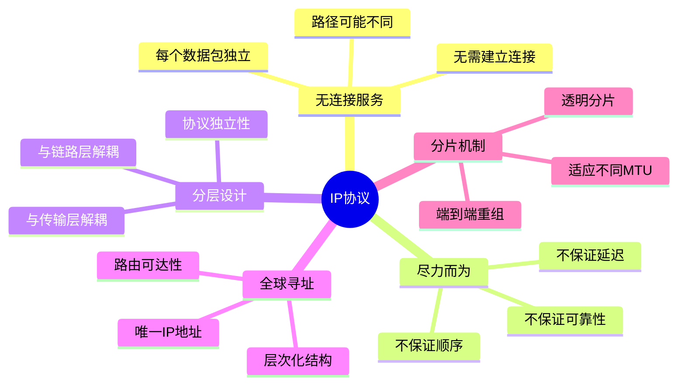
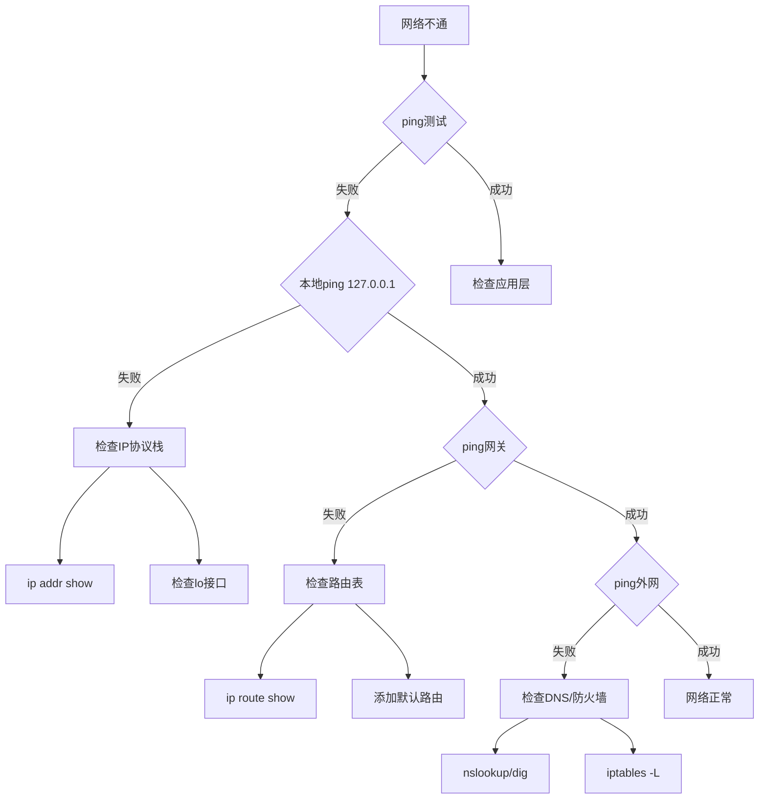

# IP协议详解 - 第六章：总结与实践

## 6.1 IP协议核心概念回顾

### 6.1.1 IP协议的关键特性



### 6.1.2 IP协议在实际网络中的作用

IP协议是互联网的基石，提供了：

1. **统一的寻址机制**：让全球设备可以互相通信
2. **路由基础设施**：实现数据包的转发和交付
3. **网络互联能力**：连接异构网络
4. **扩展性支持**：从小型网络到全球互联网

## 6.2 Linux内核IP协议栈架构

### 6.2.1 整体架构

```c
// Linux IP协议栈主要数据流
/*
 * 接收路径:
 * NIC -> netif_receive_skb -> ip_rcv -> ip_rcv_finish ->
 * ip_local_deliver 或 ip_forward
 *
 * 发送路径:
 * Application -> Socket -> ip_output -> ip_finish_output ->
 * ip_fragment (如需要) -> dev_queue_xmit -> NIC
 */

// 主要数据结构关系
struct sk_buff {           // 网络数据包缓冲区
    struct sock *sk;        // 关联的套接字
    struct net_device *dev; // 网络设备
    struct iphdr *ip_hdr;   // IP首部
    // ...
};

struct net_device {         // 网络设备
    char name[IFNAMSIZ];    // 接口名称
    unsigned int mtu;       // MTU值
    struct net_device_ops *netdev_ops; // 设备操作
    // ...
};

struct rtable {            // 路由缓存条目
    struct dst_entry dst;
    int rt_genid;
    unsigned int rt_flags;
    __u16 rt_type;
    // ...
};
```

### 6.2.2 关键代码路径

```bash
# Linux内核IP协议栈源码位置
linux/net/ipv4/
├── ip_input.c       # IP接收处理
├── ip_output.c      # IP发送处理
├── ip_forward.c     # IP转发
├── ip_fragment.c    # IP分片与重组
├── ip_options.c     # IP选项处理
├── route.c          # 路由查找
├── fib_*.c         # FIB (转发信息库)
├── arp.c           # ARP协议
├── icmp.c          # ICMP协议
├── tcp_*.c         # TCP协议
├── udp.c           # UDP协议
└── netfilter/      # 防火墙框架
```

## 6.3 实战项目：实现简化版IP协议栈

### 6.3.1 项目结构

```python
#!/usr/bin/env python3
"""
mini_ip_stack.py - 简化版IP协议栈实现
教学目的：理解IP协议的核心机制
"""

import struct
import socket
import threading
import time
from collections import defaultdict

class IPHeader:
    """IP首部处理"""

    def __init__(self, src, dst, protocol, data):
        self.version = 4
        self.ihl = 5
        self.tos = 0
        self.total_length = 20 + len(data)
        self.id = 0
        self.flags = 0
        self.frag_offset = 0
        self.ttl = 64
        self.protocol = protocol
        self.checksum = 0
        self.src = socket.inet_aton(src)
        self.dst = socket.inet_aton(dst)
        self.data = data

    def pack(self):
        """打包IP首部"""
        version_ihl = (self.version << 4) | self.ihl
        flags_frag = (self.flags << 13) | self.frag_offset

        header = struct.pack('!BBHHHBBH4s4s',
            version_ihl,
            self.tos,
            self.total_length,
            self.id,
            flags_frag,
            self.ttl,
            self.protocol,
            self.checksum,
            self.src,
            self.dst
        )

        # 计算校验和
        self.checksum = self._checksum(header)

        # 重新打包，包含校验和
        header = struct.pack('!BBHHHBBH4s4s',
            version_ihl,
            self.tos,
            self.total_length,
            self.id,
            flags_frag,
            self.ttl,
            self.protocol,
            self.checksum,
            self.src,
            self.dst
        )

        return header + self.data

    @staticmethod
    def _checksum(data):
        """计算IP校验和"""
        if len(data) % 2:
            data += b'\x00'

        s = 0
        for i in range(0, len(data), 2):
            s += (data[i] << 8) + data[i + 1]

        s = (s >> 16) + (s & 0xffff)
        s += s >> 16

        return ~s & 0xffff

    @classmethod
    def unpack(cls, packet):
        """解包IP首部"""
        header = packet[:20]
        version_ihl, tos, total_len, id, flags_frag, ttl, proto, \
            checksum, src, dst = struct.unpack('!BBHHHBBH4s4s', header)

        version = version_ihl >> 4
        ihl = version_ihl & 0x0f
        flags = flags_frag >> 13
        frag_offset = flags_frag & 0x1fff

        return {
            'version': version,
            'ihl': ihl,
            'tos': tos,
            'total_length': total_len,
            'id': id,
            'flags': flags,
            'frag_offset': frag_offset,
            'ttl': ttl,
            'protocol': proto,
            'checksum': checksum,
            'src': socket.inet_ntoa(src),
            'dst': socket.inet_ntoa(dst),
            'data': packet[ihl * 4:]
        }


class SimpleRouter:
    """简单路由器实现"""

    def __init__(self):
        self.routing_table = []
        self.arp_table = {}
        self.fragment_buffer = defaultdict(list)

    def add_route(self, network, netmask, gateway, interface):
        """添加路由条目"""
        self.routing_table.append({
            'network': socket.inet_aton(network),
            'netmask': socket.inet_aton(netmask),
            'gateway': gateway,
            'interface': interface
        })

    def route_lookup(self, dst_ip):
        """路由查找（最长前缀匹配）"""
        dst = socket.inet_aton(dst_ip)
        best_match = None
        best_prefix_len = -1

        for route in self.routing_table:
            # 检查是否匹配
            if self._match_network(dst, route['network'], route['netmask']):
                # 计算前缀长度
                prefix_len = bin(struct.unpack('!I', route['netmask'])[0]).count('1')
                if prefix_len > best_prefix_len:
                    best_match = route
                    best_prefix_len = prefix_len

        return best_match

    @staticmethod
    def _match_network(ip, network, netmask):
        """检查IP是否在网络中"""
        ip_int = struct.unpack('!I', ip)[0]
        net_int = struct.unpack('!I', network)[0]
        mask_int = struct.unpack('!I', netmask)[0]
        return (ip_int & mask_int) == (net_int & mask_int)

    def fragment(self, packet, mtu):
        """IP分片"""
        header = IPHeader.unpack(packet)
        data = header['data']
        header_len = header['ihl'] * 4

        # 检查DF标志
        if header['flags'] & 0x2:  # DF位
            raise Exception("Packet too large and DF set")

        fragments = []
        max_data = (mtu - header_len) // 8 * 8  # 8字节对齐
        offset = 0

        while offset < len(data):
            frag_data = data[offset:offset + max_data]
            is_last = (offset + len(frag_data)) >= len(data)

            # 创建分片
            frag_header = IPHeader(
                header['src'],
                header['dst'],
                header['protocol'],
                frag_data
            )
            frag_header.id = header['id']
            frag_header.flags = 0 if is_last else 0x1  # MF标志
            frag_header.frag_offset = offset // 8

            fragments.append(frag_header.pack())
            offset += len(frag_data)

        return fragments

    def reassemble(self, packet):
        """IP重组"""
        header = IPHeader.unpack(packet)
        key = (header['src'], header['dst'], header['id'])

        # 添加到缓冲区
        self.fragment_buffer[key].append({
            'offset': header['frag_offset'] * 8,
            'data': header['data'],
            'mf': header['flags'] & 0x1
        })

        # 尝试重组
        fragments = self.fragment_buffer[key]
        fragments.sort(key=lambda x: x['offset'])

        # 检查是否完整
        if fragments[0]['offset'] != 0:
            return None  # 缺少第一个分片

        reassembled = bytearray()
        expected_offset = 0

        for frag in fragments:
            if frag['offset'] != expected_offset:
                return None  # 有缺失

            reassembled.extend(frag['data'])
            expected_offset = frag['offset'] + len(frag['data'])

            if not frag['mf']:  # 最后一个分片
                del self.fragment_buffer[key]
                return bytes(reassembled)

        return None  # 还需要更多分片


class MiniIPStack:
    """迷你IP协议栈"""

    def __init__(self, ip_address, netmask):
        self.ip_address = ip_address
        self.netmask = netmask
        self.router = SimpleRouter()
        self.socket = None
        self.running = False

    def start(self):
        """启动协议栈"""
        try:
            # 创建原始套接字
            self.socket = socket.socket(socket.AF_INET,
                                       socket.SOCK_RAW,
                                       socket.IPPROTO_RAW)
            self.running = True
            print(f"Mini IP Stack started on {self.ip_address}")

            # 启动接收线程
            recv_thread = threading.Thread(target=self._receive_loop)
            recv_thread.start()

        except PermissionError:
            print("需要root权限来创建原始套接字")

    def _receive_loop(self):
        """接收循环"""
        while self.running:
            try:
                # 接收数据包
                packet, addr = self.socket.recvfrom(65535)
                self._handle_packet(packet)
            except Exception as e:
                print(f"接收错误: {e}")

    def _handle_packet(self, packet):
        """处理接收的数据包"""
        header = IPHeader.unpack(packet)
        print(f"收到: {header['src']} -> {header['dst']}, "
              f"Proto={header['protocol']}, TTL={header['ttl']}")

        # 检查是否是分片
        if header['flags'] & 0x1 or header['frag_offset'] > 0:
            # 尝试重组
            complete = self.router.reassemble(packet)
            if complete:
                print("  重组完成")
                packet = complete
            else:
                print("  等待更多分片...")
                return

        # 检查目标地址
        if header['dst'] == self.ip_address:
            print("  本地交付")
            self._local_deliver(header)
        else:
            print("  转发")
            self._forward(packet)

    def _local_deliver(self, header):
        """本地交付"""
        # 根据协议分发
        if header['protocol'] == 1:  # ICMP
            print("    ICMP数据包")
        elif header['protocol'] == 6:  # TCP
            print("    TCP数据包")
        elif header['protocol'] == 17:  # UDP
            print("    UDP数据包")

    def _forward(self, packet):
        """转发数据包"""
        header = IPHeader.unpack(packet)

        # TTL递减
        if header['ttl'] <= 1:
            print("  TTL超时，丢弃")
            return

        # 查找路由
        route = self.router.route_lookup(header['dst'])
        if not route:
            print("  无路由，丢弃")
            return

        # 检查MTU
        if len(packet) > route['interface'].get('mtu', 1500):
            # 需要分片
            fragments = self.router.fragment(packet, route['interface']['mtu'])
            for frag in fragments:
                self._send_packet(frag, route['gateway'])
        else:
            self._send_packet(packet, route['gateway'])

    def _send_packet(self, packet, next_hop):
        """发送数据包"""
        try:
            self.socket.sendto(packet, (next_hop, 0))
            print(f"  发送到 {next_hop}")
        except Exception as e:
            print(f"  发送失败: {e}")

    def send(self, dst, data, protocol=17):
        """发送数据"""
        packet = IPHeader(self.ip_address, dst, protocol, data)
        self._send_packet(packet.pack(), dst)

    def stop(self):
        """停止协议栈"""
        self.running = False
        if self.socket:
            self.socket.close()
        print("Mini IP Stack stopped")


# 测试代码
if __name__ == "__main__":
    # 创建迷你IP栈
    stack = MiniIPStack("192.168.1.100", "255.255.255.0")

    # 添加路由
    stack.router.add_route("192.168.1.0", "255.255.255.0",
                          "0.0.0.0", {'mtu': 1500})
    stack.router.add_route("0.0.0.0", "0.0.0.0",
                          "192.168.1.1", {'mtu': 1500})

    # 启动
    # stack.start()  # 需要root权限

    # 测试IP首部打包/解包
    header = IPHeader("192.168.1.1", "192.168.1.2", 17, b"Hello IP!")
    packed = header.pack()
    print(f"打包后: {len(packed)} 字节")

    unpacked = IPHeader.unpack(packed)
    print(f"解包后: {unpacked}")
```

## 6.4 性能测试与基准

### 6.4.1 IP协议性能测试工具

```bash
#!/bin/bash
# ip_performance_test.sh - IP性能测试脚本

echo "=== IP协议栈性能测试 ==="

# 1. 吞吐量测试
echo -e "\n1. 吞吐量测试"
iperf3 -c $1 -t 10 -P 4

# 2. 延迟测试
echo -e "\n2. 延迟测试"
ping -c 100 -i 0.2 $1 | tail -3

# 3. 丢包率测试
echo -e "\n3. 丢包率测试"
ping -c 1000 -f $1 | grep -E "packet loss|min/avg/max"

# 4. MTU探测
echo -e "\n4. 路径MTU探测"
for size in 576 1000 1400 1472 1500; do
    echo -n "  Size $size: "
    ping -M do -c 1 -s $size $1 &>/dev/null && echo "OK" || echo "Failed"
done

# 5. 路由跳数
echo -e "\n5. 路由跳数"
traceroute -n -q 1 $1 | wc -l

# 6. 分片测试
echo -e "\n6. 分片测试"
ping -M want -s 3000 -c 10 $1 | grep -E "packet loss|min/avg/max"
```

### 6.4.2 内核参数优化基准

```python
#!/usr/bin/env python3
"""
kernel_tuning.py - IP协议栈内核参数优化
"""

import subprocess
import json

class KernelTuner:
    """内核参数调优器"""

    # 推荐的优化参数
    OPTIMIZATIONS = {
        # 基础IP参数
        'net.ipv4.ip_forward': 1,
        'net.ipv4.ip_default_ttl': 64,
        'net.ipv4.ip_local_port_range': '1024 65535',

        # 路由参数
        'net.ipv4.route.max_size': 8388608,
        'net.ipv4.route.gc_thresh': 65536,
        'net.ipv4.route.gc_interval': 60,
        'net.ipv4.route.gc_timeout': 300,

        # 分片参数
        'net.ipv4.ipfrag_high_thresh': 4194304,
        'net.ipv4.ipfrag_low_thresh': 3145728,
        'net.ipv4.ipfrag_time': 30,
        'net.ipv4.ipfrag_max_dist': 64,

        # ARP参数
        'net.ipv4.neigh.default.gc_thresh1': 1024,
        'net.ipv4.neigh.default.gc_thresh2': 2048,
        'net.ipv4.neigh.default.gc_thresh3': 4096,

        # TCP相关（影响IP层）
        'net.ipv4.tcp_mtu_probing': 1,
        'net.ipv4.tcp_base_mss': 1024,

        # ICMP限制
        'net.ipv4.icmp_ratelimit': 1000,
        'net.ipv4.icmp_ratemask': 6168,

        # 安全相关
        'net.ipv4.conf.all.rp_filter': 1,
        'net.ipv4.conf.all.accept_source_route': 0,
        'net.ipv4.icmp_echo_ignore_broadcasts': 1,
    }

    def get_current_value(self, param):
        """获取当前参数值"""
        try:
            result = subprocess.run(
                f"sysctl -n {param}",
                shell=True,
                capture_output=True,
                text=True
            )
            return result.stdout.strip()
        except:
            return None

    def set_value(self, param, value):
        """设置参数值"""
        try:
            subprocess.run(
                f"sudo sysctl -w {param}={value}",
                shell=True,
                check=True
            )
            return True
        except:
            return False

    def benchmark(self):
        """性能基准测试"""
        results = {}

        for param, recommended in self.OPTIMIZATIONS.items():
            current = self.get_current_value(param)
            results[param] = {
                'current': current,
                'recommended': str(recommended),
                'optimized': current == str(recommended)
            }

        return results

    def optimize(self):
        """应用优化"""
        print("应用IP协议栈优化...")
        for param, value in self.OPTIMIZATIONS.items():
            if self.set_value(param, value):
                print(f"  ✓ {param} = {value}")
            else:
                print(f"  ✗ {param} 设置失败")

    def save_config(self, filename="/etc/sysctl.d/99-ip-optimization.conf"):
        """保存配置到文件"""
        with open(filename, 'w') as f:
            f.write("# IP Protocol Stack Optimizations\n\n")
            for param, value in self.OPTIMIZATIONS.items():
                f.write(f"{param} = {value}\n")
        print(f"配置已保存到 {filename}")

# 使用示例
if __name__ == "__main__":
    tuner = KernelTuner()

    # 显示当前状态
    print("=== 当前内核参数状态 ===")
    results = tuner.benchmark()
    optimized_count = sum(1 for r in results.values() if r['optimized'])

    print(f"优化状态: {optimized_count}/{len(results)}")
    for param, status in results.items():
        symbol = "✓" if status['optimized'] else "✗"
        print(f"{symbol} {param}: {status['current']} "
              f"(推荐: {status['recommended']})")

    # 应用优化（需要root权限）
    # tuner.optimize()
    # tuner.save_config()
```

## 6.5 常见问题与解决方案

### 6.5.1 问题诊断决策树



### 6.5.2 常见问题解决方案

```bash
#!/bin/bash
# ip_troubleshoot.sh - IP协议故障诊断脚本

function check_ip_stack() {
    echo "=== IP协议栈诊断 ==="

    # 1. 检查接口状态
    echo -e "\n1. 网络接口状态:"
    ip -br addr show

    # 2. 检查路由
    echo -e "\n2. 路由表:"
    ip route show
    echo "默认路由: $(ip route show default)"

    # 3. 检查ARP
    echo -e "\n3. ARP缓存:"
    ip neigh show | head -10

    # 4. 检查防火墙
    echo -e "\n4. 防火墙规则数:"
    echo "  INPUT: $(sudo iptables -L INPUT -n | wc -l)"
    echo "  FORWARD: $(sudo iptables -L FORWARD -n | wc -l)"
    echo "  OUTPUT: $(sudo iptables -L OUTPUT -n | wc -l)"

    # 5. 检查IP转发
    echo -e "\n5. IP转发状态:"
    echo "  IPv4: $(cat /proc/sys/net/ipv4/ip_forward)"
    echo "  IPv6: $(cat /proc/sys/net/ipv6/conf/all/forwarding)"

    # 6. 检查MTU
    echo -e "\n6. 接口MTU:"
    ip -br link show | awk '{print $1, $4}' | grep mtu

    # 7. 检查分片统计
    echo -e "\n7. IP分片统计:"
    netstat -s | grep -A 5 "^Ip:" | grep -E "Frag|Reasm"

    # 8. 检查错误统计
    echo -e "\n8. IP错误统计:"
    netstat -s | grep -A 10 "^Ip:" | grep -E "error|fail|drop"
}

# 执行诊断
check_ip_stack

# 常见修复建议
echo -e "\n=== 常见修复命令 ==="
echo "# 添加IP地址:"
echo "  sudo ip addr add 192.168.1.100/24 dev eth0"
echo ""
echo "# 添加默认路由:"
echo "  sudo ip route add default via 192.168.1.1"
echo ""
echo "# 启用IP转发:"
echo "  sudo sysctl -w net.ipv4.ip_forward=1"
echo ""
echo "# 清空防火墙规则:"
echo "  sudo iptables -F"
echo ""
echo "# 重启网络服务:"
echo "  sudo systemctl restart networking"
```

## 6.6 安全考虑

### 6.6.1 IP层安全威胁与防护

| 威胁类型 | 描述 | 防护措施 |
|---------|------|---------|
| IP欺骗 | 伪造源IP地址 | 启用反向路径过滤(RPF) |
| 分片攻击 | 恶意分片导致DoS | 限制分片速率和缓冲区 |
| 源路由攻击 | 指定恶意路由路径 | 禁用源路由选项 |
| 广播放大 | 利用广播地址放大攻击 | 禁用定向广播 |
| TTL耗尽 | 构造路由环路 | 设置合理的初始TTL |
| ICMP攻击 | ICMP重定向/不可达攻击 | 限制ICMP速率 |

### 6.6.2 安全加固脚本

```bash
#!/bin/bash
# ip_security_hardening.sh - IP层安全加固

echo "=== 应用IP层安全加固 ==="

# 1. 启用反向路径过滤
sudo sysctl -w net.ipv4.conf.all.rp_filter=1
sudo sysctl -w net.ipv4.conf.default.rp_filter=1

# 2. 禁用源路由
sudo sysctl -w net.ipv4.conf.all.accept_source_route=0
sudo sysctl -w net.ipv4.conf.default.accept_source_route=0

# 3. 禁用ICMP重定向
sudo sysctl -w net.ipv4.conf.all.accept_redirects=0
sudo sysctl -w net.ipv4.conf.default.accept_redirects=0
sudo sysctl -w net.ipv4.conf.all.send_redirects=0

# 4. 启用SYN Cookie（TCP层，但影响IP）
sudo sysctl -w net.ipv4.tcp_syncookies=1

# 5. 忽略ICMP ping广播
sudo sysctl -w net.ipv4.icmp_echo_ignore_broadcasts=1

# 6. 记录异常数据包
sudo sysctl -w net.ipv4.conf.all.log_martians=1

# 7. 限制ICMP速率
sudo sysctl -w net.ipv4.icmp_ratelimit=100
sudo sysctl -w net.ipv4.icmp_ratemask=88089

# 8. 设置分片参数
sudo sysctl -w net.ipv4.ipfrag_high_thresh=262144
sudo sysctl -w net.ipv4.ipfrag_low_thresh=196608
sudo sysctl -w net.ipv4.ipfrag_time=30

echo "安全加固完成"
```

## 6.7 未来展望

### 6.7.1 IPv6过渡

IPv6正在逐步取代IPv4：

- **地址空间**：从32位到128位
- **简化首部**：固定40字节，提高处理效率
- **内置安全**：IPSec成为标准组件
- **更好的QoS**：流标签支持
- **无需NAT**：端到端连接

### 6.7.2 新技术趋势

1. **SDN（软件定义网络）**
   - 控制平面与数据平面分离
   - 集中式路由决策
   - 可编程网络

2. **网络虚拟化**
   - VXLAN、NVGRE等覆盖网络
   - 容器网络
   - 网络功能虚拟化（NFV）

3. **高性能网络**
   - DPDK用户态协议栈
   - XDP（eXpress Data Path）
   - 智能网卡卸载

## 6.8 本教程总结

通过本教程，我们深入学习了IP协议的方方面面：

### 核心知识点

1. **协议基础**
   - IP数据报格式
   - 无连接、尽力而为的服务模型
   - 与其他层的接口

2. **地址体系**
   - IPv4地址分类
   - 子网划分与CIDR
   - 特殊地址用途

3. **路由机制**
   - 最长前缀匹配
   - 路由表管理
   - 动态路由协议

4. **分片与重组**
   - MTU与分片需求
   - 分片算法
   - 路径MTU发现

5. **Linux实现**
   - 内核协议栈架构
   - 关键数据结构
   - 性能优化

### 实践技能

- 使用Linux网络工具进行配置和诊断
- 理解和分析网络数据包
- 实现简单的IP协议栈功能
- 进行网络故障排查
- 应用安全最佳实践

### 深入学习建议

1. **阅读源码**：深入研究Linux内核网络子系统
2. **实验环境**：搭建网络实验环境进行测试
3. **协议扩展**：学习ICMP、ARP等相关协议
4. **性能优化**：研究高性能网络技术
5. **安全研究**：了解网络安全和防护技术

## 结语

IP协议作为互联网的基石，其设计简洁而强大。通过本教程的学习，你应该对IP协议有了全面的理解。继续深入研究和实践，你将能够：

- 设计和实现网络系统
- 诊断和解决网络问题
- 优化网络性能
- 提升网络安全

网络技术在不断发展，但IP协议的核心原理将继续指导未来的网络设计。愿本教程能够帮助你在网络技术的道路上走得更远！

---

[返回目录](./README.md)