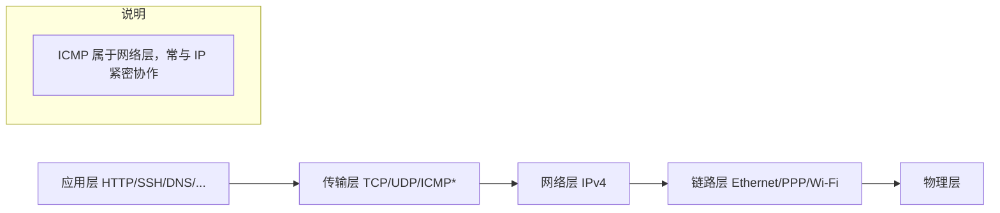
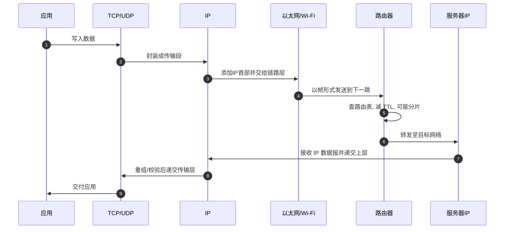

# 总览与定位

IPv4（Internet Protocol version 4）是互联网的网络层协议，负责提供无连接、尽力而为（best-effort）的数据包传输。它定义了数据包（IP 数据报）的格式、寻址方式、分片与重组、路由与转发的核心行为。

关键特性：

- 无连接：发送方与接收方之间不建立会话状态。
- 尽力而为：不保证可靠交付、顺序或延迟，需要上层（如 TCP）补足可靠性。
- 全局寻址：使用 32 位地址标识源与目的主机（或接口）。
- 可分片：当链路 MTU 较小，IP 可对数据报进行分片与重组（DF=1 禁止分片）。
- 路由转发：路由器根据目的地址决定下一跳。

IP 在网络栈中的位置：

一次“报文之旅”：

设计哲学（RFC 791 精神）：

- 简洁内核：网络层尽量简单，把可靠性留给端到端（端到端原则）。
- 宽容与兼容：对未知选项或字段应尽量忽略并继续转发（在安全许可下）。
- 可扩展性：通过选项与后续协议字段为未来扩展留口。

与 Linux 的关系：

- Linux 实现了 RFC 791 的核心语义，并在性能与安全上做了大量工程优化。
- 主要代码位置：`net/ipv4/`（如 `ip_input.c`, `ip_output.c`, `ip_forward.c`, `ip_fragment.c` 等）。
