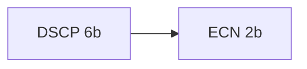
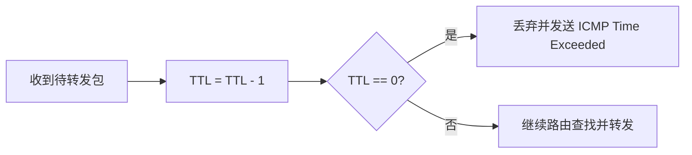
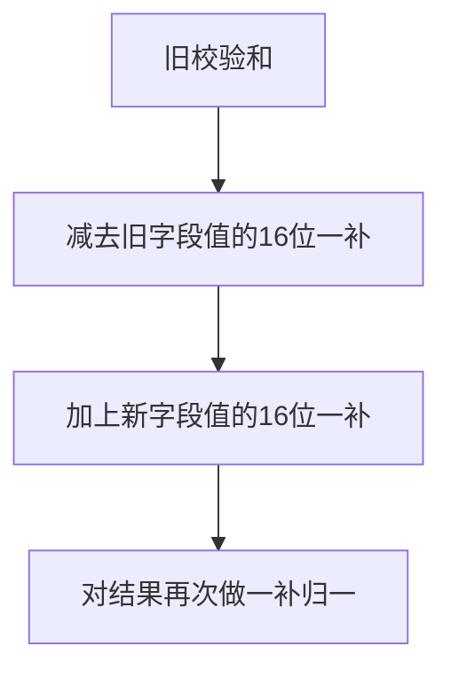

# IP 首部结构与字段（RFC 791 深入教程）

本章从“可执行的理解”出发，完整拆解 IPv4 首部的每一个比特与工程语义：不仅忠实于 RFC 791 的原始定义，还对照现代网络实践（如 DSCP/ECN 的引入、RFC 6864 对 ID 字段的更新）、Linux 内核实现与调试技巧，给出从规范到实战的桥梁。阅读完本章，你应当能够：

- 画出 IPv4 首部结构并准确解释每个字段的作用与边界条件；
- 在抓包中手工解码一个 IP 首部，核对长度与校验和；
- 理解 DF/MF/Fragment Offset 的分片语义，为后续分片章节打下基础；
- 解释 TOS 与现代 DSCP/ECN 的关系，并在 Linux 中观测与配置；
- 将 RFC 语义映射到 Linux 源码与常用工具中进行验证与排障。

快速概览：IPv4 首部是“定长 20 字节 + 可选选项”的结构；定长部分承载了路由与转发必需的元数据（如 TTL、Protocol、源与目的地址），可选部分通过 Options 承载更复杂的控制信息（诸如记录路由、时间戳或源路由等）。

首部位级结构（无选项时）：


注意：IHL（Internet Header Length）以 32 位字为单位，最小值 5，即 5×4=20 字节。当 IHL>5 时，说明存在 Options 与 Padding，首部总长 = IHL×4。

一、字段逐一精讲

1. Version（4 比特）

- 固定为 4，标识 IPv4。这一字段使得 IPv4 和 IPv6（Version 6）在网络中可以共存，设备根据版本分支解析逻辑。

2. IHL（4 比特）

- Internet Header Length，单位为 4 字节。最小 5，最大 15（意味着首部最大 60 字节）。
- 当 IHL 不合法（小于 5 或大于 Total Length）时，接收端必须丢弃报文。
- Linux 检查位置：`ip_rcv()` 处会验证 IHL 与 `skb` 长度是否合理。

3. TOS（8 比特，Type of Service）与 DSCP/ECN

- RFC 791 原始语义将该字节拆解为 Precedence（3b）与 D/T/R/C 偏好位；但现代网络广泛采用 DSCP（Differentiated Services Code Point，6b）与 ECN（Explicit Congestion Notification，2b）对该字节进行重定义。
- 现代拆分：`DSCP(6b) | ECN(2b)`。例如 DSCP 46（EF）常用于语音；ECN 可标记拥塞而不必丢包（配合 TCP 的 ECN 机制）。
- Linux 观测与设置：
  - 套接字层：`setsockopt(IP_TOS)` 设置 TOS/DSCP（需注意权限与 qdisc 映射）。
  - `iptables`/`nftables`：mangle 表可修改 DSCP/ECN；`tc` 可基于 DSCP 做队列调度。
  - 抓包显示：Wireshark 中显示 DSCP/ECN；`tcpdump -v` 可显示 TOS/DSCP 值。

TOS 字段可视化（现代视角）：



4. Total Length（16 比特）

- IP 数据报总长度（首部 + 负载），单位为字节，最大 65535。该限制来自 16 位字段上限。
- 路径 MTU 可能小于 Total Length，触发分片或 ICMP Frag Needed（见分片章节）。
- Linux 会在发送端构造该字段；接收端验证 `skb->len` 与该值一致，否则丢弃。

5. Identification（16 比特）

- 分片标识，同一原始数据报的所有分片复用相同 ID，接收端以 (src, dst, protocol, ID) 为键进行重组。
- RFC 6864 更新：对于 DF=1 且不分片的情况，ID 字段的唯一性约束放宽，发送端可以按实现优化（例如随机或静态值），避免耗费全局唯一 ID 空间。对于可能分片的报文，ID 仍应保证足够的唯一性窗口，以免不同数据报分片混淆。
- Linux 生成策略：历史上使用全局递增，现代实现倾向基于 3/5 元组哈希与随机化，减轻可预测性带来的攻击面与冲突概率（内核具体实现可查 `ip_select_ident()`）。

6. Flags（3 比特）与 Fragment Offset（13 比特）

- Flags：`0 | DF | MF`
  - 保留位（bit0）恒为 0。
  - DF（Don’t Fragment）：1 表示禁止中间节点分片；若出接口 MTU 不足，必须丢弃并返回 ICMP Frag Needed，用于 PMTUD。
  - MF（More Fragments）：1 表示后续还有分片；最后一片 MF=0。
- Fragment Offset：以 8 字节为单位的偏移；除最后一片外，分片数据长度必须是 8 的倍数。
- 组合语义：
  - 未分片：Offset=0 且 MF=0。
  - 中间分片：Offset>0 或 MF=1。
  - DF=1 且需分片：应丢弃并返回 ICMP 提示路径 MTU。

7. TTL（8 比特，Time To Live）

- 每经过一个路由器（转发一跳）减 1；减至 0 必须丢弃并回送 ICMP Time Exceeded。
- 初始值通常为 64、128 或 255，取决于操作系统。Linux 默认 `net.ipv4.ip_default_ttl=64`（可调）。
- 工程意义：防止路由环路导致的无限转发，便于 `traceroute` 识别路径跳点。

TTL 处理（示意）：



8. Protocol（8 比特）

- 指示上层协议编号，常见值：1=ICMP, 6=TCP, 17=UDP, 89=OSPF 等。
- Linux 在 `ip_local_deliver()` 中依据该字段选择相应接收处理函数（如 `icmp_rcv`, `tcp_v4_rcv`, `udp_rcv`）。

9. Header Checksum（16 比特）

- 16 位一补和，仅覆盖 IP 首部（不含数据）。
- 任何修改首部的操作（如 TTL 减 1）都需更新校验和；路由器可使用增量更新算法，避免全量重算。
- 硬件卸载：很多 NIC 支持首部校验和 offload；抓包时可能看到校验和为 0 或不一致（由网卡在发送时补上）。

校验和增量更新（示意）：



10. Source Address 与 Destination Address（各 32 比特）

- 源与目的 IPv4 地址，通常为接口地址与目标主机或路由器地址。
- 特殊地址：广播（255.255.255.255 或子网定向广播）、私有地址（RFC 1918）、保留地址等。
- Linux 选择源地址：路由过程会选择最合适的本地源，受策略路由、`ip rule`、`ip route get` 影响。

11. Options + Padding（0–40 字节）

- 当 IHL>5 时存在，具体选项类型见本教程“选项”章节。Padding 将首部补齐到 32 位对齐长度。
- 工程提醒：选项会显著降低快路径转发性能，生产路由器通常限制或丢弃复杂选项。

二、从十六进制抓包手工解码 IP 首部

以下是一个最小 IPv4 首部（无选项）的示例十六进制串，逐步解码以加深理解。假设：

```
45 00 00 54 a6 f2 40 00 40 01 00 00 c0 a8 01 64 c0 a8 01 01
```

- `45`：Version=4（高 4 位），IHL=5（低 4 位，20 字节）。
- `00`：TOS（或 DSCP/ECN）；此例为 0。
- `00 54`：Total Length=0x0054=84 字节。
- `a6 f2`：Identification。
- `40 00`：Flags/Fragment Offset。0x4000 表示 DF=1，Offset=0。
- `40`：TTL=64。
- `01`：Protocol=1（ICMP）。
- `00 00`：Header Checksum（假设未计算或为 0，便于演示）。
- `c0 a8 01 64`：源地址 192.168.1.100。
- `c0 a8 01 01`：目的地址 192.168.1.1。

校验和手算（简述）：把首部 20 字节按 16 位累加，溢出回卷，再取一补得到非零的校验和。Linux 中 `ip_fast_csum()` 提供高效实现。

三、与 Linux 结构体、代码路径的映射

- 结构体：`include/uapi/linux/ip.h` 或 `include/linux/ip.h` 中的 `struct iphdr` 大致对应：
  - `__u8 ihl:4, version:4; __u8 tos; __be16 tot_len; __be16 id; __be16 frag_off; __u8 ttl; __u8 protocol; __sum16 check; __be32 saddr; __be32 daddr;`
  - 注意大小端与位域实现细节，不同架构位域布局可能不同，内核通过读写宏保证正确。
- 发送路径：
  - `ip_local_out()` 填写 TTL、Protocol、校验和等；
  - `ip_output()` 处理路由与可能的分片；
  - `ip_finish_output()` 与邻居子系统对接 ARP，再下发到驱动。
- 接收路径：
  - `ip_rcv()` 校验 IHL、Total Length、Checksum 等，再决定本地递交或转发；
  - 本地递交走 `ip_local_deliver()`，根据 Protocol 分发给上层；
  - 转发走 `ip_forward()`，会减 TTL 并更新校验和。

四、TOS、DSCP 与 ECN 的实操

- 设置 DSCP 示例（root 权限）：
  - `iptables -t mangle -A OUTPUT -p tcp --dport 443 -j DSCP --set-dscp-class AF21`
  - `tc filter add dev eth0 protocol ip parent 1: prio 1 u32 match ip tos 0x48 0xfc flowid 1:10`
- 读取/抓包：
  - `ip -s -d link show` 查看 qdisc 统计；
  - `tcpdump -vvv -ni eth0 tcp and port 443` 显示 ToS/DSCP；
  - Wireshark 显示 DSCP 字段并可着色规则。
- ECN：
  - TCP 层协商 ECN 能力（SYN 时 ECN bits）；路由器可将 ECT 标记改为 CE，主机据此降低拥塞窗口。

五、TTL 与路径诊断（traceroute 的工作原理）

- `traceroute` 通过发送 TTL=1 的探测包，第一跳路由器将其 TTL 减至 0 后丢弃并回送 ICMP Time Exceeded，从而“暴露”该路由器的地址；随后 TTL=2、3……逐步探测后续跳点，直到达到目的主机。
- 变种：ICMP、UDP 或 TCP 探测；某些网络会限速或过滤 ICMP，导致显示不完整。
- Linux 相关：`/proc/sys/net/ipv4/icmp_ratelimit` 控制 ICMP 差错报文的速率。

六、Identification 的更新规范与安全

- RFC 6864 核心：对于不会被分片的报文，ID 字段不必保证在所有报文间唯一，可用固定或随机值；对于可能分片的报文，ID 应在一个“重组时间窗口”内保持对每个 (src,dst,protocol) 足够唯一，避免不同数据报分片混淆。
- 安全注意：可预测的 ID 序列可能用于流量侧信道推断、主机指纹识别或分片攻击。内核通常采用随机化或哈希策略降低风险。

七、首部校验和与硬件卸载

- 一补和性质：对所有 16 位字求和，一旦有单比特错误，校验大概率失败；但并非强加密校验，无法抵御有意篡改。
- NIC offload：发送时由网卡补算校验和，抓包工具若在链路上游捕获可能看到 0（未计算）；接收侧通常呈现已验证结果。
- 调试建议：抓包时配合 `ethtool -k` 确认 offload 状态；必要时可临时关闭以简化分析。

八、Options 概览与 IHL 的实际影响

- 选项会增加首部长度，减少可用负载；例如在 MTU=1500 时，IHL=15 的首部长达 60 字节，留给 L4 的空间缩小，可能影响性能与分片概率。
- 常见选项（RR、TS、LSRR、SSRR）详见“选项”章节；生产网络多禁用源路由。

九、NAT、隧道与首部字段的联动

- NAT 改写源/目的地址，需更新校验和；隧道（如 IPIP、GRE、VXLAN）会增加外层 IP 首部，影响路径 MTU 与分片；
- Linux 的隧道设备（`ip tunnel`, `ip link add vxlan`）会在封装时设置外层首部字段（TTL、TOS 复制策略可配置）。

十、常见问题与排错清单

- 现象：抓包中出现 IHL 不匹配或 Total Length 小于 IHL
  - 排查：是否抓包点在 offload 前后？是否有畸形包或攻击流量？
- 现象：TTL 在路径中异常下降过快
  - 排查：是否存在环路？查看路由策略、`traceroute` 输出与 `ip route` 配置。
- 现象：Protocol 字段未知，应用无法接收
  - 排查：是否是非 TCP/UDP/ICMP 的控制协议（如 OSPF）？是否被防火墙丢弃？
- 现象：校验和错误
  - 排查：确认 offload 状态；确认抓包点；检查是否有内存越界或应用构包错误。

十一、练习

1. 用 `tcpdump -xx -ni any icmp` 抓取一条 ICMP Echo 请求，手工计算 IPv4 首部校验和并与工具显示对比。
2. 使用 Scapy 构造一个 DF=1 的大包，验证中间路由器是否返回 ICMP Frag Needed，并记录 Next-Hop MTU。
3. 将 TOS 设置为 DSCP EF，使用 `tc` 为 EF 流量建立高优先级队列，观察时延变化。

十二、小结

IPv4 首部凝结了网络层“简单、尽力而为”的设计思想：尽量少地在网络中保留状态，将复杂性留给端点（例如可靠性与拥塞控制交由 TCP）。理解首部的每个字段，不仅是通过考试的知识点，更是进行复杂网络排障与优化的钥匙。后续章节（分片与重组、路由与转发、选项）将基于本章继续展开实战视角的深入解析。

附录 A：更深入的 TOS/DSCP/ECN 指南

- DSCP 类别与 PHB：
  - `CSx`（Class Selector）：与旧的 IP Precedence 对应，如 CS0=0x00、CS3=0x18、CS5=0x28；
  - `AFxy`（Assured Forwarding）：如 AF11=0x0A、AF21=0x12、AF31=0x1A、AF41=0x22；
  - `EF`（Expedited Forwarding）：0x2E，常用于低时延语音流；
  - 运营网络会将 DSCP 映射到队列或调度策略（WFQ/DRR/Strict Priority）。
- ECN 取值：
  - `00`：非 ECN 能力；
  - `10`：ECT(0) 可经历拥塞标记；
  - `01`：ECT(1) 可经历拥塞标记；
  - `11`：CE（Congestion Experienced，拥塞已发生）。
- Linux 相关：
  - `sysctl net.ipv4.tcp_ecn=1` 开启 TCP ECN；
  - `tc qdisc` 支持基于 DSCP 分类与 ECN 交互；
  - `nftables meta priority` 与 `csum` 表达式可匹配/操作相关字段。

附录 B：校验和伪代码与增量更新示例

伪代码（首部全量计算）：

```text
sum = 0
for i in range(0, IHL_bytes, 2):
  if i == CHECKSUM_OFFSET:
    continue
  sum += (hdr[i] << 8) + hdr[i+1]
sum = (sum & 0xFFFF) + (sum >> 16)  # 回卷
sum = ~sum & 0xFFFF                 # 一补
```

增量更新（以 TTL-1 为例）：

```text
old16 = (old_ttl << 8) + protocol
new16 = ((old_ttl-1) << 8) + protocol
sum = ~old_checksum & 0xFFFF
sum = sum - old16 + new16
sum = (sum & 0xFFFF) + (sum >> 16)
new_checksum = ~sum & 0xFFFF
```

附录 C：选项的 copy/class/number 编码

- Type 字段位：`copy(1b) | class(2b) | number(5b)`；
- copy=1 表示分片时复制到所有分片；class=0/2 常见；number 指定具体选项编号；
- 实务中，对 RR/TS/LSRR/SSRR 的解析需结合安全策略，生产网络倾向禁用源路由。

附录 D：抓包与 eBPF 观测技巧

- `tcpdump -vvv -ni <iface> '(ip and not tcp and not udp) or icmp'` 便于聚焦网络层；
- eBPF（XDP/TC）：通过 `bpf_skb_load_bytes` 读取 IPv4 首部；
- `bpftool prog tracelog` 结合调试打印快速定位异常字段；
- 在容器与命名空间环境中，善用 `ip netns exec` 抓取不同节点视角下的首部差异。

附录 E：与 IPv6 的类比（助记但不替代学习）

- IPv6 基本首部固定 40 字节，无首部校验和；扩展首部替代 IPv4 选项；分片仅在源端发生；
- DSCP/ECN 语义延续在 IPv6 Traffic Class 字段；
- 不要将 IPv4 的中间分片思维套到 IPv6 上。

