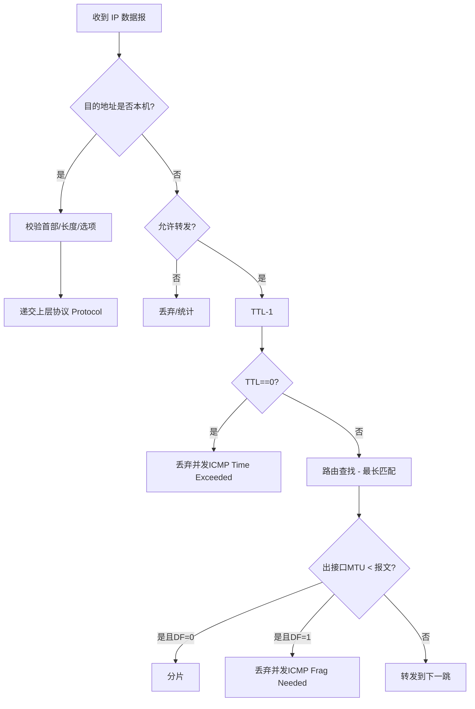

# 路由、TTL 与转发

RFC 791 将 IP 设为“尽力转发”的网络层。主机或路由器在接收数据报后，要么递交本地上层，要么转发到下一跳。关键要点如下：

- 目的判定：若目的地址属于本机（含本机接口地址、广播、组播处理例外）则递交上层，否则进入转发流程。
- TTL 处理：每转发一跳 TTL 减 1；若减到 0，丢弃并发送 ICMP Time Exceeded 给源地址。
- 路由选择：依据路由表（目的前缀最长匹配）决定下一跳与出接口。
- 分片：若出接口 MTU 小于数据报长度且 DF=0，进行分片；若 DF=1，丢弃并返回 ICMP Fragmentation Needed（RFC 1191/MTU 发现）。

接收与转发流程（简化）：

路由选择原则（RFC 与工程实践）：

- 最长前缀匹配：选择掩码最长的可达前缀。
- 默认路由（0.0.0.0/0）：在无更精确前缀时使用。
- 本地直连：目的地址在本地子网内时，下一跳即为目的主机。

与 Linux 实现的联系：

- 关键函数：`ip_rcv()`（接收）、`ip_forward()`（转发）、`ip_output()`（发送）。
- 路由查找：FIB（Forwarding Information Base）实现，相关代码位于 `net/ipv4/fib_*`（例如 `fib_trie`）。
- TTL 与 ICMP：`ip_forward()` 中检查 TTL 并使用 ICMP 模块回送错误报文。
- 邻居与出接口：`neigh_output()` 结合 ARP/NDP 解析下一跳链路层地址。

提示：实际内核还包含诸如反向路径过滤（rp_filter）、Martian 地址检查、策略路由（`ip rule`）、流量控制等，不属于 RFC 791 核心，但会影响实际转发路径。
