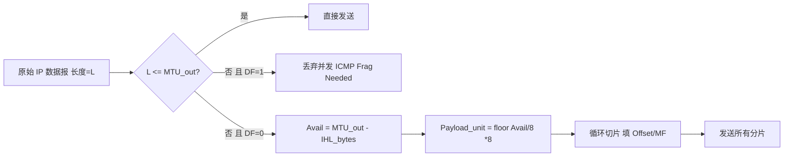
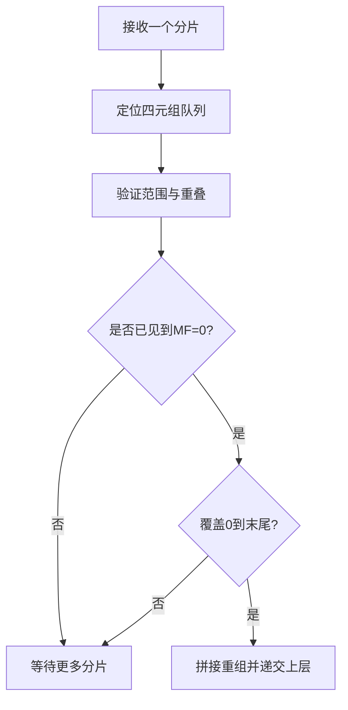
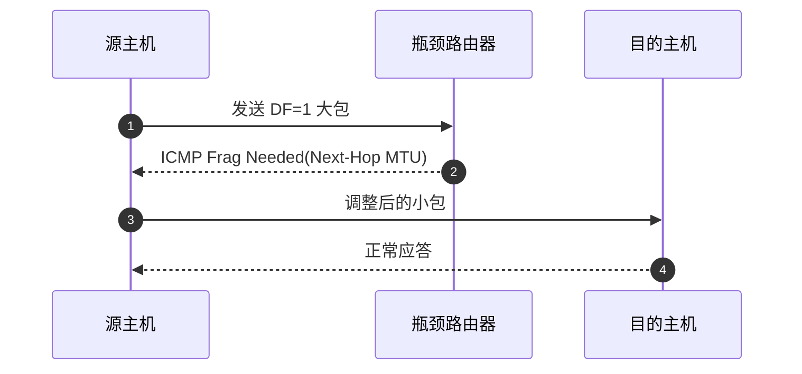

# 分片与重组（Fragmentation & Reassembly 深入教程）

本章解决两个常被忽视却极为关键的问题：为什么会产生分片、如何正确地在工程中避免或处理分片。我们将从 RFC 791 的基本规则出发，扩展到 PMTUD（RFC 1191/4821）、Linux 内核实现、隧道与叠加网络的 MTU 影响、安全攻击面与性能权衡，最后给出调优与排障的完整方法论。

一、背景：MTU、路径 MTU 与分片的必要性

- MTU（Maximum Transmission Unit）：某条链路层能承载的最大“IP 层有效载荷 + IP 首部”的上限（以太网常见 1500 字节）。
- 路径 MTU（PMTU）：源到目的路径上所有链路 MTU 的最小值。真正限制一条链路的不是单个 MTU，而是路径上的“最小桶”。
- 分片的动因：当一个 IP 数据报的总长度（首部+数据）大于下一跳出接口的 MTU，而 DF=0 时，中间节点可以将其拆分为多个片段以便通过更小的链路；若 DF=1，则必须丢弃并回送 ICMP 提示。
- 工程代价：分片会放大报文数量、增加处理开销、带来丢失重传放大（任何一片丢失即需重组失败），还引入安全与实现复杂度，因而“能避则避”。

路径可视化：


此路径的 PMTU=1400；若发送 1500 字节的 IP 报文，R2 会成为瓶颈：

- DF=0：R2 将分片；
- DF=1：R2 丢弃并返 ICMP Fragmentation Needed（包含 Next-Hop MTU=1400）。

二、RFC 791 基本规则复盘

- 触发条件：`Total Length > 出接口 MTU` 且 `DF=0`。
- 数据对齐：除最后一片外，每片“数据部分”的长度必须为 8 的倍数；偏移 Fragment Offset 单位也是 8 字节。
- 首部复制：每个分片都拥有完整 IP 首部，IHL 与选项处理需遵循 copy 语义（某些选项必须复制）。
- 标识一致：所有片的 Identification 相同；接收端以 (src,dst,protocol,ID) 为键组织重组队列。
- MF 语义：除最后一片外 MF=1，最后一片 MF=0。
- 偏移含义：分片数据区在原始报文数据区中的偏移（单位 8 字节），首片 Offset=0。
- 重组责任：只在目的主机进行（转发节点不重组）。
- 超时：重组有超时，未收齐则丢弃。

三、如何正确切片：计算方法与示例

定义：

- `MTU_out`：下一跳出接口的 MTU；
- `IHL_bytes`：当前分片的 IP 首部长度（含选项）；
- `Avail = MTU_out - IHL_bytes`：该分片可用于“数据部分”的最大字节数；
- `Payload_unit = floor(Avail / 8) * 8`：除最后一片外，数据长度必须 8 字节对齐。

示例 1：无选项，IHL=5（20B），以太网 MTU 1500，原始数据报总长 3000 字节（含首部）。

- `Avail = 1500 - 20 = 1480`
- `Payload_unit = floor(1480/8)*8 = 1480`（恰好是 8 的倍数）
- 分片：
  - 片1：首部20B + 数据1480B，Offset=0，MF=1；
  - 片2：首部20B + 数据1480B，Offset=1480/8=185，MF=1；
  - 片3：剩余：3000-20-1480-1480=20B 数据，首部20B + 数据20B，Offset=(1480+1480)/8=370，MF=0。

示例 2：有选项，IHL=8（32B），`MTU_out=1400`，原始报文长 2000B。

- `Avail = 1400 - 32 = 1368`
- `Payload_unit = floor(1368/8)*8 = 1368`
- 分片：
  - 片1：32+1368，Offset=0，MF=1；
  - 片2：32+600（最后一片可不对齐），Offset=1368/8=171，MF=0。

注意：每片的 IHL 必须与选项复制语义一致；复制错误会导致接收端重组失败或选项语义错乱。

分片流程（概览）：



四、重组算法：从分片到原报文

接收端以四元组 `(src,dst,protocol,ID)` 为键创建重组队列，逐片插入区间，检测重叠、超界与是否“覆盖了从 0 到最后一片的连续区间”。

重组流程（概览）：



Linux 细节：

- `ip_defrag()` 管理分片队列 `ipq`，每个队列维护已收片段的区间、总长度、是否收到最后一片（MF=0）等状态，超时通过 `ipfrag_time` 控制。
- 内存水位：`ipfrag_high_thresh` 与 `ipfrag_low_thresh` 限制全局分片缓存；超限时优先清理最老或开销大的队列。
- 重叠分片：为避免利用重叠覆盖绕过上层检测（经典 Teardrop/Overlapping Fragments 攻击），现代内核通常直接丢弃重叠情形或遵循严格策略（参见 RFC 5722 的启示）。

五、PMTUD：端到端避免中间分片

1) 经典 PMTUD（RFC 1191）：

- 发送方令 DF=1，从大到小尝试发送；当中途遇到更小 MTU 的链路，路由器丢弃并回送 ICMP Frag Needed（Type 3, Code 4），其中包含 Next-Hop MTU；
- 发送方据此更新“路径 MTU 缓存”，缩小报文大小或在 TCP 层降低 MSS，从而避免后续分片。

2) 黑洞 PMTUD（RFC 4821 等）：

- 某些网络出于“安全”错误地丢弃 ICMP 差错导致经典 PMTUD 失败，连接表现为“莫名卡死”；
- 黑洞 PMTUD通过探测与重传超时来推测更小的 PMTU，无需依赖 ICMP；Linux TCP 支持相关策略。

Linux 观测与配置：

- `ip route get <dst>` 可查看内核路由与 PMTU；
- PMTU 缓存存储在路由缓存/目的缓存中，老版本可用 `ip route flush cache` 刷新；
- sysctl：`net.ipv4.ip_no_pmtu_disc`（禁用 PMTUD，不推荐）、`net.ipv4.tcp_mtu_probing`（黑洞探测，0/1/2）、`net.ipv4.route.min_pmtu` 等。

PMTUD 交互（示意）：



六、隧道与叠加网络的 MTU 陷阱

- 封装开销：IPIP(+20B)、GRE(+24B)、VXLAN(+50B 左右，取决于底层)、GUE/GRE-in-UDP 等都会消耗有效 MTU；若外层仍受 1500 限制，内层必须下调 MSS/PMTU，否则极易触发分片或黑洞。
- PPPoE/VLAN 也会引入额外开销（PPPoE 8B、802.1Q 4B），使有效 MTU 小于 1500。
- Linux 配置：
  - 在隧道设备上设置合适 MTU：`ip link set dev vxlan100 mtu 1450`；
  - TCP 层夹 MSS：`iptables -t mangle -A FORWARD -p tcp --tcp-flags SYN,RST SYN -j TCPMSS --clamp-mss-to-pmtu`；
  - 注意多层叠加的总开销，预留裕度。

七、安全考量：重叠、碎片泛洪与 IDS 规避

- 重叠分片：攻击者构造相互重叠的片段，寄希望于不同设备的重组策略差异来绕过 IDS/防火墙。现代 Linux 倾向丢弃重叠或采取严格策略。
- 分片泛洪：大量半开重组队列消耗内存与 CPU，可通过 `ipfrag_*` 水位与速率限制缓解，边界设备应做 ACL 与速率控制。
- 低偏移小碎片：利用过多微小分片拖垮中间设备，或试图把关键 L4 端口信息切碎隐藏，现代安全设备会做启发式拦截。

八、Linux 实现与关键函数索引

- 发送分片：`ip_do_fragment()` / `ip_fragment()`（`net/ipv4/ip_output.c`）
- 接收重组：`ip_defrag()` / `ip_frag_queue`（`net/ipv4/ip_fragment.c`）
- 转发时的 DF/ICMP：`ip_forward()`（`net/ipv4/ip_forward.c`）
- PMTU 相关：目的缓存与路由表，`ip_rt_update_pmtu()` 等；TCP 黑洞探测参数 `tcp_mtu_probing`
- Sysctl：`net.ipv4.ipfrag_time`, `net.ipv4.ipfrag_high_thresh`, `net.ipv4.ipfrag_low_thresh`, `net.ipv4.route.min_pmtu`, `net.ipv4.ip_no_pmtu_disc`, `net.ipv4.tcp_mtu_probing`

九、观测与排障方法论（手把手）

1) 快速识别是否发生了分片

- 抓包过滤：
  - `tcpdump -ni any 'ip[6:2] & 0x3fff != 0'`（匹配 MF 或非零偏移）
  - `tcpdump -ni any 'icmp and (icmp[0] == 3 and icmp[1] == 4)'`（Frag Needed）
- 观察字段：
  - `Flags` 中的 DF/MF；`Fragment Offset` 非零；相同 ID 的多包；
  - 最后一片 MF=0，偏移+长度刚好覆盖全部负载。

2) 确认瓶颈 MTU 与 PMTU 缓存

- 使用 `ping -M do -s <size>` 二分法寻找最大可达负载（数据+ICMP首部）。
- `ip route get <dst>` 查看 PMTU；必要时刷新缓存或临时调小接口 MTU 验证。

3) 隧道与多层封装

- 列出每层封装的开销，计算内层有效 MTU；
- 对 TCP 流启用 `--clamp-mss-to-pmtu` 或在服务端设置 `tcp_adv_win_scale`、MSS 限制以缓解。

4) 处理黑洞

- 开启 `net.ipv4.tcp_mtu_probing=1` 或 2；
- 观察 RTO、重传模式是否改善；
- 与对端协作，放通必要的 ICMP 差错或采用更保守的 MTU。

十、FAQ 与常见坑

- 问：为什么我把接口 MTU 设置成 1400，还是看到 1500 的报文？
  - 答：可能是 GSO/TSO 在主机侧做了分段，在线卡处才按 MTU 分割；或者报文是进入方向，与对端配置相关。抓包点与 offload 状态非常关键。
- 问：DF=1 的 UDP 大包总是丢，怎么办？
  - 答：这是 PMTUD 典型问题。要么允许 ICMP 返回并让发送端调小，要么应用层按更小块尺寸发送。
- 问：VPN/隧道后访问外网变慢或不稳定？
  - 答：一般是未考虑封装开销导致分片或黑洞。调低隧道接口 MTU、启用 MSS clamping、或提升底层链路 MTU。
- 问：为什么安全设备总说“丢弃重叠分片”？
  - 答：这是防 IDS 规避的通用实践；若确需传输，先查清构包是否异常，再在可信网络中放通。

十一、练习与实验

1) 计算分片：给定 MTU=1400、IHL=20、总长=3000，计算每片长度与偏移，写出 MF 标记。
2) 使用 Scapy 构造若干重叠分片，观察 Linux 默认行为与日志（务必在隔离环境）。
3) 通过 `iptables -t mangle --clamp-mss-to-pmtu` 实验 TCP 性能对比，记录 RTT、丢包、重传。
4) 在 VXLAN 容器网络中逐层计算开销，并验证通过路径是否分片或黑洞。

十二、小结

分片是历史与现实妥协的产物：它让大包在窄链路上“能过去”，却以复杂度、性能与安全为代价。现代工程实践强调“端到端避免分片”：依赖 PMTUD、调整 MSS、合理设置隧道与接口 MTU；当不得不面对分片时，理解 RFC 规则与 Linux 实现细节，才是稳定与安全的保障。

附录 A：更复杂的数值练习

1) 给定 `MTU_out=1280`、`IHL=20`、原始总长 `L=5000`：

- `Avail=1260`，`Payload_unit=1260`；
- 片1：20+1260（MF=1, Off=0）
- 片2：20+1260（MF=1, Off=1260/8=157）
- 片3：20+1260（MF=1, Off=314）
- 片4：20+1160（MF=0, Off=471）

2) 若 IHL=44（含 24B 选项），`MTU_out=1500`，`Avail=1456`，`Payload_unit=1456`；按此对齐拆分，注意每片都带 44 字节首部，最后一片可非 8 字节对齐。

附录 B：NAT 与分片的交互

- NAT 常在重组后再改写端口与地址，并重新分片；
- 某些 NAT 设备处理分片不当导致连接异常；
- 建议：在边界设备上尽量避免中途分片，或配置足够的重组能力与黑名单策略。

附录 C：IPv6 的启示

- IPv6 禁止中间节点分片，只有源端可以创建分片扩展首部；
- 这迫使工程上更多依赖 PMTUD 与 MSS 调整，也更清晰地限制了攻击面；
- 对 IPv4 网络的启示：在可能的情况下，也尽量将分片控制在端点。

附录 D：Scapy 片段构造片段（仅实验环境）

```python
from scapy.all import *
ip = IP(dst="192.0.2.1", src="198.51.100.10", id=12345)
payload = b"X"*3000
f1 = ip/ICMP(type=8, code=0)/Raw(load=payload[:1480])
f1[IP].flags = 1  # MF=1
f1[IP].frag = 0
f2 = ip/ICMP(type=8, code=0)/Raw(load=payload[1480:2960])
f2[IP].flags = 1
f2[IP].frag = 185
f3 = ip/ICMP(type=8, code=0)/Raw(load=payload[2960:])
f3[IP].flags = 0  # MF=0
f3[IP].frag = 370
send(f1); send(f2); send(f3)
```

附录 E：观测指标与报警建议

- `ipfrag_*` 缓存命中率与丢弃计数；
- ICMP Frag Needed 的速率与目的分布；
- PMTU 缓存条目数量、过期与刷新频率；
- 分片相关的丢包重传统计（TCP Retrans、OutOfOrder）。
