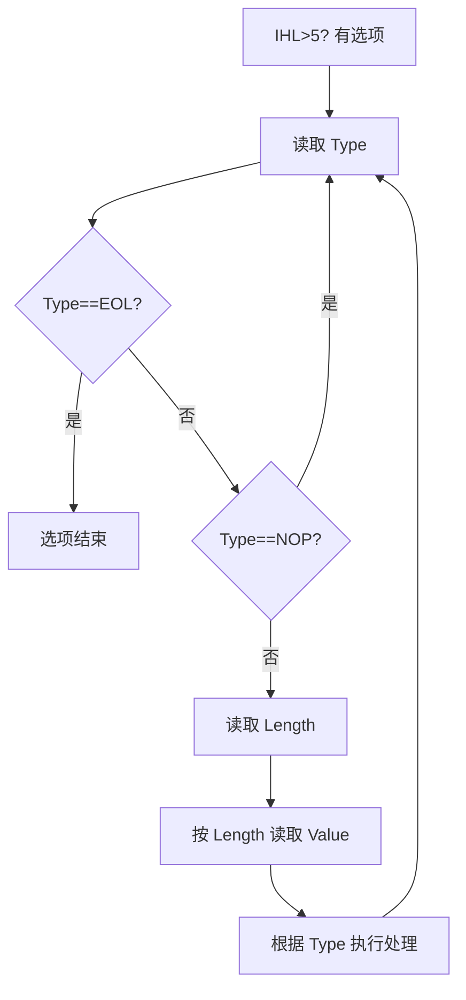

# IP 选项（Options）

IP 首部可携带可选字段（Options），用于携带控制信息或调试数据。选项以 TLV（Type-Length-Value）或单字节类型形式出现，整个首部需 32 位对齐（通过 Padding 填充）。

通用格式：

- 单字节选项：`End of Option List (EOL=0)`, `No Operation (NOP=1)`。
- TLV 选项：`Type (8b) | Length (8b) | Value (可变)`。
- Type 字段位分布：`copy(1b) | class(2b) | number(5b)`：
  - copy=1：当分片时复制该选项到所有分片。
  - class：控制类（0=常规, 2=调试/测量 等）。

常见（历史）选项：

- Record Route（RR）：记录沿途路由器的 IP 地址。
- Timestamp（TS）：记录时间戳或时间戳+地址。
- Loose Source and Record Route（LSRR）：发送方指定一系列中间路由器，路由可宽松偏离；已被普遍禁用（安全考虑）。
- Strict Source and Record Route（SSRR）：严格按指定路径转发；同样多被禁用。
- Security（SEC）：携带安全标签（历史遗留）。
- Stream ID：流标识（已废弃）。

解析流程（简化）：

实现与注意事项：

- 路由记录与源路由选项会改变转发行为，现代网络多默认丢弃或忽略以防被滥用。
- 选项处理开销较大，会降低转发性能；高速路径常绕过或限制选项。
- Linux 在 `ip_options_compile()`/`ip_options_rcv_srr()` 等路径解析与应用选项，对 L/SSRR 采取严格限制或直接丢弃策略。

工程建议：

- 生产路径禁用源路由相关选项；仅在受控实验网络中使用 RR/TS 进行路径诊断。
- 处理未知选项时遵循 RFC：保守前进（尽量转发），同时加强安全审计与速率限制。

