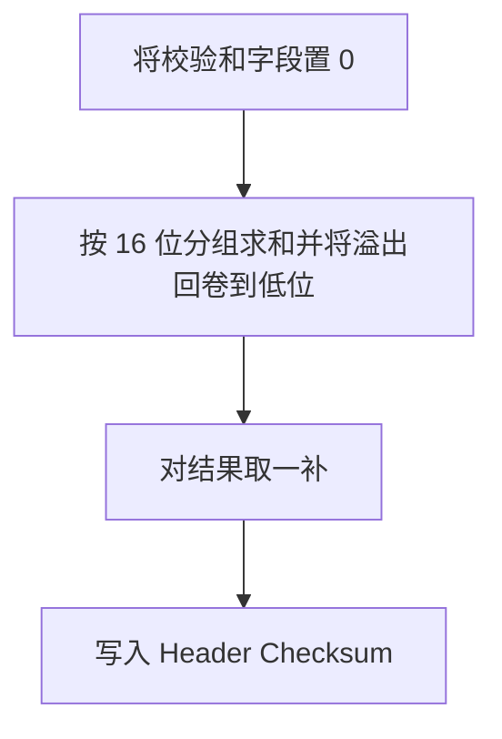

# 校验和与差错处理

IPv4 首部包含 16 位一补和（one’s complement）校验，用于检测首部在传输中的比特错误。注意：该校验不覆盖数据部分。

算法（首部校验）：

差错处理（与 ICMP 配合）：

- TTL 归零：丢弃并发送 ICMP Time Exceeded（Type 11）。
- 需要分片但 DF=1：丢弃并发送 ICMP Destination Unreachable/Frag Needed（Type 3, Code 4），包含 Next-Hop MTU（RFC 1191）。
- 路由不可达：ICMP Destination Unreachable（Type 3）。
- 首部错误：如 IHL/总长度非法、校验错误，直接丢弃，可视情况上报统计。

与 Linux 实现的联系：

- 校验：`ip_fast_csum()` 和接收路径中的增量校验优化。
- ICMP 生成：`icmp_send()` 按需构造差错报文；转发路径在 `ip_forward()` 中触发。
- 硬件分担：现代 NIC 支持 checksum offload，Linux 会根据设备能力选择软/硬件计算。

工程提示：

- 在抓包与调试时注意硬件卸载的影响（抓到的校验和可能为 0 或未计算）。
- 对异常流量设置限速，避免 ICMP 放大或 CPU 被大量差错包压垮。
