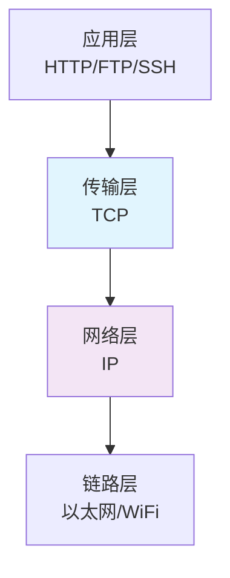
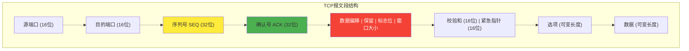
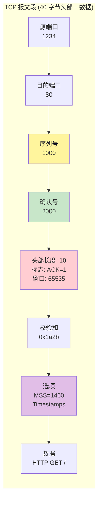
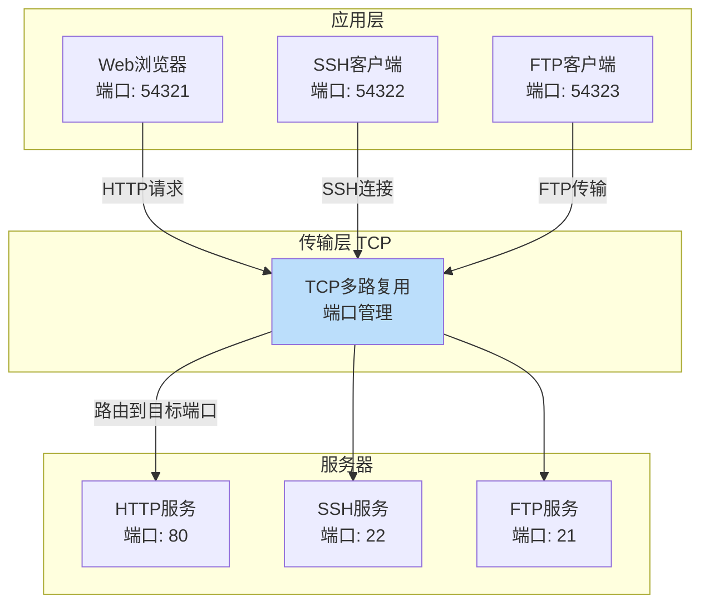

# 第一章：TCP 核心概念与报文段结构

## 1.1 什么是 TCP？

TCP（Transmission Control Protocol，传输控制协议）是互联网协议栈中最重要的传输层协议之一。想象一下，当你在浏览网页、发送邮件或观看视频时，数据并不是一次性从服务器传到你的电脑，而是被拆分成一个个小包裹，通过复杂的网络路径送达。TCP 就像一个**可靠的快递系统**，确保每个包裹都能按顺序、完整无损地送到目的地。

### TCP 的核心特性

根据 RFC 9293，TCP 提供以下关键特性：

1. **面向连接**：通信前需要建立连接（就像打电话前要先拨号）
2. **可靠传输**：保证数据完整、无错、不丢失
3. **有序交付**：数据按发送顺序到达
4. **字节流服务**：应用程序看到的是连续的字节流，而非离散的消息
5. **全双工通信**：双方可以同时发送和接收数据
6. **流量控制**：防止发送方压垮接收方
7. **拥塞控制**：防止网络过载

### TCP 与 IP 的关系



TCP 工作在传输层，依赖 IP（Internet Protocol）提供的路由和寻址功能。IP 只负责把数据包从 A 点送到 B 点，但不保证可靠性；TCP 在 IP 之上增加了可靠性机制。

## 1.2 TCP 报文段结构详解

TCP 将数据封装成**报文段（Segment）**进行传输。理解报文段结构是掌握 TCP 的第一步。

### TCP 报文段格式

```txt

       0                   1                   2                   3
       0 1 2 3 4 5 6 7 8 9 0 1 2 3 4 5 6 7 8 9 0 1 2 3 4 5 6 7 8 9 0 1
      +-+-+-+-+-+-+-+-+-+-+-+-+-+-+-+-+-+-+-+-+-+-+-+-+-+-+-+-+-+-+-+-+
      |          Source Port          |       Destination Port        |
      +-+-+-+-+-+-+-+-+-+-+-+-+-+-+-+-+-+-+-+-+-+-+-+-+-+-+-+-+-+-+-+-+
      |                        Sequence Number                        |
      +-+-+-+-+-+-+-+-+-+-+-+-+-+-+-+-+-+-+-+-+-+-+-+-+-+-+-+-+-+-+-+-+
      |                    Acknowledgment Number                      |
      +-+-+-+-+-+-+-+-+-+-+-+-+-+-+-+-+-+-+-+-+-+-+-+-+-+-+-+-+-+-+-+-+
      |  Data |       |C|E|U|A|P|R|S|F|                               |
      | Offset| Rsrvd |W|C|R|C|S|S|Y|I|            Window             |
      |       |       |R|E|G|K|H|T|N|N|                               |
      +-+-+-+-+-+-+-+-+-+-+-+-+-+-+-+-+-+-+-+-+-+-+-+-+-+-+-+-+-+-+-+-+
      |           Checksum            |         Urgent Pointer        |
      +-+-+-+-+-+-+-+-+-+-+-+-+-+-+-+-+-+-+-+-+-+-+-+-+-+-+-+-+-+-+-+-+
      |                           [Options]                           |
      +-+-+-+-+-+-+-+-+-+-+-+-+-+-+-+-+-+-+-+-+-+-+-+-+-+-+-+-+-+-+-+-+
      |                                                               :
      :                             Data                              :
      :                                                               |
      +-+-+-+-+-+-+-+-+-+-+-+-+-+-+-+-+-+-+-+-+-+-+-+-+-+-+-+-+-+-+-+-+

             Note that one tick mark represents one bit position.

                        Figure 1: TCP Header Format
```



### 字段详解

#### 1. 端口号字段（Port Numbers）

```
源端口 (Source Port): 16 位
目的端口 (Destination Port): 16 位
```

**作用**：标识通信的应用程序。

- 端口号范围：0-65535
  - 0-1023: 知名端口（Well-Known Ports），如 HTTP:80, HTTPS:443, SSH:22
  - 1024-49151: 注册端口（Registered Ports）
  - 49152-65535: 动态/私有端口（Dynamic/Private Ports）

**Linux 查看端口占用**：

```bash
# 查看所有 TCP 连接和监听端口
ss -tuln

# 查看特定端口
netstat -tuln | grep :80
```

#### 2. 序列号（Sequence Number）

```
序列号: 32 位
```

**作用**：标识每个字节的位置，保证数据有序性。

- 初始序列号（ISN）在连接建立时随机生成
- 每发送一个字节，序列号加 1
- 序列号会循环使用（0 到 2³² - 1）

**比喻**：就像给每个包裹编号，从 1001 号开始，1002、1003...，接收方按编号排序组装。

#### 3. 确认号（Acknowledgment Number）

```
确认号: 32 位
```

**作用**：告诉对方"我期望接收的下一个字节序列号"。

- 只有当 ACK 标志位为 1 时有效
- 采用**累积确认**：确认号 N 表示 N 之前的所有字节都已收到

**示例**：

```
发送方发送字节 1-100，序列号为 1000
接收方回复确认号 1100，表示"我收到了 1000-1099，期待 1100"
```

#### 4. 数据偏移（Data Offset）

```
数据偏移: 4 位
```

**作用**：指示 TCP 头部长度，以 32 位字（4 字节）为单位。

- 最小值：5（20 字节，无选项）
- 最大值：15（60 字节，40 字节选项）

#### 5. 标志位（Control Flags）

```
标志位: 8 位
```

这是 TCP 的"信号灯"，控制连接的状态转换：

| 标志位  | 含义                      | 用途                   |
| ------- | ------------------------- | ---------------------- |
| **CWR** | Congestion Window Reduced | 拥塞窗口减小（ECN）    |
| **ECE** | ECN-Echo                  | 显式拥塞通知回显       |
| **URG** | Urgent                    | 紧急指针有效           |
| **ACK** | Acknowledgment            | 确认号有效             |
| **PSH** | Push                      | 推送数据到应用层       |
| **RST** | Reset                     | 重置连接               |
| **SYN** | Synchronize               | 同步序列号（建立连接） |
| **FIN** | Finish                    | 结束连接               |

**核心标志位组合**：

- `SYN=1, ACK=0`: 连接请求
- `SYN=1, ACK=1`: 连接确认
- `FIN=1, ACK=1`: 连接关闭
- `RST=1`: 异常重置

#### 6. 窗口大小（Window Size）

```
窗口大小: 16 位 (无符号整数)
```

**作用**：流量控制，告诉对方"我还能接收多少字节"。

- 基础窗口：0-65535 字节
- 配合窗口缩放选项（RFC 7323），可支持更大窗口

**Linux 查看和调整窗口大小**：

```bash
# 查看当前 TCP 窗口参数
sysctl net.ipv4.tcp_rmem
sysctl net.ipv4.tcp_wmem

# 输出示例：
# net.ipv4.tcp_rmem = 4096 131072 6291456
# 含义：最小值 最大值 默认值（字节）
```

#### 7. 校验和（Checksum）

```
校验和: 16 位
```

**作用**：错误检测，覆盖 TCP 头部、数据和伪头部。

- **强制性**：发送方必须计算，接收方必须验证（RFC 9293 MUST-2, MUST-3）
- **伪头部**：包含 IP 地址信息，防止数据包误送

**校验和计算范围**（IPv4）：

```
伪头部（12 字节）：
  - 源 IP 地址（4 字节）
  - 目的 IP 地址（4 字节）
  - 保留字段（1 字节，全 0）
  - 协议号（1 字节，TCP=6）
  - TCP 长度（2 字节）

+ TCP 头部和数据
```

#### 8. 选项（Options）

```
选项: 可变长度（最多 40 字节）
```

**常用选项**：

| 选项类型                       | Kind | 长度 | 用途                       |
| ------------------------------ | ---- | ---- | -------------------------- |
| End of Option List             | 0    | 1    | 选项列表结束               |
| No-Operation                   | 1    | 1    | 填充对齐                   |
| **Maximum Segment Size (MSS)** | 2    | 4    | 最大报文段大小             |
| **Window Scale**               | 3    | 3    | 窗口缩放因子（RFC 7323）   |
| SACK-Permitted                 | 4    | 2    | 支持选择性确认（RFC 2018） |
| **SACK**                       | 5    | 可变 | 选择性确认块               |
| **Timestamps**                 | 8    | 10   | 时间戳（RFC 7323）         |

**Linux 查看选项启用状态**：

```bash
# 查看 SACK 是否启用
sysctl net.ipv4.tcp_sack
# 输出: net.ipv4.tcp_sack = 1 (启用)

# 查看窗口缩放是否启用
sysctl net.ipv4.tcp_window_scaling
# 输出: net.ipv4.tcp_window_scaling = 1 (启用)

# 查看时间戳是否启用
sysctl net.ipv4.tcp_timestamps
# 输出: net.ipv4.tcp_timestamps = 1 (启用)
```

## 1.3 TCP 报文段结构可视化

### 完整报文段示例



### tcpdump 抓包示例

**捕获三次握手中的 SYN 包**：

```bash
# 捕获目标端口 80 的 TCP SYN 包
sudo tcpdump -i any -nn 'tcp[tcpflags] & tcp-syn != 0 and port 80' -c 1 -vv

# 输出示例：
# 12:34:56.789012 IP 192.168.1.100.54321 > 93.184.216.34.80:
#   Flags [S], seq 123456789, win 65535, options [mss 1460,sackOK,TS val 12345 ecr 0,nop,wscale 7], length 0
```

**字段解析**：

- `Flags [S]`: SYN 标志位
- `seq 123456789`: 初始序列号
- `win 65535`: 窗口大小
- `options`:
  - `mss 1460`: ���大报文段大小
  - `sackOK`: 支持 SACK
  - `TS val 12345`: 时间戳值
  - `wscale 7`: 窗口缩放因子为 7（实际窗口 = 65535 × 2⁷）

## 1.4 TCP 与应用层的关系

### 端口与应用程序映射



### 查看本地连接

```bash
# 查看所有活动 TCP 连接及状态
ss -tan

# 输出示例：
# State    Recv-Q Send-Q Local Address:Port  Peer Address:Port
# ESTAB    0      0      192.168.1.100:54321 93.184.216.34:80
# LISTEN   0      128    0.0.0.0:22         0.0.0.0:*
# TIME-WAIT 0     0      192.168.1.100:54320 93.184.216.34:443
```

**字段含义**：

- `ESTAB`: 已建立的连接
- `LISTEN`: 监听状态（服务器）
- `Recv-Q`: 接收队列中的字节数
- `Send-Q`: 发送队列中的字节数

## 1.5 实战练习

### 练习 1：分析 TCP 头部

使用 tcpdump 捕获一个 TCP 连接，分析以下字段：

1. 初始序列号（ISN）
2. 最大报文段大小（MSS）
3. 窗口缩放因子

```bash
# 捕获到 example.com 的连接（前 3 个包）
sudo tcpdump -i any -nn host example.com -c 3 -vv -w capture.pcap

# 使用 Wireshark 或 tcpdump 分析
tcpdump -r capture.pcap -vv
```

### 练习 2：观察窗口大小变化

```bash
# 使用 ss 命令实时监控连接的窗口大小
watch -n 1 'ss -tin | grep -A 5 ESTAB'

# 输出示例：
# skmem:(r0,rb131072,t0,tb87040,f0,w0,o0,bl0,d0)
# ts sack cubic wscale:7,7 rto:204 rtt:3.5/1.75 ato:40 mss:1460
# pmtu:1500 rcvmss:1460 advmss:1460 cwnd:10 bytes_sent:1234
# bytes_acked:1234 bytes_received:5678 segs_out:15 segs_in:20
```

**关键参数**：

- `wscale:7,7`: 发送和接收窗口缩放因子
- `cwnd:10`: 拥塞窗口大小（下一章详解）
- `mss:1460`: 最大报文段大小

## 1.6 小结

本章介绍了 TCP 的核心概念和报文段结构：

✅ **关键要点**：

1. TCP 提供可靠、有序、面向连接的字节流服务
2. TCP 报文段包含 20-60 字节头部和可变长度数据
3. 序列号和确认号是可靠性的基础
4. 标志位控制连接状态转换
5. 窗口大小用于流量控制
6. 选项字段提供功能扩展

🔗 **与 Linux 实现的联系**：

- 使用 `ss`、`netstat` 查看连接状态
- 使用 `tcpdump` 抓包分析报文段结构
- 通过 `sysctl` 调整 TCP 参数

📚 **下一章预告**：
第二章将深入讲解 TCP 连接管理，包括著名的"三次握手"和"四次挥手"过程，以及 TCP 状态机的完整转换。

---

**参考资料**：

- RFC 9293: Transmission Control Protocol (TCP)
- Linux 内核文档：[tcp(7) man page](https://man7.org/linux/man-pages/man7/tcp.7.html)
