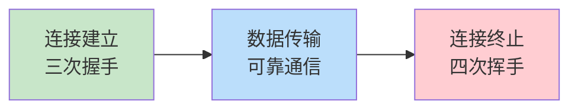
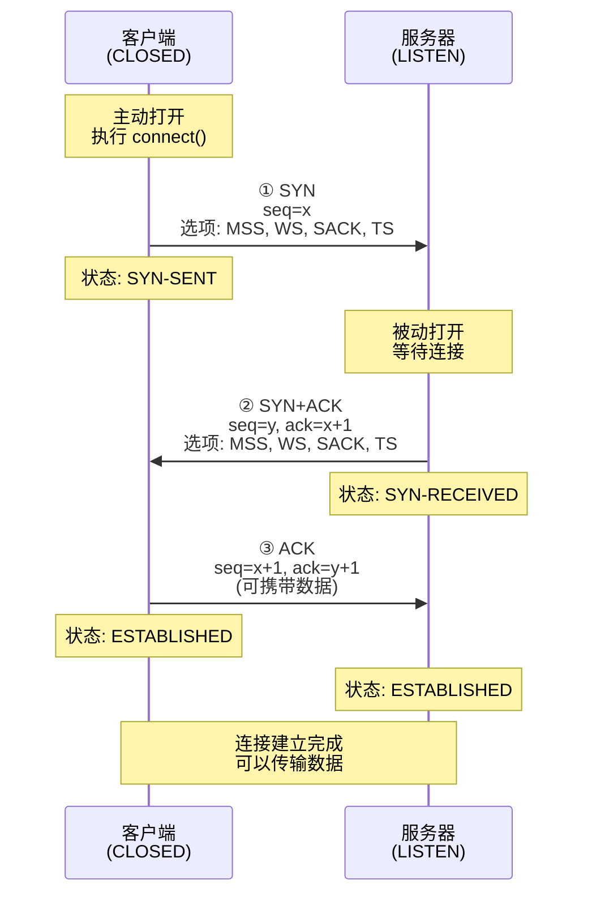
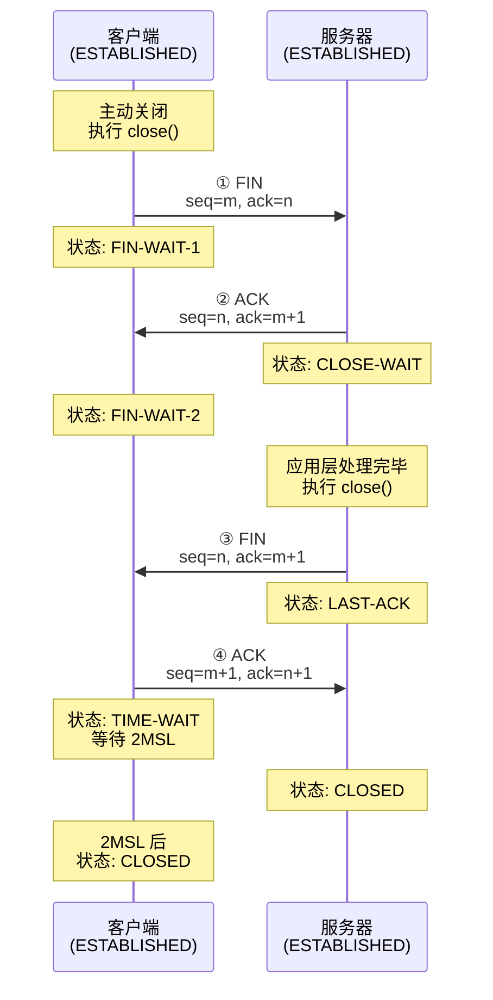
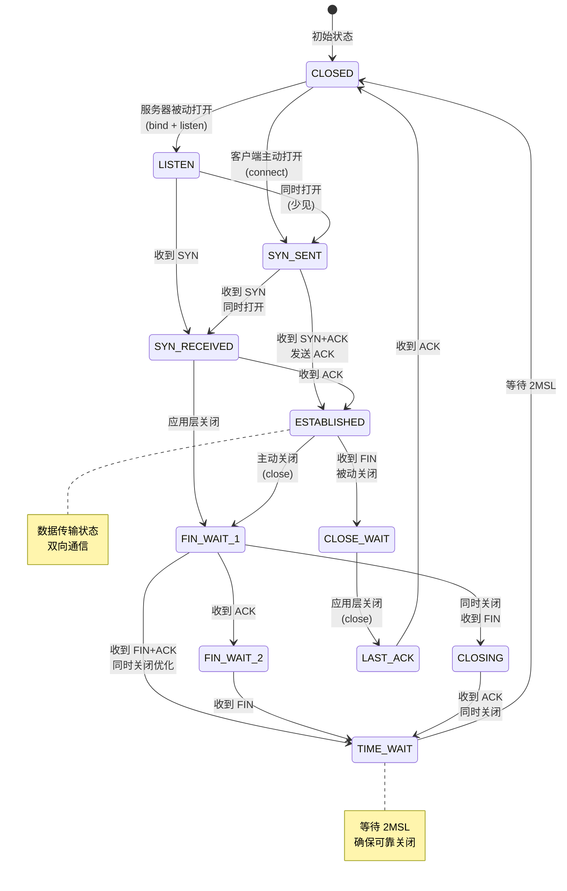
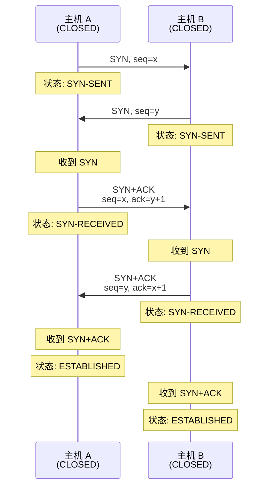
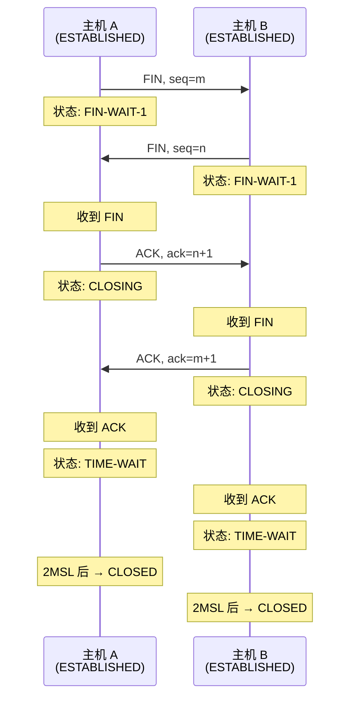

# 第二章：TCP 连接管理

## 2.1 TCP 连接的生命周期

TCP 是**面向连接**的协议,一个完整的 TCP 通信过程包括三个阶段：



理解这个过程就像理解打电话的流程：
- **拨号接通**（三次握手）
- **通话交流**（数据传输）
- **挂断电话**（四次挥手）

## 2.2 三次握手：建立连接

### 2.2.1 为什么需要三次握手？

两次握手不够安全，四次握手又太浪费。三次握手恰好能保证：
1. **双向通信能力确认**：双方都能发送和接收数据
2. **初始序列号同步**：双方协商各自的起始序列号
3. **防止历史连接**：避免旧的重复连接请求干扰

### 2.2.2 三次握手详细过程



**详细步骤解析**：

**第一次握手（SYN）**：
- 客户端发送 `SYN=1`，序列号 `seq=x`（随机生成）
- 携带 TCP 选项：
  - `MSS`（Maximum Segment Size）：通告最大报文段大小
  - `Window Scale`：窗口缩放因子
  - `SACK-Permitted`：支持选择性确认
  - `Timestamps`：时间戳
- 状态转换：`CLOSED` → `SYN-SENT`

**第二次握手（SYN-ACK）**：
- 服务器回复 `SYN=1, ACK=1`
- `seq=y`（服务器的初始序列号）
- `ack=x+1`（确认客户端的序列号）
- 同样携带 TCP 选项
- 状态转换：`LISTEN` → `SYN-RECEIVED`

**第三次握手（ACK）**：
- 客户端发送 `ACK=1`
- `seq=x+1, ack=y+1`（确认服务器的序列号）
- **可以携带应用数据**（TCP Fast Open 优化）
- 状态转换：`SYN-SENT` → `ESTABLISHED`
- 服务器收到后：`SYN-RECEIVED` → `ESTABLISHED`

### 2.2.3 tcpdump 抓包示例

**捕获三次握手过程**：
```bash
# 捕获到 www.example.com (93.184.216.34) 的连接
sudo tcpdump -i any -nn host 93.184.216.34 and port 80 -c 3 -vv

# 输出示例：
```

**第一次握手（SYN）**：
```
12:00:00.000000 IP 192.168.1.100.54321 > 93.184.216.34.80:
  Flags [S], seq 123456789, win 65535,
  options [mss 1460,sackOK,TS val 1234567 ecr 0,nop,wscale 7],
  length 0
```

**第二次握手（SYN-ACK）**：
```
12:00:00.050000 IP 93.184.216.34.80 > 192.168.1.100.54321:
  Flags [S.], seq 987654321, ack 123456790, win 65535,
  options [mss 1460,sackOK,TS val 7654321 ecr 1234567,nop,wscale 8],
  length 0
```

**第三次握手（ACK）**：
```
12:00:00.050100 IP 192.168.1.100.54321 > 93.184.216.34.80:
  Flags [.], seq 123456790, ack 987654322, win 65535,
  options [nop,nop,TS val 1234568 ecr 7654321],
  length 0
```

**关键字段解读**：
- `Flags [S]`: SYN
- `Flags [S.]`: SYN-ACK（`.` 表示 ACK）
- `Flags [.]`: ACK
- `seq`: 序列号
- `ack`: 确认号
- `win`: 窗口大小（未缩放前）
- `wscale`: 窗口缩放因子（实际窗口 = win × 2^wscale）

### 2.2.4 Linux 系统参数

**查看三次握手相关参数**：
```bash
# SYN 队列大小（半连接队列）
sysctl net.ipv4.tcp_max_syn_backlog
# 输出: net.ipv4.tcp_max_syn_backlog = 1024

# Accept 队列大小（全连接队列）
sysctl net.core.somaxconn
# 输出: net.core.somaxconn = 4096

# SYN-RECEIVED 状态超时重试次数
sysctl net.ipv4.tcp_synack_retries
# 输出: net.ipv4.tcp_synack_retries = 5

# SYN-SENT 状态超时重试次数
sysctl net.ipv4.tcp_syn_retries
# 输出: net.ipv4.tcp_syn_retries = 6
```

**监控半连接和全连接队列**：
```bash
# 查看 SYN_RECV 状态的连接数（半连接）
ss -tan | grep SYN_RECV | wc -l

# 查看全连接队列溢出统计
netstat -s | grep overflowed
# 输出: 1234 times the listen queue of a socket overflowed
```

### 2.2.5 常见问题：SYN 洪水攻击

**攻击原理**：
攻击者发送大量 SYN 包但不完成第三次握手，耗尽服务器的半连接队列。

**防御措施**：

1. **启用 SYN Cookies**：
```bash
# 查看 SYN Cookies 状态
sysctl net.ipv4.tcp_syncookies
# 输出: net.ipv4.tcp_syncookies = 1 (启用)

# SYN Cookies 工作原理：
# 不分配连接资源，而是将连接信息编码到初始序列号中
# 只有在收到第三次握手的 ACK 后才分配资源
```

2. **调整队列大小**：
```bash
# 增加半连接队列大小
sudo sysctl -w net.ipv4.tcp_max_syn_backlog=8192

# 增加全连接队列大小
sudo sysctl -w net.core.somaxconn=8192
```

## 2.3 四次挥手：终止连接

### 2.3.1 为什么需要四次挥手？

TCP 是**全双工**通信，双方都可以独立发送和接收数据。关闭连接需要：
1. 一方说"我没有数据要发了"（FIN）
2. 另一方确认"知道了"（ACK）
3. 另一方也说"我也没有数据要发了"（FIN）
4. 第一方确认"知道了"（ACK）

### 2.3.2 四次挥手详细过程



**详细步骤解析**：

**第一次挥手（FIN）**：
- 客户端发送 `FIN=1, ACK=1`
- `seq=m`（最后一个数据字节的序列号 + 1）
- 状态转换：`ESTABLISHED` → `FIN-WAIT-1`
- 含义："我没有数据要发了，但还能接收数据"

**第二次挥手（ACK）**：
- 服务器回复 `ACK=1`
- `ack=m+1`（确认客户端的 FIN）
- 状态转换：`ESTABLISHED` → `CLOSE-WAIT`
- 客户端状态：`FIN-WAIT-1` → `FIN-WAIT-2`
- 含义："知道了，我还有数据要发，等我处理完"

**第三次挥手（FIN）**：
- 服务器发送 `FIN=1, ACK=1`
- `ack=m+1`（仍然确认客户端的 FIN）
- 状态转换：`CLOSE-WAIT` → `LAST-ACK`
- 含义："我也处理完了，可以关闭了"

**第四次挥手（ACK）**：
- 客户端回复 `ACK=1`
- `ack=n+1`（确认服务器的 FIN）
- 状态转换：`FIN-WAIT-2` → `TIME-WAIT`
- 服务器收到后：`LAST-ACK` → `CLOSED`
- 客户端等待 `2MSL` 后：`TIME-WAIT` → `CLOSED`

### 2.3.3 TIME-WAIT 状态详解

**为什么需要 TIME-WAIT？**

1. **确保最后的 ACK 能够到达**：
   - 如果最后的 ACK 丢失，服务器会重传 FIN
   - TIME-WAIT 状态能够响应重传的 FIN

2. **防止旧连接的数据干扰新连接**：
   - 等待 2MSL（Maximum Segment Lifetime，最大报文段生存时间）
   - 确保旧连接的所有报文都已消失

**MSL 值**：
```bash
# 查看 Linux 的 MSL 值（实际是 TCP_TIMEWAIT_LEN）
# Linux 内核硬编码为 60 秒
# TIME-WAIT 持续时间 = 2MSL = 120 秒

# 查看 TIME-WAIT 连接数
ss -tan | grep TIME-WAIT | wc -l

# 查看 TIME-WAIT 连接详情
ss -tan state time-wait
```

**TIME-WAIT 过多的问题**：

高并发场景下，主动关闭方会积累大量 TIME-WAIT 连接，占用端口资源。

**解决方案**：

1. **启用快速回收（谨慎使用）**：
```bash
# 允许 TIME-WAIT 状态的连接快速回收（需配合 timestamps）
sysctl net.ipv4.tcp_tw_reuse
# 输出: net.ipv4.tcp_tw_reuse = 2 (启用)

# 注意：tcp_tw_recycle 在内核 4.12+ 已移除（不安全）
```

2. **调整端口范围**：
```bash
# 增加可用端口数量
sysctl net.ipv4.ip_local_port_range
# 输出: net.ipv4.ip_local_port_range = 32768    60999

# 扩大端口范围
sudo sysctl -w net.ipv4.ip_local_port_range="10000 65535"
```

3. **使用连接池**（应用层优化）：
   - 复用长连接，减少连接建立和关闭次数

## 2.4 TCP 状态机

### 2.4.1 完整状态转换图



### 2.4.2 状态说明

| 状态 | 说明 | 触发条件 | 下一状态 |
|------|------|----------|----------|
| **CLOSED** | 关闭状态 | 初始/终止 | LISTEN, SYN-SENT |
| **LISTEN** | 监听状态 | 服务器 bind+listen | SYN-RECEIVED |
| **SYN-SENT** | 发送 SYN | 客户端 connect | ESTABLISHED, SYN-RECEIVED |
| **SYN-RECEIVED** | 收到 SYN | 服务器收到 SYN | ESTABLISHED, FIN-WAIT-1 |
| **ESTABLISHED** | 连接建立 | 三次握手完成 | FIN-WAIT-1, CLOSE-WAIT |
| **FIN-WAIT-1** | 发送 FIN | 主动关闭 | FIN-WAIT-2, CLOSING, TIME-WAIT |
| **FIN-WAIT-2** | 等待对方 FIN | 收到 FIN 的 ACK | TIME-WAIT |
| **CLOSE-WAIT** | 等待关闭 | 被动关闭，收到 FIN | LAST-ACK |
| **CLOSING** | 同时关闭 | 双方同时发送 FIN | TIME-WAIT |
| **LAST-ACK** | 最后确认 | 被动关闭，发送 FIN | CLOSED |
| **TIME-WAIT** | 时间等待 | 主动关闭，收到 FIN | CLOSED（2MSL 后） |

### 2.4.3 查看连接状态

```bash
# 查看所有 TCP 连接状态统计
ss -tan | awk '{print $1}' | sort | uniq -c

# 输出示例：
#    1 State
#   45 ESTAB
#  123 TIME-WAIT
#    5 CLOSE-WAIT
#    2 FIN-WAIT-2
#   10 LISTEN

# 查看特定状态的连接
ss -tan state established
ss -tan state time-wait
ss -tan state close-wait

# 实时监控状态变化
watch -n 1 'ss -tan | awk "{print \$1}" | sort | uniq -c'
```

**异常状态诊断**：

1. **CLOSE-WAIT 过多**：
   - 原因：应用程序没有正确关闭连接
   - 解决：检查应用代码，确保调用 `close()`

2. **FIN-WAIT-2 堆积**：
   - 原因：对方没有发送 FIN（可能崩溃或网络故障）
   - 超时：由 `tcp_fin_timeout` 控制
   ```bash
   sysctl net.ipv4.tcp_fin_timeout
   # 输出: net.ipv4.tcp_fin_timeout = 60 (秒)
   ```

## 2.5 特殊场景

### 2.5.1 同时打开（Simultaneous Open）

双方同时发送 SYN，都处于 SYN-SENT 状态。



**特点**：
- 需要四次握手完成连接
- 实际应用中很少见

### 2.5.2 同时关闭（Simultaneous Close）

双方同时发送 FIN。



### 2.5.3 半关闭（Half-Close）

一方关闭写端，但仍可接收数据。

**应用场景**：
- HTTP/1.0 客户端发送完请求后，关闭写端，等待服务器响应

**系统调用**：
```c
// C 语言示例
shutdown(sockfd, SHUT_WR);  // 关闭写端，发送 FIN
// 仍可接收数据
recv(sockfd, buffer, size, 0);
```

**状态转换**：
```
ESTABLISHED → FIN-WAIT-1 → FIN-WAIT-2 (半关闭状态)
```

## 2.6 连接复位（RST）

### 2.6.1 RST 的作用

`RST`（Reset）用于**异常终止连接**，不同于正常的四次挥手。

**触发 RST 的场景**：

1. **连接请求到达不存在的端口**：
```bash
# 尝试连接未监听的端口
telnet localhost 9999
# 服务器回复 RST
```

2. **接收到无效的报文段**：
   - 连接已关闭，但收到数据
   - 序列号不在窗口范围内

3. **应用程序异常关闭**：
```c
// C 语言示例
struct linger ling = {1, 0};  // 立即发送 RST
setsockopt(sockfd, SOL_SOCKET, SO_LINGER, &ling, sizeof(ling));
close(sockfd);  // 发送 RST 而非 FIN
```

### 2.6.2 RST 抓包示例

```bash
# 捕获 RST 包
sudo tcpdump -i any 'tcp[tcpflags] & tcp-rst != 0' -vv

# 输出示例：
# 12:00:00.123456 IP 192.168.1.100.54321 > 93.184.216.34.9999:
#   Flags [S], seq 123456789, win 65535, length 0
#
# 12:00:00.173456 IP 93.184.216.34.9999 > 192.168.1.100.54321:
#   Flags [R.], seq 0, ack 123456790, win 0, length 0
```

**RST 特点**：
- 不需要确认（没有 ACK 响应）
- 立即终止连接
- 可能导致数据丢失

## 2.7 实战练习

### 练习 1：观察三次握手

```bash
# 终端 1：启动抓包
sudo tcpdump -i lo -nn port 8080 -vv

# 终端 2：启动简单服务器
nc -l 8080

# 终端 3：发起连接
nc localhost 8080
```

**分析任务**：
1. 识别三个握手包的序列号
2. 计算窗口缩放后的实际窗口大小
3. 查看协商的 MSS 值

### 练习 2：诊断 TIME-WAIT 问题

```bash
# 模拟大量短连接
for i in {1..100}; do
  curl -s http://localhost:8080 > /dev/null &
done

# 观察 TIME-WAIT 数量
watch -n 1 'ss -tan | grep TIME-WAIT | wc -l'

# 分析 TIME-WAIT 分布
ss -tan state time-wait | awk '{print $4}' | sort | uniq -c
```

### 练习 3：状态机转换追踪

```bash
# 使用 ss 追踪单个连接的状态变化
# 先获取连接的 5 元组（源 IP:Port -> 目的 IP:Port）

# 实时监控特定连接
watch -n 0.5 'ss -tan | grep "192.168.1.100:54321"'

# 触发状态变化（在另一个终端）
# 1. 建立连接
# 2. 传输数据
# 3. 关闭连接
```

## 2.8 小结

本章详细讲解了 TCP 连接管理机制：

✅ **关键要点**：
1. **三次握手**建立连接，同步序列号，确认双向通信能力
2. **四次挥手**终止连接，支持全双工的独立关闭
3. **TIME-WAIT** 状态确保可靠关闭，持续 2MSL
4. **TCP 状态机**包含 11 种状态，覆盖连接的完整生命周期
5. **RST** 用于异常终止，不经过正常挥手流程

🔗 **与 Linux 实现的联系**：
- `ss -tan` 查看连接状态统计
- `sysctl` 调整三次握手和四次挥手参数
- `tcpdump` 抓包分析握手和挥手过程
- 监控半连接队列、全连接队列，防御 SYN 洪水攻击

🛡️ **安全考虑**：
- 启用 SYN Cookies 防御 SYN 洪水攻击
- 合理配置队列大小，平衡性能和资源占用
- 谨慎使用 `tcp_tw_reuse`，避免旧连接干扰

📚 **下一章预告**：
第三章将深入讲解 TCP 可靠数据传输机制，包括序列号与确认号的详细运作、超时重传（RTO）算法、滑动窗口流量控制等核心内容。

---

**参考资料**：
- RFC 9293 Section 3.5: Establishing a Connection
- RFC 9293 Section 3.6: Closing a Connection
- Linux 内核文档：[tcp(7) man page](https://man7.org/linux/man-pages/man7/tcp.7.html)
