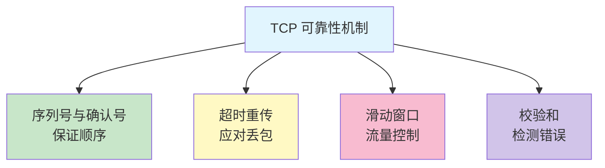
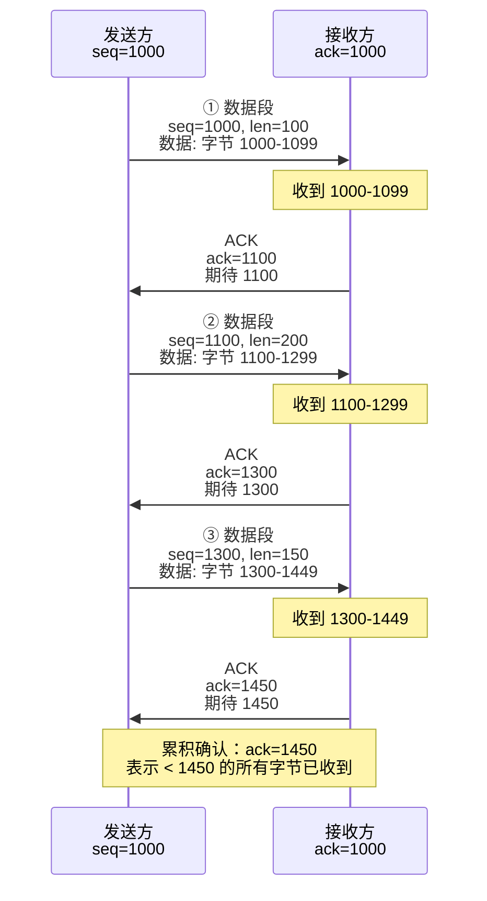
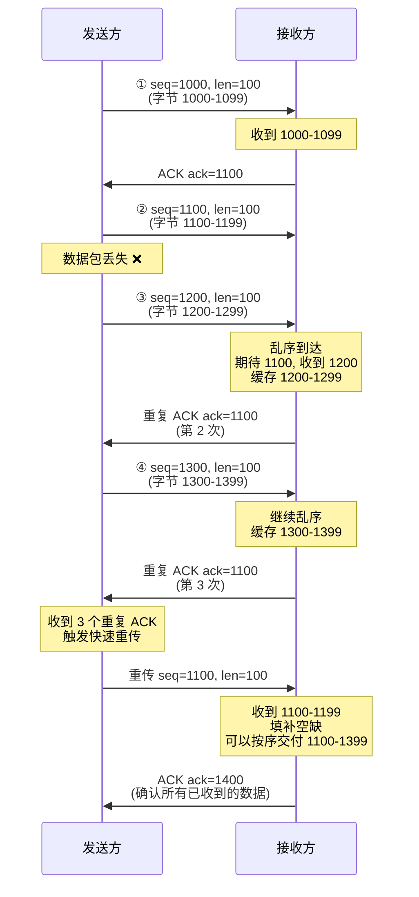
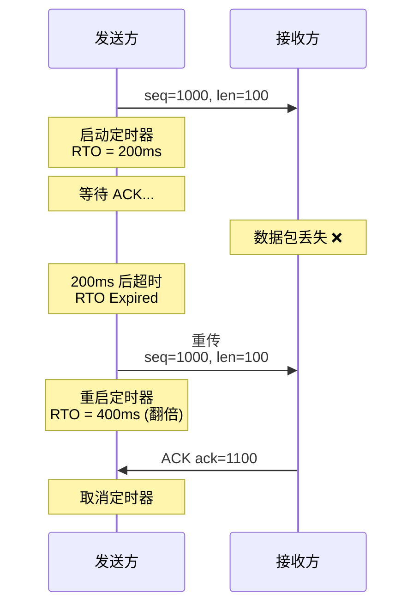
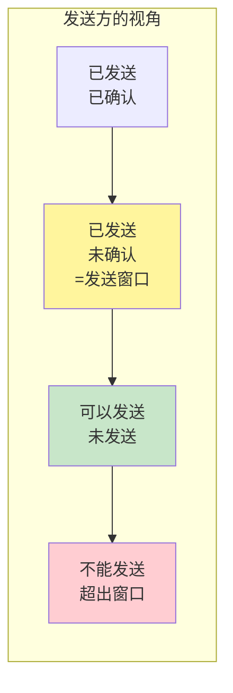
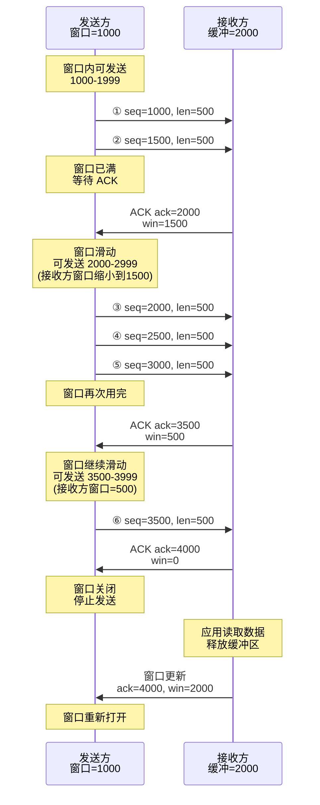
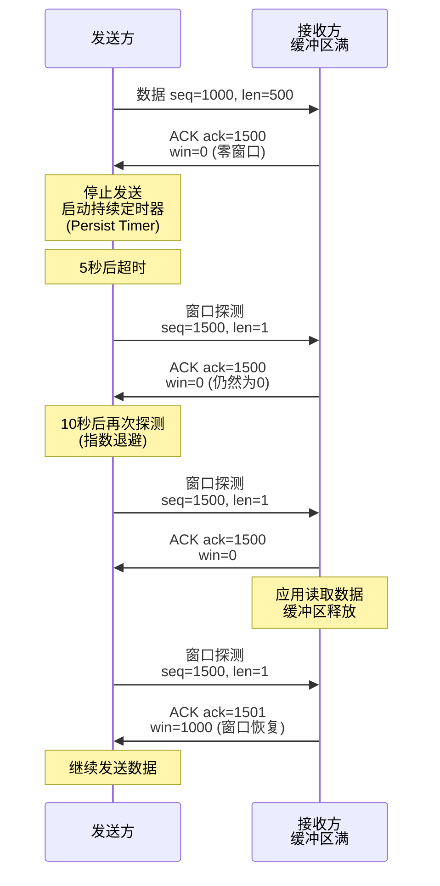
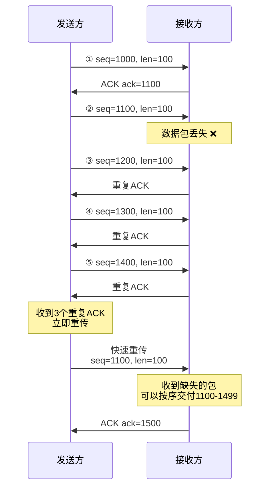

# 第三章：TCP 可靠数据传输机制

## 3.1 可靠性的挑战

网络传输面临三大挑战：
1. **丢包**：数据包在传输过程中丢失
2. **乱序**：数据包到达顺序与发送顺序不一致
3. **损坏**：数据在传输中被破坏

TCP 通过以下机制确保可靠性：



## 3.2 序列号与确认号机制

### 3.2.1 序列号的工作原理

序列号（Sequence Number）为每个字节编号，就像给包裹贴上唯一的标签。

**核心概念**：
- 序列号标识**数据的第一个字节**
- 32 位无符号整数：范围 0 到 2³² - 1（约 4.29GB）
- 序列号会循环使用（wraparound）

**示例**：
```
发送数据："HELLO"（5 字节）
序列号 = 1000
则：
  H → 序列号 1000
  E → 序列号 1001
  L → 序列号 1002
  L → 序列号 1003
  O → 序列号 1004
下一个报文段起始序列号 = 1005
```

### 3.2.2 确认号的工作原理

确认号（Acknowledgment Number）采用**累积确认**（Cumulative ACK），告诉发送方"我期待接收的下一个字节序列号"。

**累积确认的含义**：
```
确认号 = 1005
表示：序列号 < 1005 的所有字节都已正确接收
期待：接收序列号 1005 开始的数据
```

### 3.2.3 数据传输示例



**关键规则**：
1. 发送方的序列号 = 上次发送的序列号 + 上次发送的字节数
2. 接收方的确认号 = 期待接收的下一个字节序列号
3. 确认号隐式确认了之前的所有字节

### 3.2.4 乱序处理

当数据包乱序到达时，接收方仍然发送**累积确认**。



**重复 ACK（Duplicate ACK）的作用**：
1. 告知发送方"我收到了后续数据，但中间有空缺"
2. 触发**快速重传**（Fast Retransmit）：收到 3 个重复 ACK 立即重传

### 3.2.5 tcpdump 观察序列号

```bash
# 捕获 TCP 数据传输
sudo tcpdump -i any -nn port 80 -vv -c 10

# 输出示例（相对序列号）：
# 12:00:00.000000 IP 192.168.1.100.54321 > 93.184.216.34.80:
#   Flags [P.], seq 1:101, ack 1, win 65535, length 100
#   HTTP: GET / HTTP/1.1
#
# 12:00:00.050000 IP 93.184.216.34.80 > 192.168.1.100.54321:
#   Flags [.], seq 1:1461, ack 101, win 65535, length 1460
#   HTTP: 200 OK
#
# 12:00:00.050001 IP 93.184.216.34.80 > 192.168.1.100.54321:
#   Flags [.], seq 1461:2921, ack 101, win 65535, length 1460
#
# 12:00:00.050100 IP 192.168.1.100.54321 > 93.184.216.34.80:
#   Flags [.], seq 101, ack 2921, win 65535, length 0
```

**解读**：
- `seq 1:101` → 发送字节 1-100（100 字节）
- `ack 101` → 确认收到字节 < 101，期待 101
- `seq 1:1461` → 发送字节 1-1460（1460 字节，MSS 大小）
- `ack 2921` → 累积确认，收到 < 2921 的所有字节

## 3.3 超时重传机制（RTO）

### 3.3.1 重传定时器（Retransmission Timer）

当发送数据后，启动重传定时器。如果超时仍未收到 ACK，则重传数据。



### 3.3.2 RTO 计算：Jacobson/Karels 算法

RTO（Retransmission Timeout）不能固定，需要动态调整：
- 太小 → 不必要的重传
- 太大 → 恢复慢，吞吐量低

**算法**（RFC 6298）：

1. **测量 RTT**（Round-Trip Time）：
```
RTT = 发送数据到收到 ACK 的时间
```

2. **计算平滑 RTT（SRTT）**：
```
首次测量：SRTT = RTT
后续更新：SRTT = (1 - α) × SRTT + α × RTT
α = 1/8 = 0.125
```

3. **计算 RTT 变化量（RTTVAR）**：
```
首次测量：RTTVAR = RTT / 2
后续更新：RTTVAR = (1 - β) × RTTVAR + β × |SRTT - RTT|
β = 1/4 = 0.25
```

4. **计算 RTO**：
```
RTO = SRTT + 4 × RTTVAR
最小值：1 秒
```

**示例计算**：
```
初始 RTT = 100ms

第一次：
SRTT = 100ms
RTTVAR = 50ms
RTO = 100 + 4×50 = 300ms

测量到新的 RTT = 120ms

第二次：
SRTT = 0.875×100 + 0.125×120 = 102.5ms
RTTVAR = 0.75×50 + 0.25×|102.5-120| = 41.9ms
RTO = 102.5 + 4×41.9 = 270ms
```

### 3.3.3 Linux 的 RTO 实现

```bash
# 查看 RTO 相关参数
sysctl net.ipv4.tcp_rto_min
# 输出: net.ipv4.tcp_rto_min = 200 (毫秒)

sysctl net.ipv4.tcp_rto_max
# 输出: net.ipv4.tcp_rto_max = 120000 (120秒)

# 查看活动连接的 RTO
ss -tino | grep -A 1 ESTAB

# 输出示例：
# ESTAB  0  0  192.168.1.100:54321  93.184.216.34:80
#  cubic wscale:7,7 rto:204 rtt:3.5/1.75 ato:40 mss:1460
#  cwnd:10 bytes_sent:1234 bytes_acked:1234
```

**字段解读**：
- `rto:204` → 当前 RTO = 204ms
- `rtt:3.5/1.75` → 平滑 RTT = 3.5ms, RTT 变化量 = 1.75ms
- `ato:40` → ACK 延迟超时 = 40ms

### 3.3.4 指数退避（Exponential Backoff）

重传失败后，RTO 翻倍，避免网络拥塞：

```
第 1 次重传：RTO = 200ms
第 2 次重传：RTO = 400ms
第 3 次重传：RTO = 800ms
第 4 次重传：RTO = 1600ms
...
最大尝试次数：15 次（net.ipv4.tcp_retries2）
```

```bash
# 查看最大重传次数
sysctl net.ipv4.tcp_retries2
# 输出: net.ipv4.tcp_retries2 = 15

# 总超时时间约：
# 200 + 400 + 800 + 1600 + ... ≈ 13-30 分钟
```

## 3.4 滑动窗口机制

### 3.4.1 窗口的概念

**发送窗口**：发送方在未收到确认前可以发送的最大字节数。
**接收窗口**：接收方愿意接收的最大字节数。



**发送窗口大小** = min(接收方通告窗口, 拥塞窗口)

### 3.4.2 滑动窗口工作流程



### 3.4.3 窗口管理示例

**发送方窗口状态**：
```
序列号空间：
  [已确认]|[已发送未确认]|[可发送]|[不可发送]
         ^               ^        ^
       SND.UNA       SND.NXT   SND.UNA+SND.WND

SND.UNA：最早的未确认字节
SND.NXT：下一个要发送的字节
SND.WND：发送窗口大小
```

**接收方窗口状态**：
```
序列号空间：
  [已接收交付]|[可接收]|[不可接收]
             ^        ^
          RCV.NXT   RCV.NXT+RCV.WND

RCV.NXT：期待接收的下一个字节
RCV.WND：接收窗口大小（剩余缓冲区）
```

### 3.4.4 零窗口与窗口探测

**零窗口（Zero Window）**：
接收方缓冲区满，通告 `win=0`，发送方停止发送。

**窗口探测（Window Probe）**：
发送方定期发送 1 字节数据，探测窗口是否恢复。



**持续定时器参数**：
```bash
# 查看探测间隔（秒）
sysctl net.ipv4.tcp_keepalive_intvl
# 输出: net.ipv4.tcp_keepalive_intvl = 75

# 查看探测次数
sysctl net.ipv4.tcp_keepalive_probes
# 输出: net.ipv4.tcp_keepalive_probes = 9
```

### 3.4.5 糊涂窗口综合症（Silly Window Syndrome）

**问题**：
接收方每次只释放很小的窗口（如 1 字节），导致发送方发送大量小包，效率低下。

**解决方案（接收方）**：
只在窗口达到一定阈值时才通告（David Clark 算法）：
```
通告窗口 ≥ min(MSS, 接收缓冲区的一半)
```

**解决方案（发送方）**：
Nagle 算法，合并小数据包：
```c
// Nagle 算法伪代码
if (数据大小 >= MSS || 没有未确认的数据) {
    立即发送();
} else {
    等待更多数据或收到ACK();
}
```

**Linux 控制 Nagle 算法**：
```bash
# 应用程序可以禁用 Nagle（实时应用）
# C 语言示例：
int flag = 1;
setsockopt(sockfd, IPPROTO_TCP, TCP_NODELAY, &flag, sizeof(flag));
```

## 3.5 快速重传与快速恢复

### 3.5.1 快速重传（Fast Retransmit）

不等待 RTO 超时，收到 **3 个重复 ACK** 立即重传。



**优势**：
- 比等待 RTO 超时（通常数百毫秒）快得多
- 典型恢复时间：1 RTT

### 3.5.2 快速恢复（Fast Recovery）

快速重传后，不回到慢启动，而是：
1. 将 `ssthresh` 设为当前 `cwnd` 的一半
2. 将 `cwnd` 设为 `ssthresh + 3 × MSS`
3. 每收到一个重复 ACK，`cwnd += MSS`（临时膨胀）
4. 收到新 ACK 后，`cwnd = ssthresh`，恢复正常

**状态转换**：
```
正常发送 → 收到3个重复ACK → 快速重传 → 快速恢复 → 拥塞避免
```

**下一章详解拥塞控制算法时会深入讲解。**

## 3.6 实战练习

### 练习 1：观察序列号和确认号

```bash
# 终端 1：启动 HTTP 服务器
python3 -m http.server 8000

# 终端 2：抓包
sudo tcpdump -i lo -nn port 8000 -A -vv

# 终端 3：发起请求
curl http://localhost:8000/
```

**分析任务**：
1. 追踪序列号的变化
2. 验证累积确认机制
3. 计算每个报文段的数据长度

### 练习 2：触发快速重传

```bash
# 使用 tc (Traffic Control) 模拟丢包
sudo tc qdisc add dev lo root netem loss 10%

# 启动抓包
sudo tcpdump -i lo -nn port 8000 -vv

# 发起大文件下载
curl http://localhost:8000/large_file.zip -o /dev/null

# 观察重复 ACK 和快速重传

# 恢复网络
sudo tc qdisc del dev lo root
```

### 练习 3：监控 RTO 和 RTT

```bash
# 实时监控连接的 RTT 和 RTO
watch -n 0.5 'ss -tino | grep -A 1 ESTAB | grep -E "rto|rtt"'

# 输出示例：
#  rto:204 rtt:3.5/1.75 ato:40
#  rto:208 rtt:4.2/2.1 ato:40
```

**分析**：
- 观察 RTT 变化如何影响 RTO
- 验证 RTO = SRTT + 4 × RTTVAR

### 练习 4：零窗口测试

```bash
# C 程序模拟慢速接收方（不读取数据）
# 服务器端设置小缓冲区
setsockopt(sockfd, SOL_SOCKET, SO_RCVBUF, &bufsize, sizeof(bufsize));

# 客户端持续发送，触发零窗口

# 抓包观察窗口探测
sudo tcpdump -i any -nn 'tcp[tcpflags] & tcp-push != 0' -vv
```

## 3.7 小结

本章深入讲解了 TCP 可靠数据传输机制：

✅ **关键要点**：
1. **序列号**为每个字节编号，**确认号**采用累积确认
2. **超时重传**使用动态 RTO，基于 Jacobson/Karels 算法
3. **滑动窗口**实现流量控制，防止发送方压垮接收方
4. **快速重传**通过 3 个重复 ACK 快速恢复丢包
5. **零窗口探测**防止死锁，**Nagle 算法**避免小包

🔗 **与 Linux 实现的联系**：
- `ss -tino` 查看 RTT、RTO、窗口大小
- `sysctl` 调整 RTO 范围、重传次数
- `tcpdump` 观察序列号、ACK、窗口变化
- 应用程序可通过 `setsockopt` 调整缓冲区和 Nagle 算法

📈 **性能优化**：
- 合理设置接收缓冲区大小（`SO_RCVBUF`）
- 避免零窗口：及时读取数据
- 实时应用禁用 Nagle（`TCP_NODELAY`）

📚 **下一章预告**：
第四章将详细讲解 TCP 拥塞控制算法，包括慢启动、拥塞避免、快速重传和快速恢复的完整流程，以及 Linux 中的 Cubic、BBR 等现代拥塞控制算法。

---

**参考资料**：
- RFC 9293 Section 3.8: Data Communication
- RFC 6298: Computing TCP's Retransmission Timer
- RFC 9293 Section 3.7.4: Nagle Algorithm
- Linux 内核文档：[tcp(7) man page](https://man7.org/linux/man-pages/man7/tcp.7.html)
