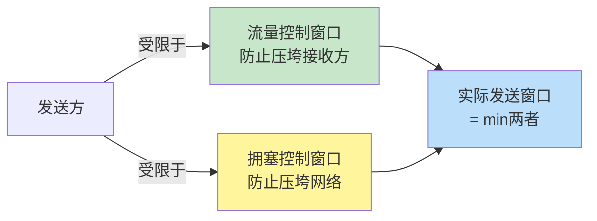
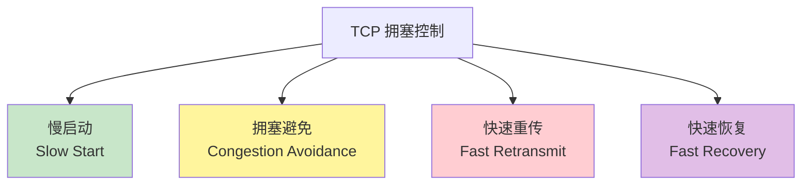
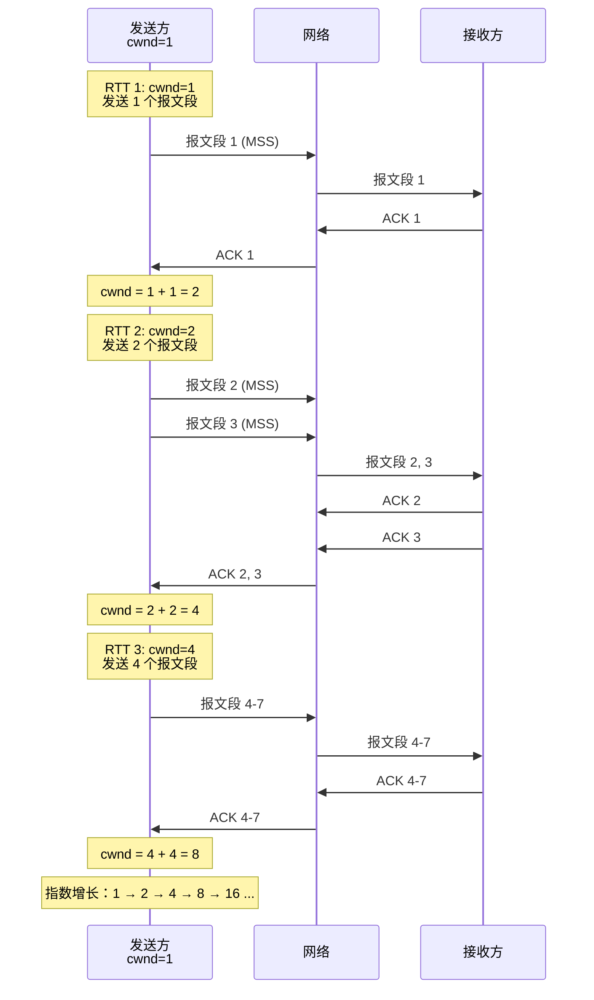
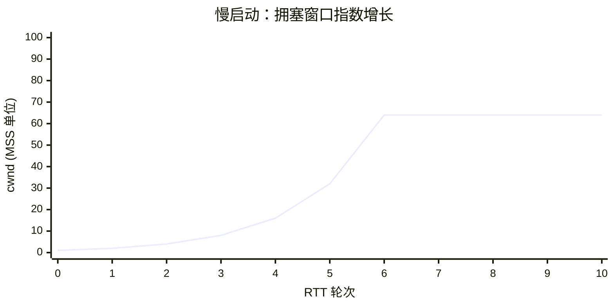
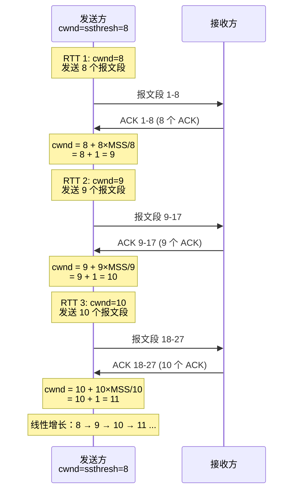
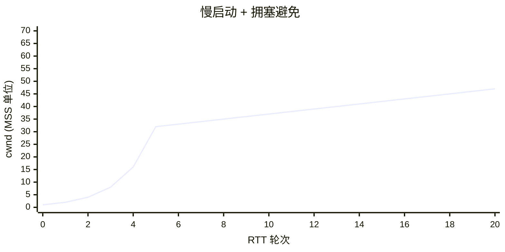
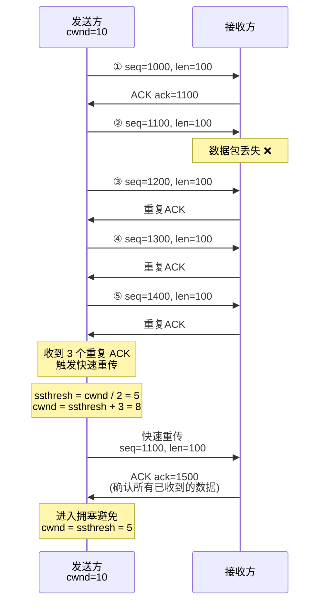
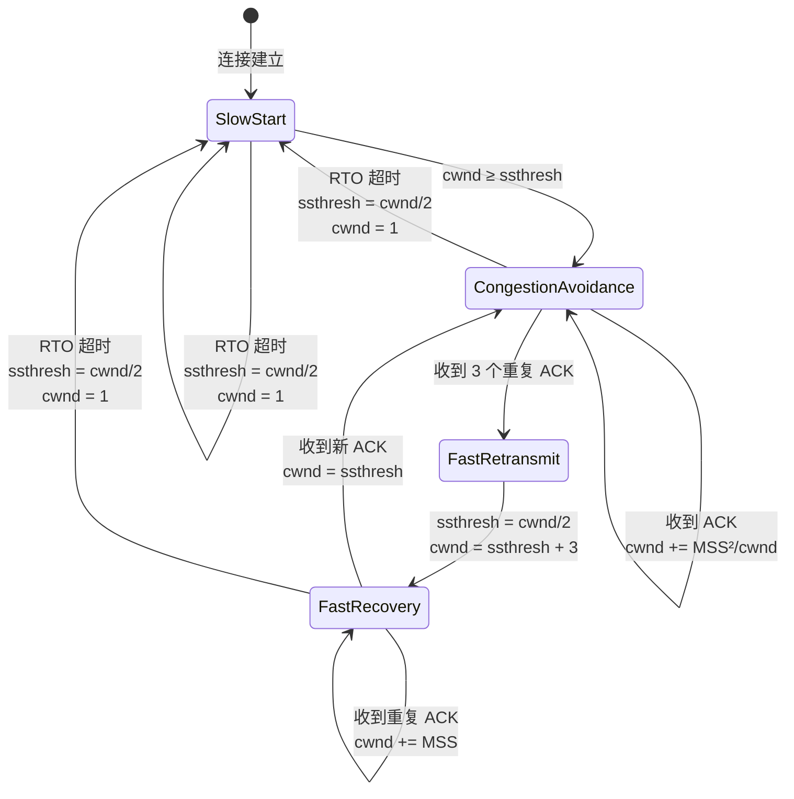
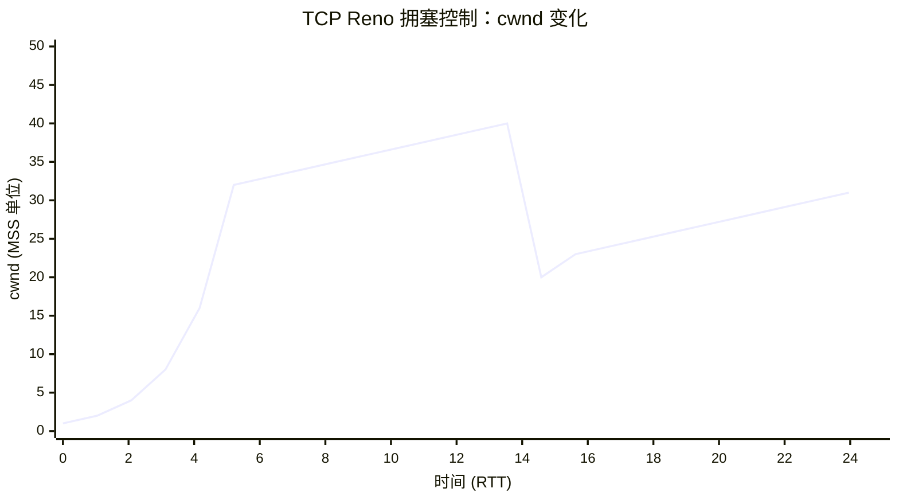
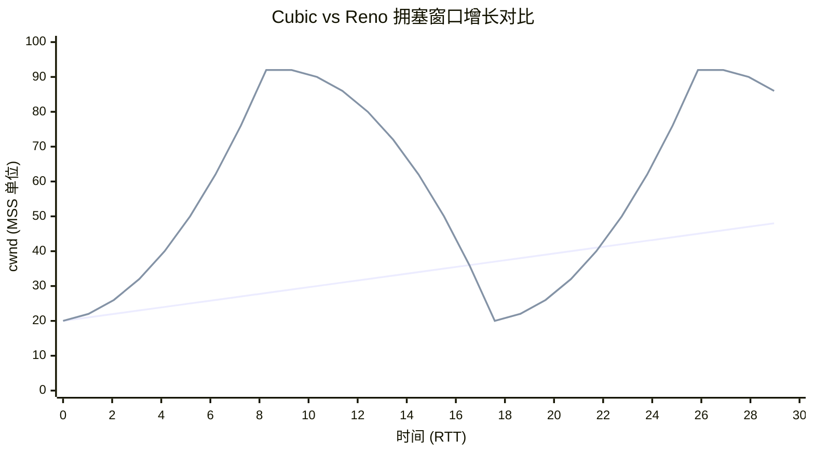

# 第四章：TCP 拥塞控制

## 4.1 什么是网络拥塞？

**拥塞**（Congestion）是指网络中的数据包超过网络的处理能力，导致：
- 路由器缓冲区溢出
- 数据包丢失
- 延迟增加
- 吞吐量下降

### 拥塞与流量控制的区别

| 维度 | 流量控制 | 拥塞控制 |
|------|----------|----------|
| **目的** | 防止发送方压垮接收方 | 防止发送方压垮网络 |
| **作用范围** | 端到端（点对点） | 整个网络 |
| **控制依据** | 接收方通告窗口 | 网络状况（丢包、RTT） |
| **机制** | 滑动窗口 | 慢启动、拥塞避免、快速重传/恢复 |



**发送窗口**：
```
发送窗口 = min(接收窗口 rwnd, 拥塞窗口 cwnd)
```

## 4.2 TCP 拥塞控制的四大算法

根据 RFC 5681，TCP 拥塞控制包含四个核心算法：



### 核心变量

| 变量 | 含义 | 初始值 |
|------|------|--------|
| **cwnd** | 拥塞窗口（Congestion Window） | IW（初始窗口） |
| **ssthresh** | 慢启动阈值（Slow Start Threshold） | 任意大值（如 65535） |
| **rwnd** | 接收窗口（Receiver Window） | 接收方通告 |
| **MSS** | 最大报文段大小（Maximum Segment Size） | 协商值（通常 1460） |

## 4.3 慢启动（Slow Start）

### 4.3.1 慢启动的动机

连接建立时，发送方不知道网络容量，如果立即发送大量数据，可能导致拥塞。慢启动采用**指数增长**策略，快速探测网络容量。

### 4.3.2 慢启动算法

**核心思想**：每收到一个 ACK，`cwnd += MSS`（或增加 1 个报文段）。

**初始窗口（IW）**：
```
If MSS > 2190 bytes:
    IW = 2 × MSS  (不超过 2 个报文段)
If 1095 < MSS ≤ 2190 bytes:
    IW = 3 × MSS  (不超过 3 个报文段)
If MSS ≤ 1095 bytes:
    IW = 4 × MSS  (不超过 4 个报文段)

常见情况（MSS=1460）：
IW = 3 × 1460 = 4380 字节 (约 3 个报文段)
```

**慢启动流程**：
```
cwnd < ssthresh 时，执行慢启动：
每收到 1 个 ACK，cwnd += MSS
```

### 4.3.3 慢启动示例



**增长曲线**：



**结束条件**：
1. `cwnd ≥ ssthresh` → 转入拥塞避免
2. 检测到丢包 → 调整 `ssthresh`，可能重新慢启动

### 4.3.4 Linux 慢启动参数

```bash
# 查看初始拥塞窗口（单位：MSS）
sysctl net.ipv4.tcp_init_cwnd
# 输出: net.ipv4.tcp_init_cwnd = 10

# 查看慢启动阈值初始值
sysctl net.ipv4.tcp_init_ssthresh
# 输出: net.ipv4.tcp_init_ssthresh = 2147483647 (任意大值)

# 实时查看连接的 cwnd
ss -tino | grep -A 1 ESTAB | grep cwnd

# 输出示例：
#  cubic wscale:7,7 rto:204 rtt:3.5/1.75 cwnd:10 ssthresh:32
```

**字段解读**：
- `cwnd:10` → 当前拥塞窗口 = 10 MSS
- `ssthresh:32` → 慢启动阈值 = 32 MSS

## 4.4 拥塞避免（Congestion Avoidance）

### 4.4.1 拥塞避免的动机

慢启动的指数增长太激进，当 `cwnd ≥ ssthresh` 时，切换到**线性增长**，小心翼翼地增加窗口。

### 4.4.2 拥塞避免算法

**核心思想**：每经过一个 RTT，`cwnd += MSS`（线性增长）。

**实现**：
```
每收到一个 ACK:
    cwnd += MSS × MSS / cwnd
    (每个 RTT 增加约 1 MSS)
```

### 4.4.3 拥塞避免示例



**增长曲线**：



**说明**：
- RTT 1-5：慢启动阶段，指数增长（1 → 32）
- RTT 6-20：拥塞避免阶段，线性增长（32 → 47）
- `ssthresh = 32`

## 4.5 快速重传（Fast Retransmit）

### 4.5.1 快速重传的动机

等待 RTO 超时太慢（通常数百毫秒），快速重传利用**重复 ACK** 快速检测丢包。

### 4.5.2 快速重传算法

**触发条件**：收到 **3 个重复 ACK**。

**操作**：
1. 立即重传丢失的报文段
2. 设置 `ssthresh = max(飞行中的字节数 / 2, 2 × MSS)`
3. 进入快速恢复

### 4.5.3 快速重传示例



## 4.6 快速恢复（Fast Recovery）

### 4.6.1 快速恢复的动机

快速重传后，如果直接回到慢启动，窗口从 1 开始，浪费网络容量。快速恢复在 `ssthresh` 附近重启，快速恢复吞吐量。

### 4.6.2 快速恢复算法（TCP Reno）

**步骤**：

1. **收到 3 个重复 ACK 时**：
   ```
   ssthresh = max(飞行中的字节数 / 2, 2 × MSS)
   cwnd = ssthresh + 3 × MSS
   重传丢失的报文段
   ```

2. **收到更多重复 ACK 时**（临时膨胀）：
   ```
   cwnd += MSS
   (每个重复 ACK 表示一个报文段已离开网络)
   ```

3. **收到新 ACK 时**（确认新数据）：
   ```
   cwnd = ssthresh
   进入拥塞避免阶段
   ```

### 4.6.3 快速恢复流程



### 4.6.4 完整示例：TCP Reno



**图示说明**：
- **RTT 1-5**（慢启动）：1 → 2 → 4 → 8 → 16 → 32
- **RTT 6-13**（拥塞避免）：32 → 40（线性增长）
- **RTT 14**（快速重传/恢复）：
  - 收到 3 个重复 ACK
  - `ssthresh = 40 / 2 = 20`
  - `cwnd = 20 + 3 = 23`
- **RTT 15-25**（拥塞避免）：23 → 32（线性增长）

## 4.7 Linux 中的拥塞控制算法

### 4.7.1 查看和设置拥塞控制算法

```bash
# 查看可用的拥塞控制算法
sysctl net.ipv4.tcp_available_congestion_control
# 输出: net.ipv4.tcp_available_congestion_control = reno cubic

# 查看当前默认算法
sysctl net.ipv4.tcp_congestion_control
# 输出: net.ipv4.tcp_congestion_control = cubic

# 设置默认算法（需要 root 权限）
sudo sysctl -w net.ipv4.tcp_congestion_control=bbr

# 查看特定连接使用的算法
ss -tino | grep -A 1 ESTAB | grep -o 'cubic\|bbr\|reno'
```

### 4.7.2 常见拥塞控制算法对比

| 算法 | 年份 | 特点 | 适用场景 |
|------|------|------|----------|
| **Reno** | 1990 | 基于丢包，慢启动+拥塞避免+快速重传/恢复 | 传统算法，基准参考 |
| **Cubic** | 2008 | 基于丢包，立方函数增长，高带宽网络优化 | **Linux 默认**，广泛使用 |
| **BBR** | 2016 | 基于延迟和带宽，探测最优工作点 | 高延迟、丢包网络（如 4G/5G） |
| **Vegas** | 1994 | 基于 RTT 变化，主动避免拥塞 | 低延迟网络 |
| **Westwood** | 2001 | 基于带宽估计，适应无线网络 | 无线网络 |

### 4.7.3 Cubic 算法简介

**核心思想**：使用立方函数调整 `cwnd`，而非线性增长。

**窗口增长**：
```
W(t) = C × (t - K)³ + Wmax

其中：
  Wmax：丢包前的最大窗口
  K：达到 Wmax 所需时间
  C：常数（0.4）
  t：自上次丢包以来的时间
```

**特点**：
- 快速探测 `Wmax` 附近的容量
- 远离 `Wmax` 时增长慢，接近时增长快
- 更适合高带宽延迟乘积（BDP）网络

**Cubic vs Reno**：



**图示**：
- 蓝线（Reno）：线性增长
- 橙线（Cubic）：立方函数，快速探测容量

### 4.7.4 BBR 算法简介

**核心思想**：不基于丢包，而是通过测量 **RTT** 和 **带宽**，找到最优工作点。

**BBR 的四个阶段**：
1. **STARTUP**（启动）：指数增长，快速填满管道
2. **DRAIN**（排空）：减小发送速率，排空队列
3. **PROBE_BW**（探测带宽）：周期性增减速率，探测最大带宽
4. **PROBE_RTT**（探测 RTT）：定期降低窗口，测量最小 RTT

**优势**：
- 高丢包率网络仍能保持高吞吐量
- 降低缓冲区膨胀（Bufferbloat）
- 适合移动网络（4G/5G）

**Linux 启用 BBR**：
```bash
# 检查内核版本（需要 4.9+）
uname -r

# 加载 BBR 模块
sudo modprobe tcp_bbr

# 设置为默认算法
sudo sysctl -w net.ipv4.tcp_congestion_control=bbr
sudo sysctl -w net.core.default_qdisc=fq

# 持久化配置
echo "net.ipv4.tcp_congestion_control=bbr" | sudo tee -a /etc/sysctl.conf
echo "net.core.default_qdisc=fq" | sudo tee -a /etc/sysctl.conf
sudo sysctl -p
```

## 4.8 实战练习

### 练习 1：观察慢启动和拥塞避免

```bash
# 使用 ss 实时监控 cwnd 变化
watch -n 0.5 'ss -tino | grep -A 1 ESTAB | grep cwnd'

# 另一个终端：下载大文件
wget http://example.com/large_file.zip
```

**观察任务**：
1. 初始 `cwnd` 值（通常是 10）
2. 慢启动阶段的指数增长
3. 达到 `ssthresh` 后的线性增长

### 练习 2：模拟丢包触发快速重传

```bash
# 使用 tc 模拟 5% 丢包率
sudo tc qdisc add dev eth0 root netem loss 5%

# 抓包观察重复 ACK 和快速重传
sudo tcpdump -i eth0 -nn 'tcp' -vv | grep -E 'dup ack|retransmission'

# 启动传输
curl http://example.com/file.zip -o /dev/null

# 恢复网络
sudo tc qdisc del dev eth0 root
```

### 练习 3：对比不同拥塞控制算法

**测试脚本**：
```bash
#!/bin/bash
# 对比 Reno, Cubic, BBR 的性能

for algo in reno cubic bbr; do
    echo "Testing $algo..."
    sudo sysctl -w net.ipv4.tcp_congestion_control=$algo

    # 使用 iperf3 测试吞吐量
    iperf3 -c example.com -t 30 -i 1 | tee "${algo}_result.txt"

    sleep 5
done
```

**分析**：
- 吞吐量（Mbps）
- RTT 变化
- 丢包恢复速度

### 练习 4：监控拥塞事件

```bash
# 查看拥塞相关统计
netstat -s | grep -i congest

# 输出示例：
#    1234 times the congestion window was reduced
#    567 resets received for embryonic SYN_RECV sockets
#    89 fast retransmits

# 实时监控拥塞窗口变化
ss -tino | grep -A 3 ESTAB | grep -E 'cwnd|ssthresh|retrans'
```

## 4.9 小结

本章详细讲解了 TCP 拥塞控制机制：

✅ **关键要点**：
1. **慢启动**：指数增长，快速探测网络容量
2. **拥塞避免**：线性增长，谨慎增加窗口
3. **快速重传**：收到 3 个重复 ACK 立即重传
4. **快速恢复**：避免回到慢启动，快速恢复吞吐量
5. **现代算法**：Cubic（Linux 默认）、BBR（基于延迟和带宽）

🔗 **与 Linux 实现的联系**：
- `ss -tino` 查看 `cwnd`、`ssthresh`、重传次数
- `sysctl` 设置拥塞控制算法（Reno、Cubic、BBR）
- `tc netem` 模拟丢包、延迟，测试拥塞控制
- `iperf3` 测试不同算法的性能

📊 **算法对比**：
- **Reno**：经典基准，基于丢包
- **Cubic**：高带宽网络优化，立方增长
- **BBR**：高延迟/丢包网络优化，基于 RTT 和带宽

📚 **下一章预告**：
第五章将讲解 TCP 高性能扩展，包括窗口缩放（Window Scale）、时间戳（Timestamps）、选择性确认（SACK）等机制，以及它们如何应对"长肥网络"（Long Fat Networks）的挑战。

---

**参考资料**：
- RFC 5681: TCP Congestion Control
- RFC 8312: CUBIC for Fast Long-Distance Networks
- [BBR: Congestion-Based Congestion Control](https://queue.acm.org/detail.cfm?id=3022184)
- Linux 内核文档：[tcp(7) man page](https://man7.org/linux/man-pages/man7/tcp.7.html)
