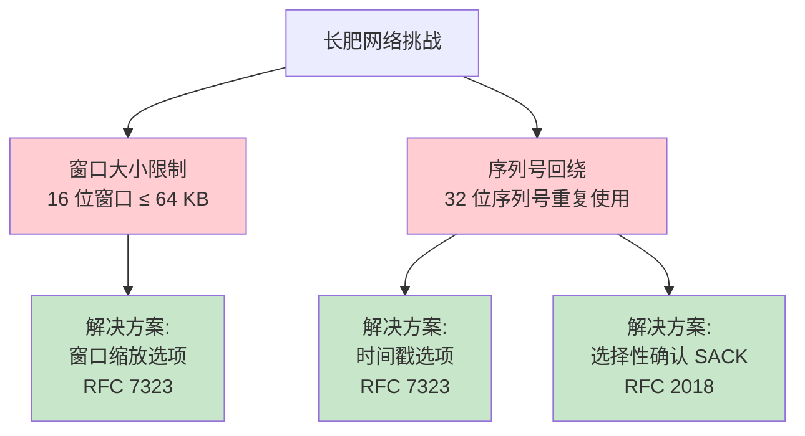
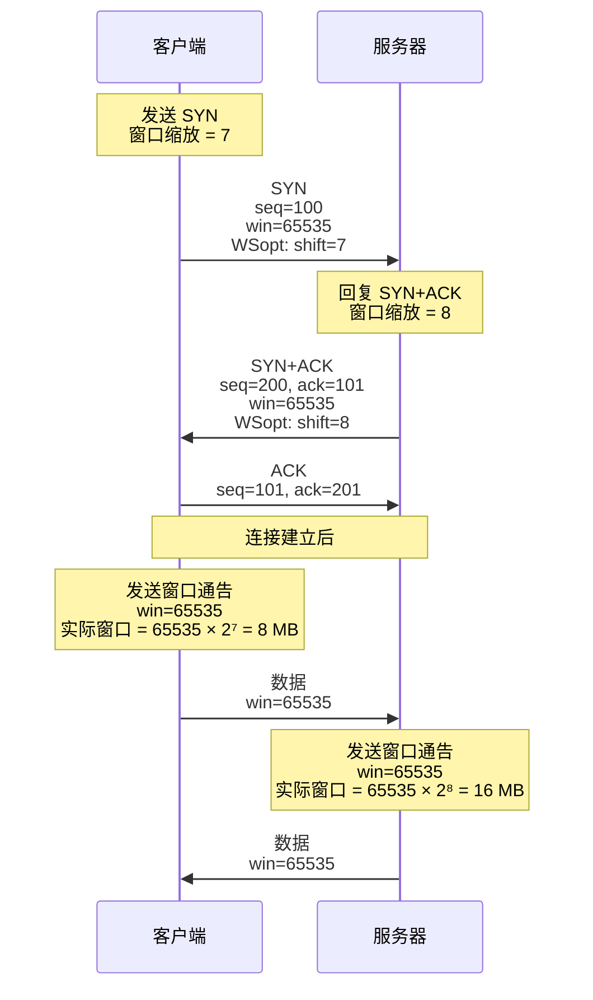
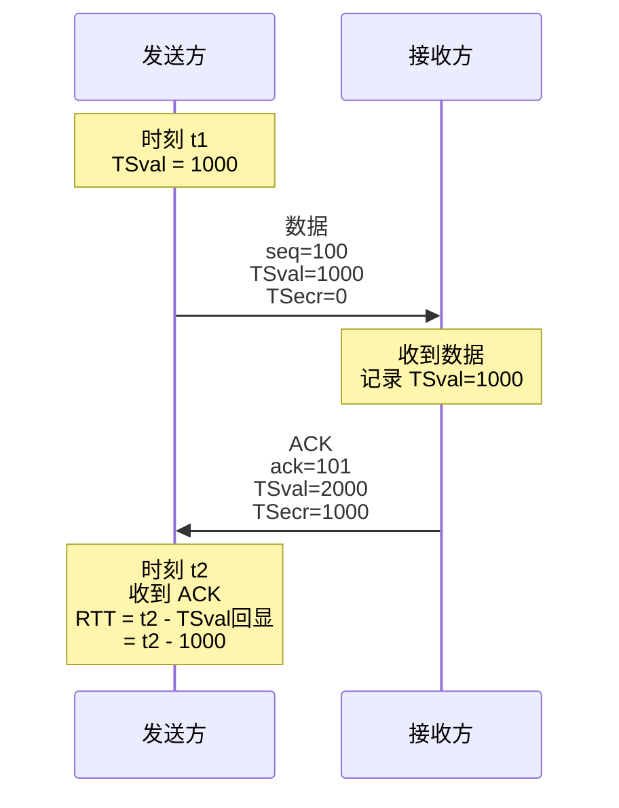
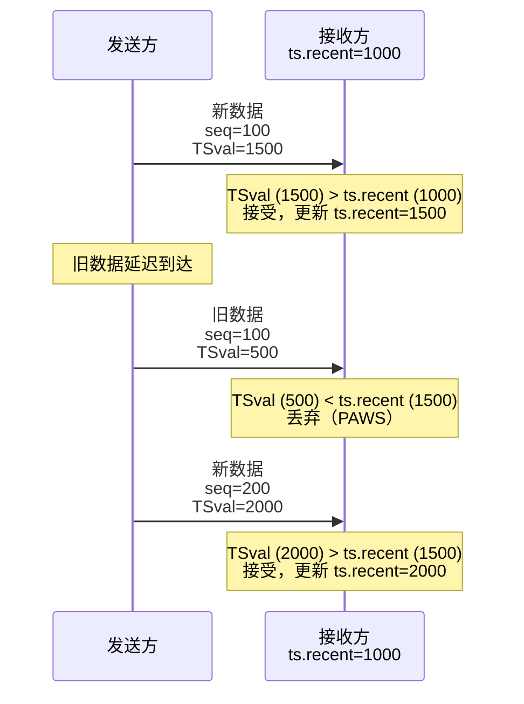
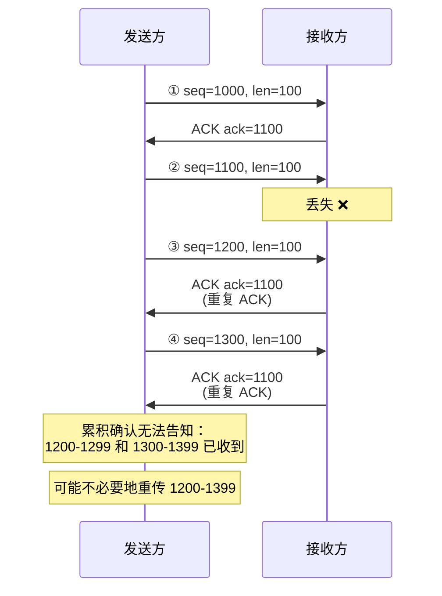
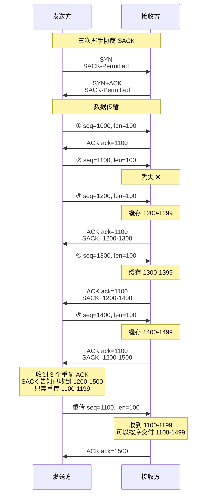
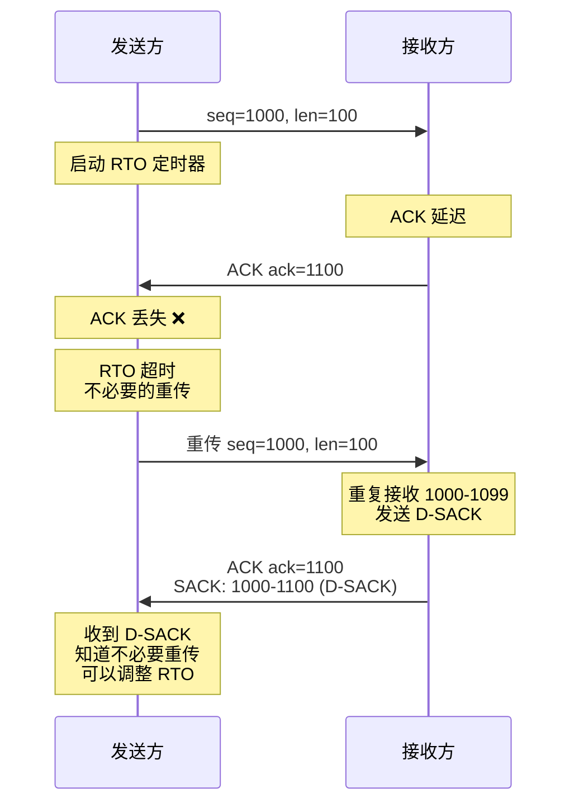

# 第五章：TCP 高性能扩展

## 5.1 长肥网络（Long Fat Networks, LFN）的挑战

### 5.1.1 什么是长肥网络？

**长肥网络**指的是具有**高带宽 × 高延迟**特性的网络，就像一条又长又粗的水管。

**带宽延迟乘积（BDP）**：
```
BDP = Bandwidth × RTT

示例：
  带宽 = 100 Mbps = 12.5 MB/s
  RTT = 100 ms = 0.1 s
  BDP = 12.5 MB/s × 0.1 s = 1.25 MB

含义：为了充分利用带宽，需要 1.25 MB 的"在途数据"
```

### 5.1.2 TCP 的性能瓶颈

基础 TCP（RFC 793）在 LFN 上存在两大问题：



**问题 1：窗口大小限制**
- TCP 头部窗口字段只有 16 位
- 最大窗口 = 2¹⁶ = 64 KB
- BDP > 64 KB 时，无法充分利用带宽

**问题 2：序列号回绕**
- 序列号 32 位：0 到 2³² - 1（约 4 GB）
- 高速网络下，序列号会快速循环
- 可能将旧数据误认为新数据

## 5.2 窗口缩放选项（Window Scale）

### 5.2.1 窗口缩放的原理

**核心思想**：将窗口字段左移 N 位，扩大窗口范围。

```
实际窗口 = 窗口字段 × 2^缩放因子

示例：
  窗口字段 = 65535（16 位最大值）
  缩放因子 = 7
  实际窗口 = 65535 × 2⁷ = 65535 × 128 = 8,388,480 字节（≈8 MB）
```

**最大缩放因子**：14（窗口最大 1 GB）
```
最大窗口 = 65535 × 2¹⁴ = 1,073,725,440 字节（≈1 GB）
```

### 5.2.2 窗口缩放选项格式

```
+--------+--------+--------+
| Kind=3 | Len=3  | Shift  |
+--------+--------+--------+

Kind: 3（窗口缩放）
Len: 3 字节
Shift: 缩放因子（0-14）
```

**协商规则**：
- 只能在 SYN 报文段中发送
- 双方独立协商各自的缩放因子
- 连接建立后不可更改

### 5.2.3 窗口缩放示例



### 5.2.4 tcpdump 观察窗口缩放

```bash
# 捕获 SYN 包，查看窗口缩放选项
sudo tcpdump -i any -nn 'tcp[tcpflags] & tcp-syn != 0' -vv -c 2

# 输出示例：
# 客户端 SYN：
# Flags [S], seq 123456789, win 65535,
#   options [mss 1460,nop,wscale 7,sackOK,TS val 12345 ecr 0]
#
# 服务器 SYN-ACK：
# Flags [S.], seq 987654321, ack 123456790, win 65535,
#   options [mss 1460,nop,wscale 8,sackOK,TS val 67890 ecr 12345]
```

**字段解读**：
- `win 65535` → 窗口字段值
- `wscale 7` → 缩放因子
- 实际窗口 = 65535 × 2⁷ = 8,388,480 字节

### 5.2.5 Linux 窗口缩放参数

```bash
# 查看窗口缩放是否启用
sysctl net.ipv4.tcp_window_scaling
# 输出: net.ipv4.tcp_window_scaling = 1 (启用)

# 查看接收缓冲区大小（决定窗口大小）
sysctl net.ipv4.tcp_rmem
# 输出: net.ipv4.tcp_rmem = 4096 131072 6291456
# 含义: 最小值 默认值 最大值（字节）

# 查看发送缓冲区大小
sysctl net.ipv4.tcp_wmem
# 输出: net.ipv4.tcp_wmem = 4096 16384 4194304

# 查看具体连接的窗口缩放因子
ss -tino | grep -A 1 ESTAB | grep wscale

# 输出示例：
#  wscale:7,8 rto:204 rtt:3.5/1.75 rcv_space:14600
```

**字段解读**：
- `wscale:7,8` → 发送缩放因子 7，接收缩放因子 8
- `rcv_space:14600` → 接收窗口大小（字节）

## 5.3 时间戳选项（Timestamps）

### 5.3.1 时间戳的作用

时间戳选项（RFC 7323）提供两大功能：

1. **RTTM（Round-Trip Time Measurement）**：
   - 精确测量 RTT
   - 改进 RTO 计算

2. **PAWS（Protection Against Wrapped Sequences）**：
   - 防止序列号回绕导致的数据混乱
   - 检测和丢弃过期的报文段

### 5.3.2 时间戳选项格式

```
+--------+--------+--------+--------+--------+--------+--------+--------+--------+--------+
| Kind=8 | Len=10 |           TS Value (TSval)            |           TS Echo Reply (TSecr)           |
+--------+--------+--------+--------+--------+--------+--------+--------+--------+--------+

Kind: 8（时间戳）
Len: 10 字节
TSval: 发送方的时间戳值（32 位）
TSecr: 回显对方的时间戳值（32 位）
```

**字段说明**：
- `TSval`：发送方的当前时间戳
- `TSecr`：回显最近收到的对方的 `TSval`

### 5.3.3 RTTM：RTT 测量

**工作原理**：



**优势**：
- 每个报文段都可测量 RTT（不受 Karn 算法限制）
- 重传的报文段也能测量 RTT

**Karn 算法**（传统方法的问题）：
```
问题：重传的报文段无法测量 RTT
原因：收到 ACK 时，无法确定是哪次传输的 ACK

Karn 解决：重传的报文段不测量 RTT
缺点：丢包后 RTT 估计停滞

时间戳方案：通过 TSval/TSecr 区分，重传也可测量
```

### 5.3.4 PAWS：防止序列号回绕

**序列号回绕问题**：

```
带宽 = 1 Gbps = 125 MB/s
序列号空间 = 2³² 字节 = 4 GB

回绕时间 = 4 GB / 125 MB/s ≈ 32 秒

如果 RTT = 60 秒：
  旧数据（序列号 1000）可能与新数据（序列号 1000）混淆
```

**PAWS 检测机制**：

```
接收方维护每个连接的最新时间戳 ts.recent

收到报文段时：
  if (TSval < ts.recent) {
      // 时间戳过期，丢弃报文段
      drop_packet();
  } else {
      // 接受报文段，更新 ts.recent
      ts.recent = TSval;
  }
```

**示例**：



### 5.3.5 时间戳时钟

**时间戳单位**：
- RFC 建议：1 ms 到 1 s 之间
- Linux 实现：1 ms（毫秒级精度）

**时间戳回绕**：
```
32 位时间戳，1 ms 精度：
回绕时间 = 2³² ms ≈ 49.7 天

连接持续时间 < 49.7 天，时间戳单调递增
```

**Linux 时间戳参数**：

```bash
# 查看时间戳是否启用
sysctl net.ipv4.tcp_timestamps
# 输出: net.ipv4.tcp_timestamps = 1 (启用)

# 查看连接的时间戳值
ss -tino | grep -A 1 ESTAB | grep TS

# 输出示例：
#  TS val 12345678 ecr 87654321
```

## 5.4 选择性确认（SACK）

### 5.4.1 SACK 的动机

**累积确认的问题**：



**SACK 的优势**：
- 接收方明确告知已收到的非连续数据块
- 发送方只重传真正丢失的数据
- 减少不必要的重传

### 5.4.2 SACK 选项格式

**SACK-Permitted 选项**（SYN 报文段）：
```
+--------+--------+
| Kind=4 | Len=2  |
+--------+--------+
```

**SACK 选项**（数据报文段）：
```
+--------+--------+--------+--------+--------+--------+--------+--------+
| Kind=5 | Len    |     Left Edge of 1st Block      |    Right Edge of 1st Block     |
+--------+--------+--------+--------+--------+--------+--------+--------+
|     Left Edge of 2nd Block      |    Right Edge of 2nd Block     | ...
+--------+--------+--------+--------+--------+--------+--------+--------+

Kind: 5（SACK）
Len: 可变（8n + 2 字节，n 为块数）
Left Edge: 块的起始序列号（32 位）
Right Edge: 块的结束序列号 + 1（32 位）
```

**块数限制**：
- 每个块 8 字节（左边界 + 右边界）
- 最多 40 字节选项空间
- 配合时间戳（10 字节）：最多 3 个 SACK 块
- 无时间戳：最多 4 个 SACK 块

### 5.4.3 SACK 工作流程



### 5.4.4 SACK 块规则

**SACK 块顺序**（RFC 2018）：

1. **第一个块**：必须是**最近收到的数据块**
   - 确保发送方获得最新信息

2. **后续块**：重复之前的 SACK 块
   - 防止 SACK 选项丢失
   - 通常报告至少 3 次

**示例**：
```
接收顺序：1000-1099, 1200-1299, 1400-1499, 1300-1399

第 1 个 ACK：SACK: [1200-1300]
第 2 个 ACK：SACK: [1400-1500, 1200-1300]
第 3 个 ACK：SACK: [1300-1400, 1400-1500, 1200-1300]
第 4 个 ACK：SACK: [1300-1400, 1400-1500, 1200-1300]
```

### 5.4.5 tcpdump 观察 SACK

```bash
# 捕获 SACK 选项
sudo tcpdump -i any -nn 'tcp' -vv | grep -E 'sack|SACK'

# 输出示例：
# SYN 包协商：
# Flags [S], seq 123456789, win 65535,
#   options [mss 1460,sackOK,TS val 12345 ecr 0,nop,wscale 7]
#
# 数据包 SACK：
# Flags [.], seq 1000:1100, ack 500, win 65535,
#   options [nop,nop,TS val 12350 ecr 67890,nop,nop,sack 1 {1200:1300}]
#
# 多个 SACK 块：
# options [nop,nop,TS val 12355 ecr 67895,nop,nop,sack 2 {1300:1400 1200:1300}]
```

### 5.4.6 Linux SACK 参数

```bash
# 查看 SACK 是否启用
sysctl net.ipv4.tcp_sack
# 输出: net.ipv4.tcp_sack = 1 (启用)

# 查看 SACK 统计
netstat -s | grep -i sack

# 输出示例：
#    1234 SACK blocks received
#    567 DSACKs sent for old packets
#    89 DSACKs received

# 查看连接的 SACK 信息
ss -tino | grep -A 2 ESTAB | grep sack
```

## 5.5 D-SACK（Duplicate SACK）

### 5.5.1 D-SACK 的作用

D-SACK（RFC 2883）是 SACK 的扩展，用于报告**重复接收**的数据块。

**用途**：
1. **检测不必要的重传**（网络不拥塞，但 RTO 过短）
2. **检测 ACK 丢失**
3. **检测数据包重复**（网络或路由器故障）

### 5.5.2 D-SACK 示例

**场景 1：不必要的重传**



**D-SACK 格式**：
```
第一个 SACK 块报告重复的序列号范围
且该范围在累积 ACK 之内

示例：
  ACK ack=1100
  SACK: [1000-1100]  ← D-SACK（1000-1100 < 1100）
```

### 5.5.3 D-SACK 统计

```bash
# 查看 D-SACK 统计
netstat -s | grep DSACK

# 输出示例：
#    567 DSACKs sent for old packets
#    123 DSACKs received
#    45 DSACKs for out of order packets received
```

**字段含义**：
- `DSACKs sent`：发送的 D-SACK 数量（收到重复数据）
- `DSACKs received`：收到的 D-SACK 数量（对方收到重复数据）
- `DSACKs for out of order`：乱序数据导致的 D-SACK

## 5.6 实战练习

### 练习 1：观察窗口缩放

```bash
# 捕获三次握手，查看窗口缩放因子
sudo tcpdump -i any -nn 'tcp[tcpflags] & tcp-syn != 0' -vv -c 3

# 分析任务：
# 1. 客户端的窗口缩放因子
# 2. 服务器的窗口缩放因子
# 3. 计算实际窗口大小
```

### 练习 2：测试 SACK 效果

**对比测试**：
```bash
# 禁用 SACK
sudo sysctl -w net.ipv4.tcp_sack=0

# 使用 tc 模拟 5% 丢包
sudo tc qdisc add dev eth0 root netem loss 5%

# 下载测试
curl http://example.com/10MB.zip -o /dev/null

# 查看重传统计
netstat -s | grep retransmit

# 启用 SACK
sudo sysctl -w net.ipv4.tcp_sack=1

# 重复测试，对比重传次数
```

### 练习 3：观察时间戳和 RTT

```bash
# 实时监控时间戳和 RTT
watch -n 0.5 'ss -tino | grep -A 1 ESTAB | grep -E "TS|rtt"'

# 输出示例：
#  TS val 12345678 ecr 87654321
#  rto:204 rtt:3.5/1.75 ato:40

# 分析：
# 1. TSval 增长速度（约 1 ms/单位）
# 2. rtt 与时间戳的关系
```

### 练习 4：SACK 可视化

```bash
# 捕获 SACK 详细信息
sudo tcpdump -i any -nn 'tcp' -vv -w sack_capture.pcap

# 使用 Wireshark 分析：
# 1. Statistics -> TCP Stream Graphs -> Time-Sequence Graph (Stevens)
# 2. 观察 SACK 块的位置
# 3. 分析重传策略
```

## 5.7 高性能扩展总结

### 5.7.1 三大扩展对比

| 扩展 | RFC | 目的 | 关键字段 | Linux 参数 |
|------|-----|------|----------|-----------|
| **Window Scale** | 7323 | 支持大窗口（>64 KB） | `wscale` | `tcp_window_scaling` |
| **Timestamps** | 7323 | RTT 测量 + PAWS | `TSval`, `TSecr` | `tcp_timestamps` |
| **SACK** | 2018 | 选择性确认 | `sack` 块 | `tcp_sack` |

### 5.7.2 长肥网络性能提升

**无扩展 vs 有扩展**：

```
场景：1 Gbps，RTT=100 ms
BDP = 12.5 MB

无扩展：
  最大窗口 = 64 KB
  吞吐量 = 64 KB / 0.1 s = 640 KB/s = 5.12 Mbps (0.5% 利用率)

有窗口缩放（wscale=7）：
  最大窗口 = 64 KB × 128 = 8 MB
  吞吐量 ≈ 8 MB / 0.1 s = 80 MB/s = 640 Mbps (64% 利用率)

有窗口缩放 + SACK：
  丢包恢复更快
  吞吐量 ≈ 800-900 Mbps (80-90% 利用率)
```

### 5.7.3 最佳实践

**推荐配置**（Linux）：
```bash
# 启用所有高性能扩展
sysctl -w net.ipv4.tcp_window_scaling=1
sysctl -w net.ipv4.tcp_timestamps=1
sysctl -w net.ipv4.tcp_sack=1

# 调整缓冲区大小（支持大窗口）
sysctl -w net.ipv4.tcp_rmem="4096 131072 16777216"  # 16 MB
sysctl -w net.ipv4.tcp_wmem="4096 65536 16777216"   # 16 MB

# 设置拥塞控制算法（高 BDP 网络）
sysctl -w net.ipv4.tcp_congestion_control=cubic  # 或 bbr

# 持久化配置
echo "net.ipv4.tcp_window_scaling=1" >> /etc/sysctl.conf
echo "net.ipv4.tcp_timestamps=1" >> /etc/sysctl.conf
echo "net.ipv4.tcp_sack=1" >> /etc/sysctl.conf
sysctl -p
```

## 5.8 小结

本章详细讲解了 TCP 高性能扩展：

✅ **关键要点**：
1. **窗口缩放**：支持 > 64 KB 窗口，适应长肥网络
2. **时间戳**：精确 RTT 测量（RTTM）+ 防止序列号回绕（PAWS）
3. **SACK**：选择性确认，减少不必要的重传
4. **D-SACK**：检测重复接收，优化 RTO 计算

🔗 **与 Linux 实现的联系**：
- `ss -tino` 查看 `wscale`、`TS val`、`sack` 信息
- `sysctl` 启用/禁用高性能扩展
- `netstat -s` 查看 SACK、D-SACK 统计
- `tcpdump` 抓包分析选项协商和使用

📊 **性能提升**：
- 窗口缩放：64 KB → 数 MB 甚至 GB
- SACK：丢包恢复速度提升 2-10 倍
- 时间戳：RTT 测量精度提升，RTO 更准确

🌐 **应用场景**：
- **卫星通信**：高延迟（500+ ms），需要大窗口
- **数据中心**：高带宽（10/40/100 Gbps），需要 SACK
- **移动网络**：丢包率高，SACK 和时间戳至关重要

📚 **全书总结**：
通过五章的学习，我们全面掌握了 TCP 协议：
1. **核心概念**：报文段结构、端口、序列号
2. **连接管理**：三次握手、四次挥手、状态机
3. **可靠传输**：序列号确认、超时重传、滑动窗口
4. **拥塞控制**：慢启动、拥塞避免、快速重传/恢复、Cubic/BBR
5. **高性能扩展**：窗口缩放、时间戳、SACK

---

**参考资料**：
- RFC 7323: TCP Extensions for High Performance
- RFC 2018: TCP Selective Acknowledgment Options
- RFC 2883: An Extension to the SACK Option for TCP (D-SACK)
- Linux 内核文档：[tcp(7) man page](https://man7.org/linux/man-pages/man7/tcp.7.html)
